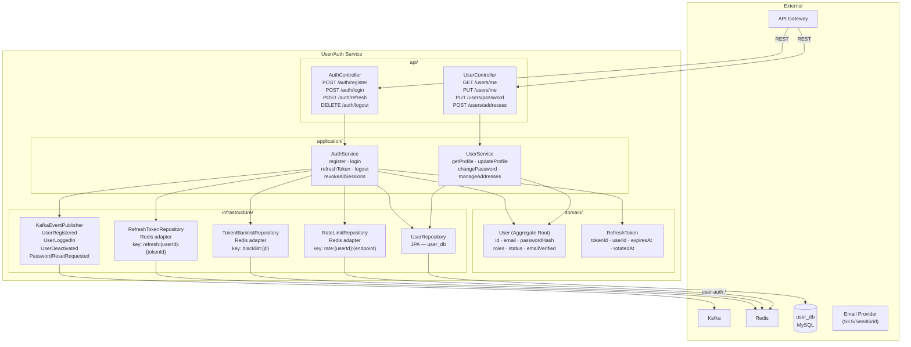
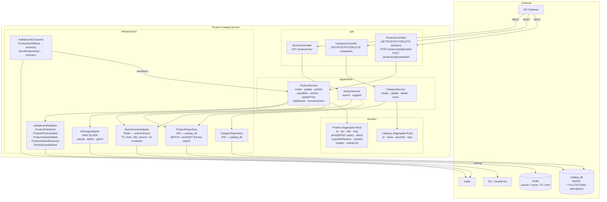
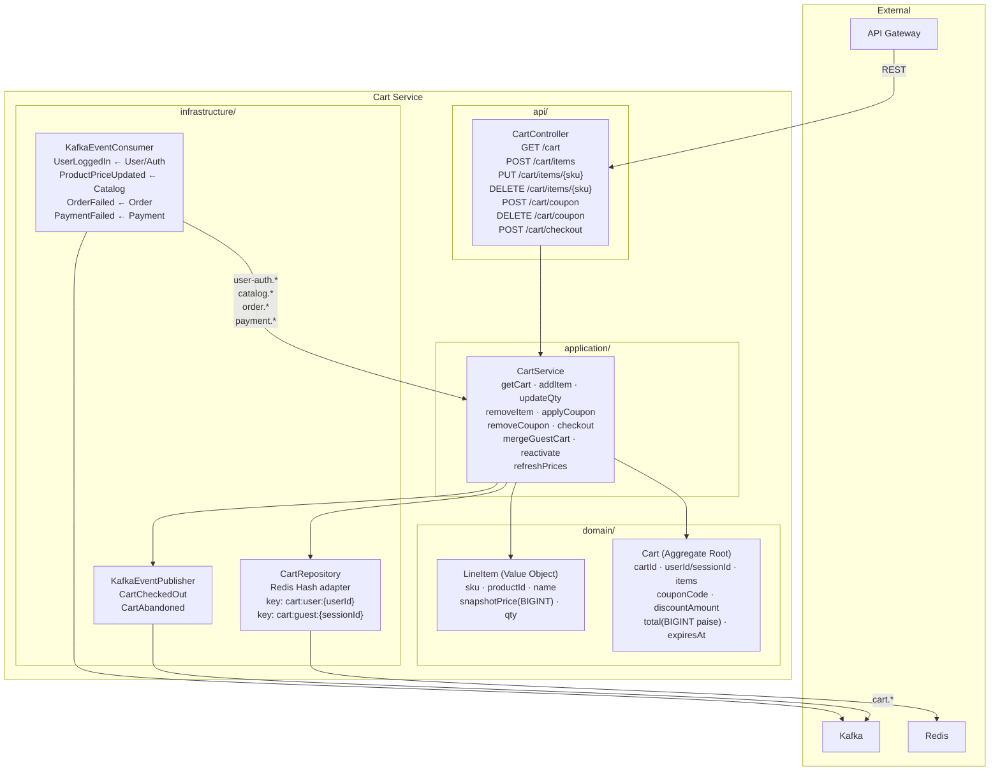
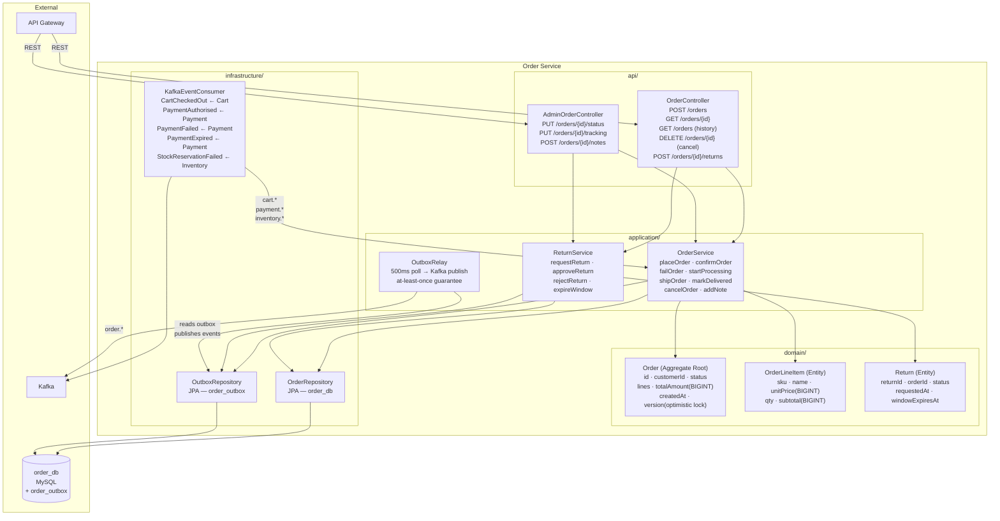
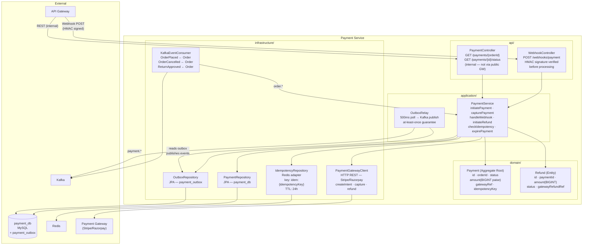
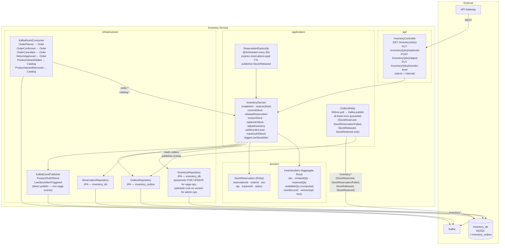
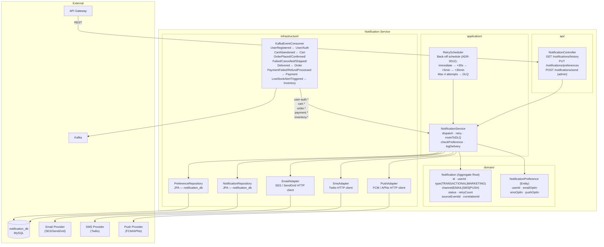

# Component Diagrams — High-Level Design

**Artefact type:** C4 Level 3 — Component Diagrams (all 7 services)  
**Phase:** ARCH  
**Status:** Draft  
**Version:** 0.1  
**Date:** 2026-06-08  
**Author:** System Architect  
**Inputs:** `docs/hld/container-diagram.md`, `docs/requirements/event-storming.md` v0.3

---

## 1. Scope

This document zooms into each microservice container from the Level 2 diagram and shows the internal Spring Boot component structure: controllers, services, repositories, domain aggregates, and infrastructure adapters (Kafka, Redis, HTTP clients).

**What is shown per service:**
- REST layer (Controllers)
- Business logic layer (Services, Domain Aggregates)
- Data access layer (Repositories — JPA and non-JPA)
- Infrastructure adapters (Kafka publisher/consumer, Redis, external HTTP clients)
- Key dependency arrows between components

**What is NOT shown:** Class fields, method signatures, or implementation detail — those belong in the LLD documents (`docs/lld/`).

---

## 2. Component Structure Convention

Every service follows the same layered package structure:

```
com.ecommerce.[context]/
├── api/              ← Controllers (REST handlers)
├── application/      ← Services (use cases, aggregate operations)
├── domain/           ← Aggregates, Entities, Value Objects, Domain Events
├── infrastructure/
│   ├── persistence/  ← JPA Repositories, Redis adapters
│   ├── messaging/    ← Kafka producers, Kafka consumers
│   └── client/       ← External HTTP clients (gateway, email, SMS)
└── config/           ← Spring configuration, beans
```

Arrows in diagrams flow: `Controller → Service → Domain / Repository / Adapter`

---

## 3. User/Auth Service

**Bounded context:** User/Auth  
**Aggregates:** `User`, `RefreshToken`  
**DB:** `user_db` (MySQL)  
**Cache:** Redis (refresh tokens, token blacklist, rate-limit counters)



---

## 4. Product Catalog Service

**Bounded context:** Product Catalog  
**Aggregates:** `Product`, `Category`  
**DB:** `catalog_db` (MySQL)  
**External:** S3 (image storage). Search is MySQL full-text + Redis cache for Phase 1
(ADR-0013) — Elasticsearch is deferred to Phase 2 (see Migration Path in ADR-0013).



---

## 5. Cart Service

**Bounded context:** Cart  
**Aggregates:** `Cart`, `LineItem`  
**Storage:** Redis only (no MySQL — Cart is entirely cache-resident)



---

## 6. Order Service

**Bounded context:** Order  
**Aggregates:** `Order`, `OrderLineItem`, `Return`  
**DB:** `order_db` (MySQL) including `order_outbox` table  
**Pattern:** Transactional outbox for Kafka event publishing



---

## 7. Payment Service

**Bounded context:** Payment  
**Aggregates:** `Payment`, `Refund`  
**DB:** `payment_db` (MySQL) including `payment_outbox` table  
**Cache:** Redis (idempotency keys)  
**Pattern:** Transactional outbox + HMAC webhook verification



---

## 8. Inventory Service

**Bounded context:** Inventory  
**Aggregates:** `InventoryItem`, `StockReservation`  
**DB:** `inventory_db` (MySQL) including `inventory_outbox` table (ADR-0014, scoped to saga-critical events)  
**Pattern:** Pessimistic locking (`FOR UPDATE`) for saga-triggered stock mutations, optimistic locking (`version`) for admin operations; scheduled job for reservation TTL expiry; transactional outbox for `StockReserved`/`StockReservationFailed`/`StockReleased`/`StockRestored`



---

## 9. Notification Service

**Bounded context:** Notification  
**Aggregates:** `Notification`, `NotificationPreference`  
**DB:** `notification_db` (MySQL)  
**External:** Email Provider (SES/SendGrid), SMS Provider (Twilio), Push Provider (FCM/APNs)  
**Pattern:** Consumer-only — no domain events published; retry with exponential back-off; DLQ after 3 failures



---

## 10. Cross-Cutting Component Patterns

The following components appear in every service and are not repeated in each diagram above.

### 10.1 Exception Handling

```
GlobalExceptionHandler (@RestControllerAdvice)
  ├── DomainException → HTTP 422 + correlationId
  ├── ResourceNotFoundException → HTTP 404
  ├── ValidationException → HTTP 400 + field errors
  ├── OptimisticLockException → HTTP 409 + retry hint
  └── Uncaught → HTTP 500 + correlationId (no stack trace exposed)
```

All error responses include `correlationId` (UUID, propagated from `X-Correlation-ID` request header or generated if absent).

### 10.2 Observability

```
MicrometerMetricsFilter (per request)
  └── records: http.server.requests (method, path, status, duration)

KafkaConsumerMetricsListener
  └── records: kafka.consumer.lag, kafka.consumer.records-consumed

@Timed annotations on Service methods
  └── records: business operation duration histograms
```

All spans carry `correlationId` and `traceId` (Micrometer Tracing → Zipkin/Tempo).

### 10.3 Security Filter Chain

```
SecurityFilterChain (Spring Security)
  ├── CorsFilter
  ├── JwtAuthenticationFilter
  │     └── validates RS256 signature + exp claim
  │     └── populates SecurityContext with userId + roles
  ├── RateLimitFilter (Redis token bucket)
  └── AuthorizationFilter (role-based per endpoint)
```

`/webhooks/payment` bypasses JWT filter — HMAC verification is done inside `WebhookController`.

---

## 11. Open Questions

| # | Question | Severity | Owner |
|---|---|---|---|
| OQ-C3-01 | Should `CartService` call `InventoryService` synchronously at checkout to validate stock, or rely on eventual consistency (reserve on `OrderPlaced`)? A sync call reduces oversell but adds coupling. | High | Architect — resolve before Cart LLD |
| OQ-C3-02 | `ReservationExpiryJob` polling every 30s — acceptable lag for reservation TTL? Flash-sale scenarios may need sub-10s expiry. Consider Redis TTL + keyspace notification as an alternative. | Medium | Architect — note in Inventory LLD |
| OQ-C3-03 | Notification `RetryScheduler` — in-process scheduler vs dedicated Kafka retry topic (standard pattern). Kafka retry topics are more resilient on service restart. | Medium | Architect — resolve in ADR-008 |

---

## 12. Next Artefacts

| Artefact | Task |
|---|---|
| Sequence diagrams (Order saga, Payment flow, Inventory reservation) | SA-004 |
| ER diagrams — all 5 MySQL services | SA-005 |
| Order state machine | SA-006 |
| ADR-001: Monetary precision | SA-007 |
