# Container Diagram — High-Level Design

**Artefact type:** C4 Level 2 — Container Diagram  
**Phase:** ARCH  
**Status:** Draft  
**Version:** 0.1  
**Date:** 2026-06-08  
**Author:** System Architect  
**Inputs:** `docs/hld/system-context.md`, `docs/requirements/event-storming.md` v0.3, `docs/requirements/non-functional-requirements.md`

---

## 1. Scope

This document zooms into the **Ecommerce Platform** system box from the Level 1 diagram and shows all internal containers: microservices, the API gateway, message broker, databases, and cache layer. It defines which container owns which data and how containers communicate.

It does **not** show internal class structure of any service — that is the responsibility of C4 Level 3 diagrams in the individual LLD documents (`docs/lld/`).

---

## 2. NFR Targets This Design Must Satisfy

| ID | Requirement | Target | Design implication |
|---|---|---|---|
| NFR-AVAIL-001 | Overall uptime | 99.9% | No single point of failure; Kafka replicated (RF=3) |
| NFR-AVAIL-002 | Order + Payment uptime | 99.95% | Separate deployments; HPA; circuit breakers |
| NFR-PERF-001 | Product search p95 | < 200 ms | Search Index for reads; MySQL only for writes |
| NFR-PERF-004 | Order placement p99 | < 500 ms | Async saga; Payment call is the only sync hop |
| NFR-SCALE-001 | Concurrent users | 10,000 | HPA on all services; Redis for session state |
| NFR-SCALE-002 | Peak orders / min | 500 | Kafka partitioning absorbs burst; stateless services |
| NFR-CONS-001 | Cross-context eventual consistency | ≤ 2 s | Kafka consumer lag SLA; outbox relay interval ≤ 1 s |

---

## 3. Container Inventory

| Container | Technology | Owns | Exposes |
|---|---|---|---|
| **API Gateway** | Spring Cloud Gateway (Phase 1) / AWS API Gateway (Phase 2) | Routing, rate limiting, JWT validation | HTTPS :443 |
| **User/Auth Service** | Spring Boot 3, Java 21 | Identity, JWT issuance, refresh tokens | REST `/api/v1/auth/**`, `/api/v1/users/**` |
| **Product Catalog Service** | Spring Boot 3, Java 21 | Product lifecycle, categories, search proxy | REST `/api/v1/products/**`, `/api/v1/categories/**` |
| **Cart Service** | Spring Boot 3, Java 21 | Session cart, price snapshots, coupon validation | REST `/api/v1/cart/**` |
| **Order Service** | Spring Boot 3, Java 21 | Order state machine, returns | REST `/api/v1/orders/**` |
| **Payment Service** | Spring Boot 3, Java 21 | Payment lifecycle, idempotency, refunds | REST `/api/v1/payments/**` (internal); Webhook receiver `/webhooks/payment` |
| **Inventory Service** | Spring Boot 3, Java 21 | Stock levels, reservations | REST `/api/v1/inventory/**` (admin + internal) |
| **Notification Service** | Spring Boot 3, Java 21 | Message dispatch, retry, DLQ | REST `/api/v1/notifications/**` (admin + preferences) |
| **Apache Kafka** | Kafka 3.x, Kraft mode | Domain event bus | Brokers :9092 (internal) |
| **Redis** | Redis 7 (cluster mode) | Session cache, cart state, idempotency keys, refresh tokens | :6379 (internal) |
| **user_db** | MySQL 8 | User, role, address, refresh_token tables | :3306 (internal) |
| **catalog_db** | MySQL 8 | Product, category, product_image, product_attribute tables | :3306 (internal) |
| **order_db** | MySQL 8 | Order, order_line, return, order_outbox tables | :3306 (internal) |
| **payment_db** | MySQL 8 | Payment, refund, idempotency_key, payment_outbox tables | :3306 (internal) |
| **inventory_db** | MySQL 8 | Inventory_item, stock_reservation, stock_movement tables | :3306 (internal) |
| **notification_db** | MySQL 8 | Notification, notification_preference, notification_template tables | :3306 (internal) |
| **Search Index** | Elasticsearch / OpenSearch | Product search documents | HTTPS :9200 (internal) |
| **Object Storage** | AWS S3 | Product images (binary) | HTTPS (S3 API) |
| **CDN** | AWS CloudFront | Cached product images | HTTPS :443 (public) |

---

## 4. C4 Level 2 — Container Diagram

```mermaid
graph TB
    Guest(["👤 Guest"])
    Customer(["👤 Customer"])
    Admin(["👤 Admin"])

    subgraph platform ["⬛ Ecommerce Platform (Phase 1 — Kubernetes)"]

        GW["🔷 API Gateway\n[Spring Cloud Gateway]\nRoute · rate-limit · validate JWT"]

        subgraph svc ["Microservices"]
            UA["User/Auth Service\n[Spring Boot 3]"]
            PC["Product Catalog Service\n[Spring Boot 3]"]
            CS["Cart Service\n[Spring Boot 3]"]
            OS["Order Service\n[Spring Boot 3]"]
            PS["Payment Service\n[Spring Boot 3]"]
            IS["Inventory Service\n[Spring Boot 3]"]
            NS["Notification Service\n[Spring Boot 3]"]
        end

        Kafka["⬛ Apache Kafka\n[Kraft, RF=3]\n7 topic groups"]

        Redis[("🔴 Redis 7\n[Cluster]\ncart · tokens · idempotency")]

        UA_DB[("user_db\n[MySQL 8]")]
        PC_DB[("catalog_db\n[MySQL 8]")]
        OS_DB[("order_db\n[MySQL 8]\n+ order_outbox")]
        PS_DB[("payment_db\n[MySQL 8]\n+ payment_outbox")]
        IS_DB[("inventory_db\n[MySQL 8]")]
        NS_DB[("notification_db\n[MySQL 8]")]
        Search[("Search Index\n[Elasticsearch]")]
    end

    PayGW(["🔲 Payment Gateway\n(Stripe / Razorpay)"])
    EmailProv(["🔲 Email Provider\n(SES / SendGrid)"])
    SMSProv(["🔲 SMS Provider\n(Twilio)"])
    PushProv(["🔲 Push Provider\n(FCM / APNs)"])
    S3CDN(["🔲 S3 + CloudFront\n(Object Storage + CDN)"])

    %% Actors → Gateway
    Guest & Customer & Admin -->|"HTTPS :443"| GW
    PayGW -->|"Webhook POST\n[HMAC signed]"| GW

    %% Gateway → Services
    GW -->|"REST"| UA
    GW -->|"REST"| PC
    GW -->|"REST"| CS
    GW -->|"REST"| OS
    GW -->|"REST (webhook)"| PS

    %% Services → Databases
    UA --- UA_DB
    PC --- PC_DB
    OS --- OS_DB
    PS --- PS_DB
    IS --- IS_DB
    NS --- NS_DB

    %% Redis consumers
    UA -->|"refresh tokens\nrate-limit counters"| Redis
    CS -->|"cart state\n(hash, TTL)"| Redis
    PS -->|"idempotency keys\n(TTL)"| Redis

    %% Search
    PC -->|"index / de-index\n[HTTPS]"| Search
    PC -->|"search proxy\n[HTTPS]"| Search

    %% S3
    PC -->|"image upload\n[S3 SDK]"| S3CDN
    Guest & Customer -->|"image load\n[HTTPS]"| S3CDN

    %% Payment external
    PS -->|"authorise / capture\n/ refund [HTTPS REST]"| PayGW

    %% Notification external
    NS -->|"send email\n[HTTPS REST]"| EmailProv
    NS -->|"send SMS\n[HTTPS REST]"| SMSProv
    NS -->|"send push\n[HTTPS REST]"| PushProv

    %% Kafka publish (services → Kafka)
    UA -->|"publish\nuser-auth.*"| Kafka
    PC -->|"publish\ncatalog.*"| Kafka
    CS -->|"publish\ncart.*"| Kafka
    OS -->|"publish\norder.*\n(via outbox)"| Kafka
    PS -->|"publish\npayment.*\n(via outbox)"| Kafka
    IS -->|"publish\ninventory.*"| Kafka

    %% Kafka consume (Kafka → services)
    Kafka -->|"cart.*, catalog.*\norder.*, payment.*"| CS
    Kafka -->|"cart.*\npayment.*\ninventory.*"| OS
    Kafka -->|"order.*"| PS
    Kafka -->|"order.*\ncatalog.*"| IS
    Kafka -->|"inventory.*"| PC
    Kafka -->|"user-auth.*\ncart.*\norder.*\npayment.*\ninventory.*"| NS
```



---

## 5. Kafka Topic Map

| Topic group | Owner (publisher) | Key events | Consumers |
|---|---|---|---|
| `user-auth.*` | User/Auth Service | `UserRegistered`, `UserLoggedIn`, `UserDeactivated` | Cart, Notification |
| `catalog.*` | Product Catalog Service | `ProductPriceUpdated`, `ProductVariantAdded`, `ProductVariantRemoved` | Cart, Inventory |
| `cart.*` | Cart Service | `CartCheckedOut`, `CartAbandoned` | Order, Notification |
| `order.*` | Order Service | `OrderPlaced`, `OrderConfirmed`, `OrderFailed`, `OrderCancelled`, `OrderShipped`, `OrderDelivered`, `ReturnApproved` | Payment, Inventory, Notification, Cart |
| `payment.*` | Payment Service | `PaymentAuthorised`, `PaymentFailed`, `PaymentExpired`, `RefundProcessed`, `RefundFailed` | Order, Cart, Notification |
| `inventory.*` | Inventory Service | `StockReservationFailed`, `StockReserved`, `ProductOutOfStock`, `LowStockAlertTriggered` | Order, Product Catalog, Notification |

**Topic naming convention:** `{context}.{entity}.{event}` — e.g., `order.order.placed`, `payment.payment.authorised`.  
**Partitioning key:** `orderId` for order/payment/inventory topics; `userId` for user-auth and cart topics.  
**Replication factor:** 3 (minimum) across 3 brokers.  
**Retention:** 7 days default; 30 days for `order.*` and `payment.*` (audit requirement).

---

## 6. Redis Namespace Map

| Namespace | Owner | Key pattern | TTL | Purpose |
|---|---|---|---|---|
| `cart:user:{userId}` | Cart Service | Hash | 7 days (auth) / 30 min (guest) | Authenticated cart state |
| `cart:guest:{sessionId}` | Cart Service | Hash | 30 min | Guest cart state |
| `refresh:{userId}:{tokenId}` | User/Auth Service | String | 7 days | Refresh token storage |
| `blacklist:{jti}` | User/Auth Service | String | Match JWT expiry | Revoked access token JTIs |
| `rate:{userId}:{endpoint}` | User/Auth Service | Counter | 1 min sliding window | Rate limiting |
| `idem:{idempotencyKey}` | Payment Service | String | 24 h | Payment deduplication |

All namespaces are logically isolated by key prefix. In production, Redis ACLs enforce service-level read/write boundaries.

---

## 7. Outbox Pattern (Order and Payment Services)

Order Service and Payment Service both participate in the checkout saga and must publish Kafka events atomically with DB state changes. Both use the **transactional outbox pattern**:

```
1. DB transaction: write state change + insert row into [entity]_outbox table
2. Outbox relay (scheduled, 500ms poll): read unpublished outbox rows → publish to Kafka → mark published
3. On Kafka publish failure: outbox row remains unpublished → relay retries on next poll
```

This guarantees at-least-once event delivery without a distributed transaction between MySQL and Kafka.

**Why only Order and Payment?** Cart, User/Auth, Catalog, Inventory, and Notification publish less-critical events where a small window of loss on service crash is acceptable. Order and Payment carry financial state — at-least-once is a hard requirement.

---

## 8. API Gateway Responsibilities

| Responsibility | Mechanism |
|---|---|
| TLS termination | Ingress controller (Nginx / Traefik) |
| JWT validation | Spring Cloud Gateway filter — validates RS256 signature and `exp` claim on every protected route |
| Rate limiting | Redis-backed token bucket (1,000 req/min per authenticated user; 100 req/min per IP for unauthenticated) |
| Request routing | Path-prefix routing: `/api/v1/auth/**` → User/Auth, `/api/v1/orders/**` → Order, etc. |
| Webhook routing | `POST /webhooks/payment` → Payment Service (bypasses JWT check; HMAC verified inside Payment Service) |
| Admin routing | Admin endpoints require `ADMIN` role claim in JWT — enforced at gateway level |

---

## 9. Service Communication Rules

| Pattern | When to use | Example |
|---|---|---|
| **Synchronous REST** | Actor-initiated requests needing an immediate response | Customer places order → Order Service responds with `orderId` |
| **Kafka event (async)** | Cross-context side effects not in the customer's critical path | `OrderPlaced` → Inventory reserves stock asynchronously |
| **Direct DB read** | Never across service boundaries | ❌ Order Service must not read `catalog_db` |
| **Gateway call** | Never service-to-service via gateway | ❌ Services call each other's internal APIs via Kubernetes DNS, not via the public gateway |

**Internal service calls (Phase 1):** Where a synchronous response is needed between services (e.g., Cart validating stock before checkout), the calling service uses the Kubernetes DNS name of the target service (`inventory-service.default.svc.cluster.local`) — never the public gateway URL.

---

## 10. Failure Modes

| Failure | Affected path | Behaviour | NFR met? |
|---|---|---|---|
| Kafka broker down (1 of 3) | All async flows | Kafka replication continues on remaining 2 brokers; no data loss (RF=3) | ✅ |
| Kafka cluster down | All async flows | Services continue to accept requests; outbox rows queue up; events delivered when Kafka recovers | ✅ (with lag) |
| Redis down | Cart reads, auth token checks | Cart Service falls back to DB read for cart (degraded performance); auth falls back to stateless JWT validation only (no refresh) | ⚠️ Degraded |
| Payment Gateway down | Checkout | Order Service returns 503; order not persisted; outbox relay retries on recovery | ✅ |
| Search Index down | Product search | Product Catalog falls back to MySQL full-text search (per ADR-010) | ⚠️ Degraded |
| MySQL (one service DB) down | Owning service only | Other services unaffected (no shared DB); owning service returns 503 | ✅ (isolated) |
| Notification provider down | Email / SMS / Push delivery | Retry up to 3× with back-off; DLQ after 4th failure; no impact on order flow | ✅ |

---

## 11. Phase 2 Delta (AWS Serverless)

| Phase 1 container | Phase 2 equivalent | Key difference |
|---|---|---|
| Spring Cloud Gateway | AWS API Gateway (HTTP API) | Managed; no Kubernetes Ingress needed |
| Spring Boot microservice | AWS Lambda (Java 21 + SnapStart) | Cold start mitigated by SnapStart; stateless enforced |
| Apache Kafka | Amazon EventBridge + SQS | EventBridge for fan-out; SQS for per-consumer queues; no broker to manage |
| MySQL 8 (per service) | DynamoDB (single-table design per context) | Schema-less; provisioned/on-demand capacity; no Flyway |
| Redis | ElastiCache (Serverless) or DynamoDB TTL items | Cart and token state moves to DynamoDB items with TTL |
| Outbox pattern | EventBridge Pipes + DynamoDB Streams | DynamoDB Stream triggers EventBridge event directly — no polling relay |
| Kubernetes HPA | Lambda concurrency scaling | Automatic; no manifest to maintain |

The Order saga moves from **choreography** (Kafka events) in Phase 1 to **orchestration** (AWS Step Functions) in Phase 2 — documented in ADR-003.

---

## 12. Open Questions / ADR Candidates

| # | Question | Severity | Target ADR |
|---|---|---|---|
| OQ-CD-01 | Spring Cloud Gateway vs Nginx Ingress as API gateway for Phase 1 — Spring Cloud Gateway adds Spring Boot dependency but simplifies JWT filter reuse; Nginx Ingress is lighter but requires Lua or external auth service | Medium | ADR to raise if team has Nginx expertise |
| OQ-CD-02 | Single Redis cluster vs per-service Redis instances — single cluster is cheaper and simpler; per-service isolates failure blast radius | Medium | Note in deployment architecture HLD |
| OQ-CD-03 | Kafka Kraft mode vs ZooKeeper — Kafka 3.x Kraft is production-ready and removes ZooKeeper dependency; no strong reason to use ZooKeeper | Low | Accepted: Kraft mode |
| OQ-CD-04 | Outbox relay polling interval — 500 ms chosen; if order volume spikes, relay may lag; consider event-driven relay via MySQL binlog (Debezium) at higher scale | Medium | Raise as risk if order volume exceeds 200/min sustained |

---

## 13. Next Artefacts

| Artefact | Description |
|---|---|
| **SA-003** — C4 Level 3 Components | Per-service component diagrams (Controller → Service → Repository layers, aggregate structure) — produced per-LLD |
| **SA-007 / ADR-001** | Monetary precision decision (integer paise) — unblocks Payment LLD |
| **SA-008 / ADR-002** | Kafka topic design and partitioning — unblocks all event-driven LLDs |
| **docs/lld/order-lld.md** | First LLD to write — Order is the saga coordinator and has the highest design complexity |
