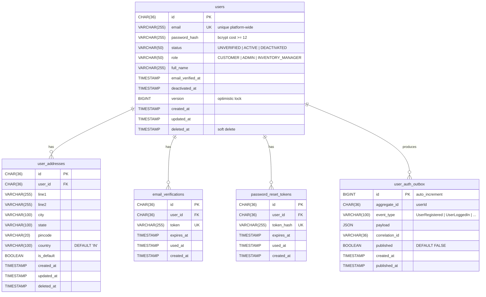
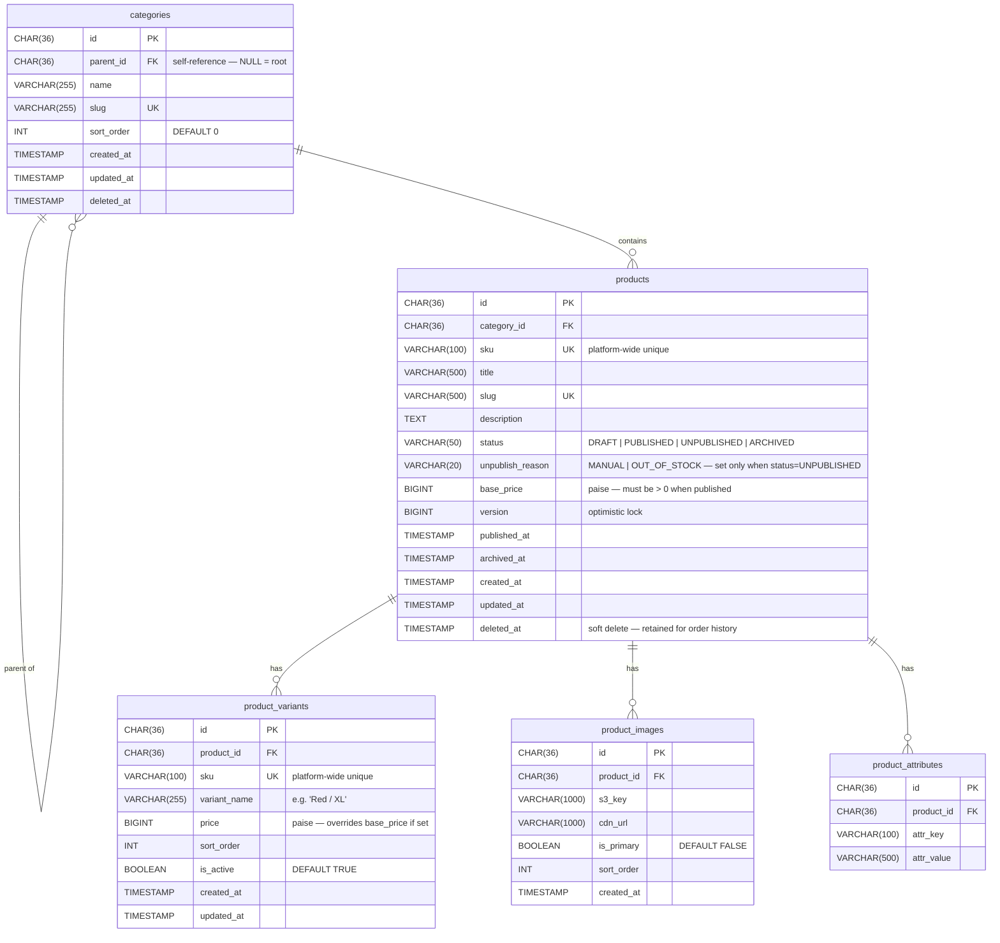
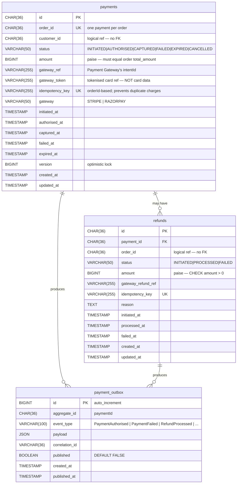
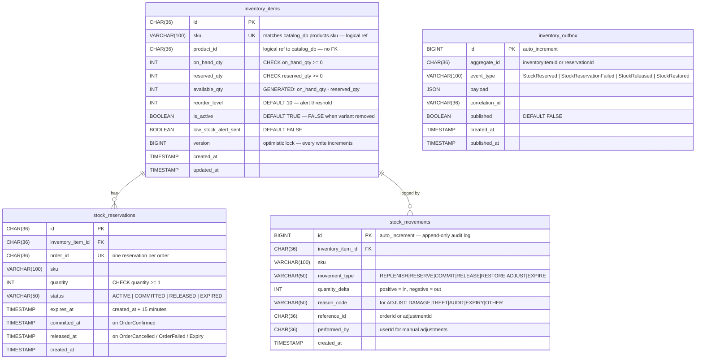
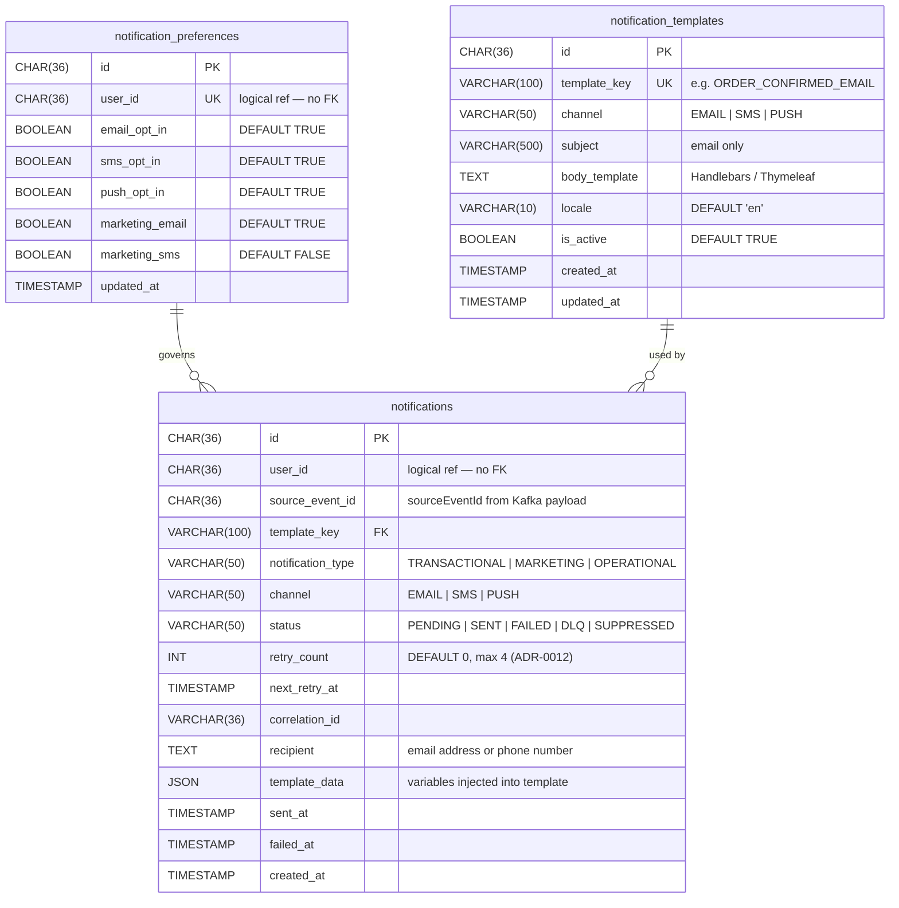

# ER Diagrams — High-Level Design

**Artefact type:** Entity-Relationship Diagrams (all 5 MySQL services)  
**Phase:** ARCH  
**Status:** Draft  
**Version:** 0.1  
**Date:** 2026-06-08  
**Author:** System Architect  
**Inputs:** `docs/hld/component-diagrams.md`, `docs/requirements/event-storming.md` v0.3

---

## 1. Scope

This document covers the relational data model for all five MySQL 8 services. Cart Service uses Redis exclusively and has no ER diagram. Notification Service schema is appended as a reference.

**Rules applied across all schemas:**

| Rule | Rationale |
|---|---|
| All monetary columns are `BIGINT` (paise) | ADR-001 — no floating-point for money |
| No foreign keys across schema boundaries | One schema per service — cross-context refs are by ID only (logical, not enforced) |
| All tables have `created_at`, `updated_at` (`TIMESTAMP DEFAULT CURRENT_TIMESTAMP`) | Audit trail and soft-delete support |
| Soft deletes via `deleted_at TIMESTAMP` where stated | Retain records for order history referential integrity |
| Outbox tables (`*_outbox`) included for saga-participant services | Transactional event publishing pattern |
| `version BIGINT DEFAULT 0` on mutable aggregates | Optimistic locking — incremented on every write |

---

## 2. User/Auth Service — `user_db`

**Aggregates:** `User`, `AuthSession`



**Indexes:**
- `users(email)` — unique, used on every login
- `users(status)` — filter active users
- `email_verifications(token)` — unique, lookup on verify
- `password_reset_tokens(token_hash)` — unique, lookup on reset
- `user_auth_outbox(published, created_at)` — outbox relay poll query

---

## 3. Product Catalog Service — `catalog_db`

**Aggregates:** `Product`, `Category`



**Indexes:**
- `products(sku)` — unique
- `products(slug)` — unique
- `products(category_id, status)` — browse by category
- `products(status, published_at)` — ordered product listings
- `products(title, description)` FULLTEXT — MySQL full-text search, primary search strategy for Phase 1 (per ADR-0013)
- `product_variants(sku)` — unique
- `product_images(product_id, is_primary)` — fetch primary image

---

## 4. Order Service — `order_db`

**Aggregates:** `Order`, `OrderLineItem`, `Return`

```mermaid
erDiagram
    orders {
        CHAR(36)        id              PK
        CHAR(36)        customer_id     "logical ref to user_db — no FK"
        VARCHAR(50)     status          "PENDING|CONFIRMED|PROCESSING|SHIPPED|DELIVERED|CANCELLED|FAILED"
        BIGINT          total_amount    "paise — immutable after OrderPlaced"
        BIGINT          discount_amount "paise — from coupon at cart checkout"
        VARCHAR(100)    coupon_code
        VARCHAR(36)     correlation_id  "from CartCheckedOut event"
        JSON            shipping_address "snapshot — address as-was at order time"
        TIMESTAMP       confirmed_at
        TIMESTAMP       shipped_at
        TIMESTAMP       delivered_at
        TIMESTAMP       cancelled_at
        BIGINT          version         "optimistic lock — prevents concurrent state changes"
        TIMESTAMP       created_at
        TIMESTAMP       updated_at
    }

    order_line_items {
        CHAR(36)        id              PK
        CHAR(36)        order_id        FK
        VARCHAR(100)    sku             "snapshot — product may be deleted later"
        CHAR(36)        product_id      "logical ref — no FK"
        VARCHAR(500)    product_name    "snapshot"
        BIGINT          unit_price      "paise — snapshotted at checkout"
        INT             quantity        "CHECK quantity >= 1"
        BIGINT          subtotal        "paise — unit_price * quantity"
        TIMESTAMP       created_at
    }

    order_notes {
        CHAR(36)        id              PK
        CHAR(36)        order_id        FK
        CHAR(36)        author_id       "userId of note author"
        VARCHAR(50)     author_role     "CUSTOMER | ADMIN"
        TEXT            content
        TIMESTAMP       created_at
    }

    returns {
        CHAR(36)        id              PK
        CHAR(36)        order_id        FK UK "one return per order"
        VARCHAR(50)     status          "REQUESTED | APPROVED | REJECTED | COMPLETED"
        TEXT            reason
        TIMESTAMP       window_expires_at   "30 days from OrderDelivered"
        TIMESTAMP       approved_at
        TIMESTAMP       rejected_at
        TIMESTAMP       created_at
        TIMESTAMP       updated_at
    }

    return_line_items {
        CHAR(36)        id              PK
        CHAR(36)        return_id       FK
        CHAR(36)        order_line_id   FK
        INT             quantity        "CHECK quantity >= 1 AND <= order_line qty"
    }

    order_outbox {
        BIGINT          id              PK "auto_increment"
        CHAR(36)        aggregate_id    "orderId"
        VARCHAR(100)    event_type      "OrderPlaced | OrderConfirmed | ..."
        JSON            payload
        VARCHAR(36)     correlation_id
        BOOLEAN         published       "DEFAULT FALSE"
        TIMESTAMP       created_at
        TIMESTAMP       published_at
    }

    orders ||--o{ order_line_items : "contains"
    orders ||--o{ order_notes : "has"
    orders ||--o| returns : "may have"
    returns ||--o{ return_line_items : "specifies"
    orders ||--o{ order_outbox : "produces"
```

**Indexes:**
- `orders(customer_id, created_at DESC)` — order history query
- `orders(status)` — admin order management
- `orders(correlation_id)` — idempotency check on `CartCheckedOut`
- `order_outbox(published, created_at)` — outbox relay poll

---

## 5. Payment Service — `payment_db`

**Aggregates:** `Payment`, `Refund`



**Constraints:**
- `CHECK (SUM(refunds.amount) <= payments.amount)` — enforced at application layer; DB constraint advisory
- `payments.gateway_token` — stores gateway payment method token only, never raw card data (PCI-DSS)

**Indexes:**
- `payments(order_id)` — unique, primary lookup
- `payments(idempotency_key)` — unique, deduplication
- `payments(gateway_ref)` — webhook lookup by gateway intent ID
- `refunds(payment_id)` — fetch all refunds for a payment
- `payment_outbox(published, created_at)` — outbox relay poll

---

## 6. Inventory Service — `inventory_db`

**Aggregates:** `InventoryItem`, `StockReservation`



**Indexes:**
- `inventory_items(sku)` — unique, primary lookup
- `inventory_items(available_qty, reorder_level)` — low-stock query
- `stock_reservations(order_id)` — unique, saga lookup
- `stock_reservations(status, expires_at)` — expiry job query
- `stock_movements(inventory_item_id, created_at DESC)` — audit history
- `inventory_outbox(published, created_at)` — relay poll query

**`inventory_outbox` scope (ADR-0014):** covers only the four saga-critical events
(`StockReserved`, `StockReservationFailed`, `StockReleased`, `StockRestored`) consumed
by `order_saga_state`'s `SagaJoinService`. `ProductOutOfStock` and
`LowStockAlertTriggered` remain direct-publish (no saga depends on them).

---

## 7. Notification Service — `notification_db`

Cart has no MySQL schema. Notification is consumer-only; its schema is reference-level.



**Key constraint:** `UNIQUE (user_id, source_event_id, channel)` on `notifications` — deduplication on Kafka replay (ADR-008 / hotspot H-NT-1).

**Indexes:**
- `notifications(user_id, created_at DESC)` — notification history
- `notifications(status, next_retry_at)` — retry scheduler poll
- `notifications(source_event_id, channel)` — deduplication check

---

## 8. Schema Isolation Summary

| Service | Schema | Tables | Outbox | Cross-schema refs |
|---|---|---|---|---|
| User/Auth | `user_db` | users, user_addresses, email_verifications, password_reset_tokens | user_auth_outbox | None |
| Product Catalog | `catalog_db` | categories, products, product_variants, product_images, product_attributes | None (Kafka publish acceptable loss) | None |
| Order | `order_db` | orders, order_line_items, order_notes, returns, return_line_items | order_outbox | customer_id → user_db (logical) |
| Payment | `payment_db` | payments, refunds | payment_outbox | order_id → order_db (logical) |
| Inventory | `inventory_db` | inventory_items, stock_reservations, stock_movements, inventory_outbox | `inventory_outbox` (StockReserved, StockReservationFailed, StockReleased, StockRestored only — ADR-0014); other events Kafka publish acceptable loss | sku → catalog_db (logical) |
| Notification | `notification_db` | notifications, notification_preferences, notification_templates | None | user_id → user_db (logical) |
| Cart | Redis only | — | — | — |

**"Logical ref"** = the ID is stored as a plain column with no `FOREIGN KEY` constraint. Referential integrity across service boundaries is maintained at the application layer, not at the DB layer.

---

## 9. Open Questions

| # | Question | Severity | Target |
|---|---|---|---|
| OQ-ER-01 | `inventory_items.available_qty` — computed column (`GENERATED ALWAYS AS (on_hand_qty - reserved_qty) STORED`) vs computed in application layer. GENERATED ensures DB-level consistency but adds MySQL version dependency. | Medium | Inventory LLD |
| OQ-ER-02 | `orders.shipping_address` stored as JSON snapshot — acceptable for Phase 1? Alternative is a dedicated `order_addresses` table. JSON is simpler but not queryable. | Low | Order LLD |
| OQ-ER-03 | `notifications` dedup key `(user_id, source_event_id, channel)` — what is `source_event_id` when the notification is triggered by an admin manual send? Needs a synthetic ID scheme. | Medium | Notification LLD |
