# SA-006: Order Lifecycle State Machine

**Artefact type:** High-Level Design  
**Phase:** ARCH  
**Bounded context:** Order  
**Status:** Draft  
**Last updated:** 2026-06-08

---

## Purpose

Defines every valid state an Order can occupy, the events that drive transitions, the
compensation actions triggered on failure paths, and the invariants the Order aggregate
must enforce. This is the authoritative reference for the Order Service state machine
implementation and the choreography saga boundaries.

---

## States

| State | Description | Terminal? |
|---|---|---|
| `CREATED` | Order record persisted; saga initiated | No |
| `PENDING_PAYMENT` | Payment authorisation in flight | No |
| `PAYMENT_FAILED` | Payment rejected; retry window open | No |
| `CONFIRMED` | Payment authorised **and** stock reserved | No |
| `PROCESSING` | Fulfilment centre accepted order; picking/packing | No |
| `CANCELLATION_REQUESTED` | Cancel requested while fulfilment in progress | No |
| `SHIPPED` | Courier collected; tracking number issued | No |
| `DELIVERED` | Delivery confirmed (or auto-confirmed after 7 days) | Quasi |
| `RETURN_REQUESTED` | Customer initiated return (within 30-day window) | No |
| `RETURN_APPROVED` | Ops approved the return | No |
| `RETURN_COMPLETED` | Physical return received; refund issued; stock restored | Yes |
| `CANCELLED` | Order voided; all reservations released | Yes |

> **DELIVERED** is quasi-terminal: it accepts a `RETURN_REQUESTED` transition within the
> 30-day return window. After that window closes the state is effectively terminal.

---

## State Diagram

```mermaid
stateDiagram-v2
    direction LR

    [*] --> CREATED : OrderPlaced

    CREATED --> PENDING_PAYMENT : initiatePayment
    CREATED --> CANCELLED : systemError

    PENDING_PAYMENT --> CONFIRMED : PaymentAuthorised ∧ StockReserved
    PENDING_PAYMENT --> PAYMENT_FAILED : PaymentFailed
    PENDING_PAYMENT --> CANCELLED : StockUnavailable → voidPayment

    PAYMENT_FAILED --> PENDING_PAYMENT : retryPayment (attempt ≤ 3)
    PAYMENT_FAILED --> CANCELLED : maxRetriesExhausted\nor CustomerCancelRequest

    CONFIRMED --> PROCESSING : FulfilmentStarted
    CONFIRMED --> CANCELLED : CustomerCancelRequest → voidPayment + releaseStock

    PROCESSING --> SHIPPED : ShipmentCreated
    PROCESSING --> CANCELLATION_REQUESTED : CustomerCancelRequest

    CANCELLATION_REQUESTED --> CANCELLED : FulfilmentCancelled → RefundProcessed + releaseStock
    CANCELLATION_REQUESTED --> SHIPPED : cannotCancel (already dispatched)

    SHIPPED --> DELIVERED : DeliveryConfirmed\nor autoConfirm (+7 days)

    DELIVERED --> RETURN_REQUESTED : ReturnRequested (≤ 30 days)

    RETURN_REQUESTED --> RETURN_APPROVED : ReturnApproved (ops)
    RETURN_REQUESTED --> DELIVERED : ReturnRejected

    RETURN_APPROVED --> RETURN_COMPLETED : RefundProcessed ∧ StockRestored

    CANCELLED --> [*]
    RETURN_COMPLETED --> [*]
```



---

## Transition Table

| # | From | To | Trigger | Actor | Domain Event Published | Compensation |
|---|---|---|---|---|---|---|
| T-01 | `[*]` | `CREATED` | Customer submits checkout | Customer | `OrderPlaced` | — |
| T-02 | `CREATED` | `PENDING_PAYMENT` | Order Service initiates payment | Order Svc | — | — |
| T-03 | `CREATED` | `CANCELLED` | System error pre-payment | System | `OrderCancelled` | — |
| T-04 | `PENDING_PAYMENT` | `CONFIRMED` | `PaymentAuthorised` + `StockReserved` | Payment + Inventory (via Kafka) | `OrderConfirmed` | — |
| T-05 | `PENDING_PAYMENT` | `PAYMENT_FAILED` | `PaymentFailed` event received | Payment Svc | — | Hold stock reservation |
| T-06 | `PENDING_PAYMENT` | `CANCELLED` | `StockUnavailable` → saga voids payment | Inventory Svc | `OrderCancelled` | `PaymentVoided` |
| T-07 | `PAYMENT_FAILED` | `PENDING_PAYMENT` | Retry (attempt ≤ 3) | Order Svc (scheduler) | `PaymentRetryInitiated` | — |
| T-08 | `PAYMENT_FAILED` | `CANCELLED` | Max retries exhausted or customer cancel | Timer / Customer | `OrderCancelled` | Release stock reservation |
| T-09 | `CONFIRMED` | `PROCESSING` | `FulfilmentStarted` event | Inventory Svc | — | — |
| T-10 | `CONFIRMED` | `CANCELLED` | `CustomerCancelRequest` (pre-fulfilment) | Customer | `OrderCancelled` | `PaymentVoided`, `StockReleased` |
| T-11 | `PROCESSING` | `SHIPPED` | `ShipmentCreated` event | Fulfilment Svc | `OrderShipped` | — |
| T-12 | `PROCESSING` | `CANCELLATION_REQUESTED` | `CustomerCancelRequest` (in-fulfilment) | Customer | `CancellationRequested` | — |
| T-13 | `CANCELLATION_REQUESTED` | `CANCELLED` | `FulfilmentCancelled` | Fulfilment Svc | `OrderCancelled` | `RefundProcessed`, `StockReleased` |
| T-14 | `CANCELLATION_REQUESTED` | `SHIPPED` | Already dispatched — cancel rejected | Fulfilment Svc | `CancellationRejected`, `OrderShipped` | — |
| T-15 | `SHIPPED` | `DELIVERED` | `DeliveryConfirmed` or +7-day auto | Courier / Timer | `OrderDelivered` | — |
| T-16 | `DELIVERED` | `RETURN_REQUESTED` | Customer requests return (≤ 30 days) | Customer | `ReturnRequested` | — |
| T-17 | `RETURN_REQUESTED` | `RETURN_APPROVED` | Ops approves return | Ops | `ReturnApproved` | — |
| T-18 | `RETURN_REQUESTED` | `DELIVERED` | Ops rejects return | Ops | `ReturnRejected` | — |
| T-19 | `RETURN_APPROVED` | `RETURN_COMPLETED` | `RefundProcessed` + `StockRestored` received | Payment + Inventory (via Kafka) | `ReturnCompleted` | — |

---

## Saga Boundaries

### Saga A — Order Confirmation (Happy Path)
Spans Order + Payment + Inventory.

```
OrderPlaced
  → Payment.authorise()          [PaymentAuthorised]
  → Inventory.reserveStock()     [StockReserved]
  → Order transitions CONFIRMED  [OrderConfirmed]
```

Both `PaymentAuthorised` and `StockReserved` must arrive before `CONFIRMED` is set.
Order Service uses a correlated event join keyed on `orderId`.

### Saga B — Payment Failure
```
PaymentFailed
  → Order → PAYMENT_FAILED
  → if retries < 3: emit PaymentRetryInitiated → back to PENDING_PAYMENT
  → if retries == 3: emit OrderCancelled → Inventory.releaseStock()
```

### Saga C — Stock Unavailable
```
StockUnavailable (after PaymentAuthorised)
  → Payment.void(paymentId)      [PaymentVoided]
  → Order → CANCELLED            [OrderCancelled]
```

### Saga D — Cancellation During Processing
```
CustomerCancelRequest (state=PROCESSING)
  → Order → CANCELLATION_REQUESTED
  → Fulfilment.cancelOrder()
    → FulfilmentCancelled: Order → CANCELLED, Payment.refund(), Inventory.release()
    → CannotCancel: Order → SHIPPED, notify customer
```

### Saga E — Return Flow
```
ReturnRequested
  → Ops approval
    → Approved: Order → RETURN_APPROVED
      → Inventory.restoreStock()    [StockRestored]
      → Payment.refund()            [RefundProcessed]
      → Order → RETURN_COMPLETED
    → Rejected: Order → DELIVERED
```

---

## Aggregate Invariants

| # | Invariant | Enforcement |
|---|---|---|
| INV-01 | `total_amount` is immutable once `CREATED` | Column write-blocked after insert; no UPDATE on `total_amount` |
| INV-02 | Only one active payment per order | `payments.order_id UNIQUE` constraint |
| INV-03 | Retry count ≤ 3 before forced `CANCELLED` | Order Service checks `payment_retry_count` before T-07 |
| INV-04 | Return window: 30 days from `delivered_at` | Order Service validates `now() - delivered_at ≤ 30d` before accepting T-16 |
| INV-05 | `CANCELLATION_REQUESTED` is only reachable from `PROCESSING` | State machine guard in `OrderAggregate.cancel()` |
| INV-06 | Terminal states (`CANCELLED`, `RETURN_COMPLETED`) admit no further transitions | Guard: `if (status.isTerminal()) throw IllegalStateTransitionException` |
| INV-07 | Optimistic locking on every status mutation | `version` column; ORM raises `OptimisticLockException` on conflict |

---

## Timer / Scheduler Events

| Event | Trigger | Action |
|---|---|---|
| `auto-confirm` | +7 days after `ShipmentCreated` if no `DeliveryConfirmed` | T-15: SHIPPED → DELIVERED |
| `payment-retry` | +15 min after `PaymentFailed` (attempts 1–2), +30 min (attempt 3) | T-07: PAYMENT_FAILED → PENDING_PAYMENT |
| `retry-exhausted` | After attempt 3 retry timer fires | T-08: PAYMENT_FAILED → CANCELLED |
| `return-window-close` | +30 days after `delivered_at` | Mark order permanently terminal; reject any future T-16 |

Timers are implemented as Kafka Streams punctuators in Phase 1 and EventBridge Scheduler rules in Phase 2.

---

## Domain Events Catalogue (Order Context)

| Event | Published on Transition | Consumers |
|---|---|---|
| `OrderPlaced` | T-01 | Payment, Notification |
| `OrderConfirmed` | T-04 | Notification, Inventory (fulfilment start) |
| `OrderCancelled` | T-03, T-06, T-08, T-10, T-13 | Payment, Inventory, Notification |
| `PaymentRetryInitiated` | T-07 | Payment, Notification |
| `CancellationRequested` | T-12 | Fulfilment, Notification |
| `CancellationRejected` | T-14 | Notification |
| `OrderShipped` | T-11, T-14 | Notification |
| `OrderDelivered` | T-15 | Notification |
| `ReturnRequested` | T-16 | Notification |
| `ReturnApproved` | T-17 | Payment, Inventory, Notification |
| `ReturnRejected` | T-18 | Notification |
| `ReturnCompleted` | T-19 | Notification |

All events are written to `order_outbox` in the same DB transaction as the state mutation
(transactional outbox pattern — see ADR-003).

---

## Phase 2 Delta (AWS Serverless)

| Concern | Phase 1 | Phase 2 |
|---|---|---|
| State persistence | `orders.status` column, MySQL | DynamoDB item attribute + TTL for timer records |
| Timer events | Kafka Streams punctuator | EventBridge Scheduler (one rule per timer per order) |
| Saga coordination | Choreography via Kafka events | AWS Step Functions (express workflow) for confirmation saga; EventBridge for cancellation/return |
| Optimistic locking | MySQL `version` column + JPA | DynamoDB conditional write (`ConditionExpression: version = :expected`) |
| Outbox relay | Kafka producer via DB polling | DynamoDB Streams → Lambda → EventBridge |

The Step Functions choice for the confirmation saga (Phase 2) is justified by the need
to coordinate two parallel async responses (`PaymentAuthorised` + `StockReserved`) with
a timeout — expressible cleanly as a `.waitForTaskToken` state with a parallel branch.

---

## Open Questions

| ID | Question | Owner | Target |
|---|---|---|---|
| OQ-SM-01 | Should `CANCELLATION_REQUESTED` expose a customer-visible status or map to `PROCESSING` in the public API? | Architect + PM | LLD sprint |
| OQ-SM-02 | What is the SLA for Fulfilment to respond to a cancel request? Needed to set the `CANCELLATION_REQUESTED` timeout. | PM + Ops | RE phase gap |
| OQ-SM-03 | Partial delivery (some items delivered, some lost in transit) — is this in scope for Phase 1? | PM | Backlog refinement |
