# Sequence Diagrams — High-Level Design

**Artefact type:** Cross-service sequence diagrams  
**Phase:** ARCH  
**Status:** Draft  
**Version:** 0.1  
**Date:** 2026-06-08  
**Author:** System Architect  
**Inputs:** `docs/hld/component-diagrams.md`, `docs/requirements/event-storming.md` v0.3

---

## 1. Scope

This document covers all key cross-service flows, expanding on the event storming saga diagrams with implementation-level detail:

- Solid arrows `→` = synchronous REST/HTTP call (caller waits for response)
- Dashed arrows `-->` = asynchronous Kafka event (fire and forget; consumer processes independently)
- All flows carry `X-Correlation-ID` header (HTTP) or `correlationId` field (Kafka event payload)
- Monetary amounts in all diagrams are in **paise (integer)** per ADR-001

---

## 2. Flow Index

| # | Flow | Type | Services involved |
|---|---|---|---|
| SD-01 | User Registration + Email Verification | Auth | User/Auth, Notification |
| SD-02 | User Login + Guest Cart Merge | Auth | User/Auth, Cart |
| SD-03 | Refresh Token Rotation | Auth | User/Auth |
| SD-04 | Product Search | Read | API Gateway, Product Catalog, Search Index |
| SD-05 | Add Item to Cart | Write | Cart |
| SD-06 | Checkout → Order Placement (Saga A — Happy Path) | Saga | Cart, Order, Inventory, Payment, Notification |
| SD-07 | Payment Failure Compensation (Saga B) | Saga | Payment, Order, Inventory, Cart, Notification |
| SD-08 | Stock Unavailable Compensation (Saga C) | Saga | Order, Inventory, Cart, Notification |
| SD-09 | Order Cancellation + Refund (Saga D) | Saga | Order, Inventory, Payment, Notification |
| SD-10 | Stockout → Catalog Unpublish (Saga E) | Saga | Inventory, Product Catalog, Notification |
| SD-11 | Notification Retry + DLQ Escalation | Infra | Notification, Email Provider |
| SD-12 | Admin: Manual Stock Replenishment | Write | Inventory, Product Catalog, Notification |

---

## 3. SD-01 — User Registration + Email Verification

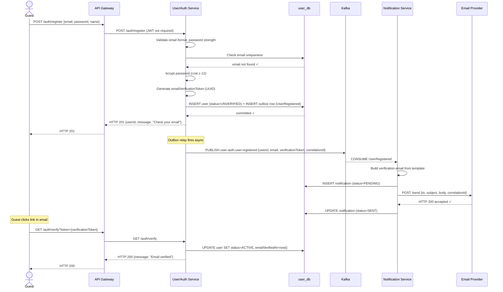

---

## 4. SD-02 — User Login + Guest Cart Merge

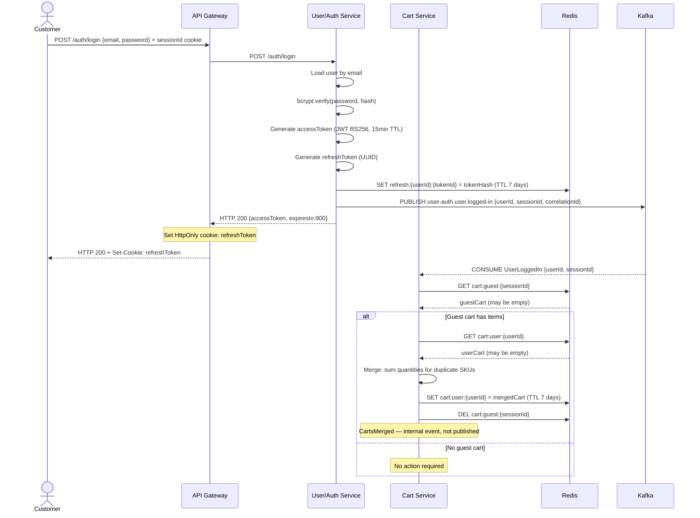

---

## 5. SD-03 — Refresh Token Rotation

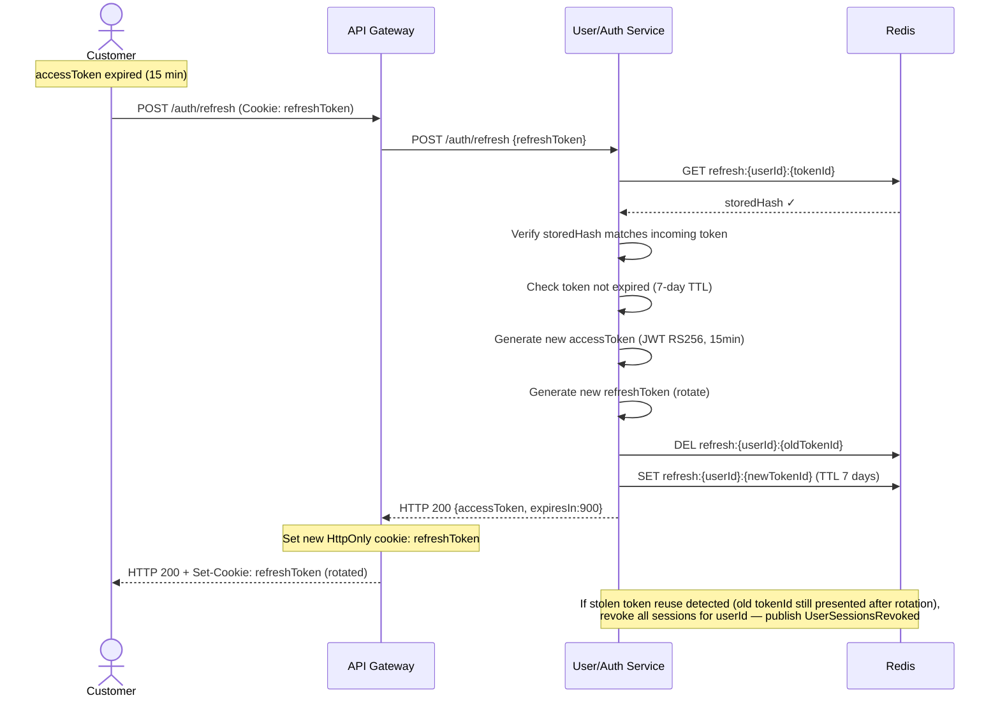

---

## 6. SD-04 — Product Search

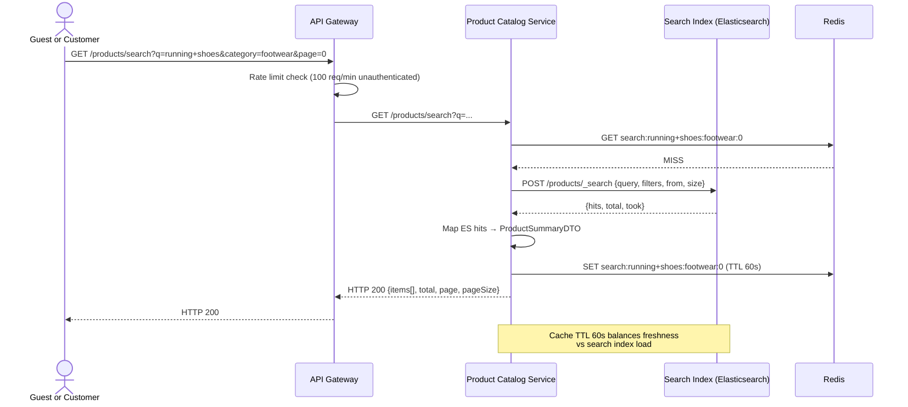

---

## 7. SD-05 — Add Item to Cart

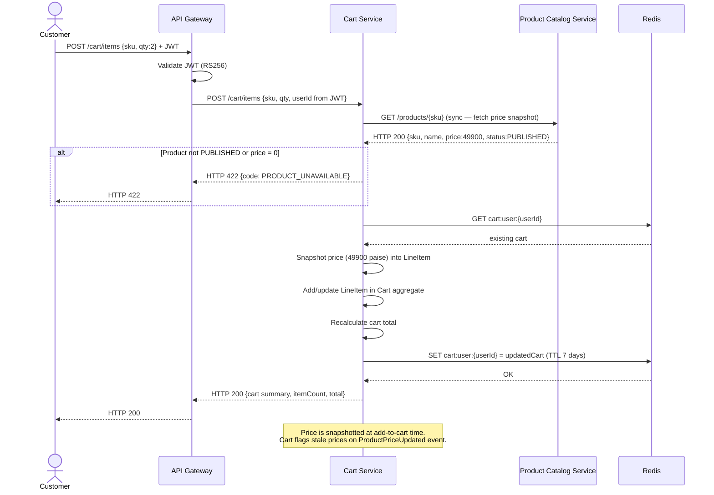

---

## 8. SD-06 — Checkout → Order Placement (Saga A — Happy Path)

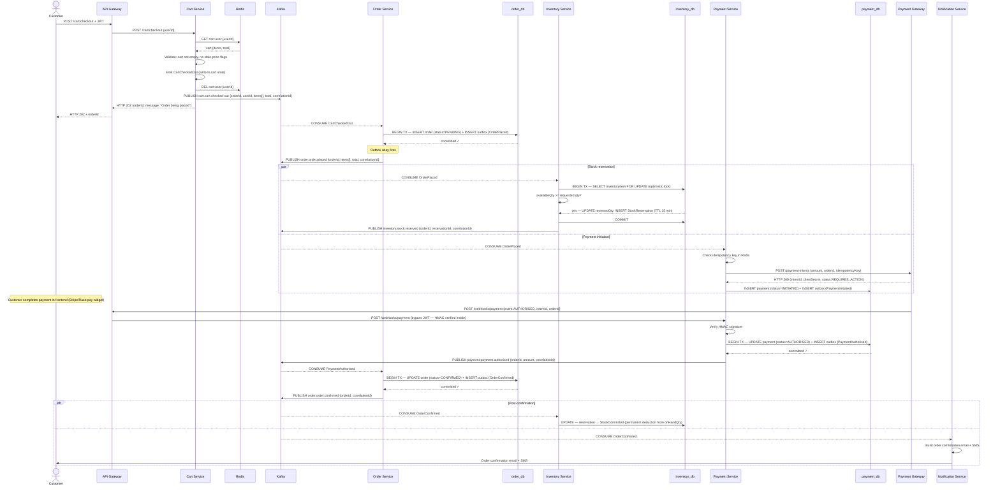

---

## 9. SD-07 — Payment Failure Compensation (Saga B)

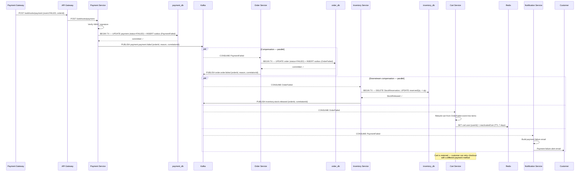

---

## 10. SD-08 — Stock Unavailable Compensation (Saga C)

```mermaid
sequenceDiagram
    participant Kafka
    participant OS as Order Service
    participant ODB as order_db
    participant IS as Inventory Service
    participant IDB as inventory_db
    participant CS as Cart Service
    participant Redis
    participant NS as Notification Service

    Note over IS: OrderPlaced consumed; availableQty < requested qty
    IS->>IDB: No reservation written — constraint violated
    IS->>Kafka: PUBLISH inventory.stock.reservation-failed {orderId, sku, requestedQty, availableQty, correlationId}

    Kafka-->>OS: CONSUME StockReservationFailed
    OS->>ODB: BEGIN TX — UPDATE order (status=FAILED) + INSERT outbox (OrderFailed)
    ODB-->>OS: committed ✓
    OS->>Kafka: PUBLISH order.order.failed {orderId, reason:STOCK_UNAVAILABLE, correlationId}

    par Downstream compensation — parallel
        Kafka-->>CS: CONSUME OrderFailed
        CS->>CS: Rebuild cart from order line items
        CS->>Redis: SET cart:user:{userId} = reactivatedCart (TTL 7 days)
    and
        Kafka-->>NS: CONSUME OrderFailed
        NS->>NS: Build stock unavailable email
        NS->>Customer: "Item out of stock" email + cart restored message
    end

    Note over OS,IS: Payment service also consumes OrderFailed —<br/>if payment was INITIATED but not yet AUTHORISED,<br/>cancel the payment intent with the gateway
```

---

## 11. SD-09 — Order Cancellation + Refund (Saga D)

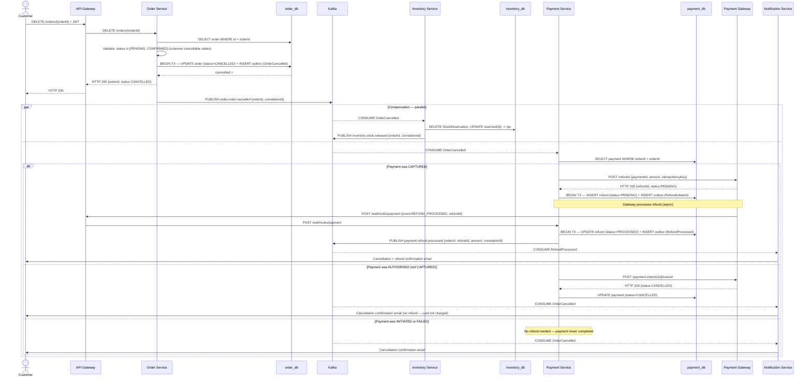

---

## 12. SD-10 — Stockout → Catalog Unpublish (Saga E)

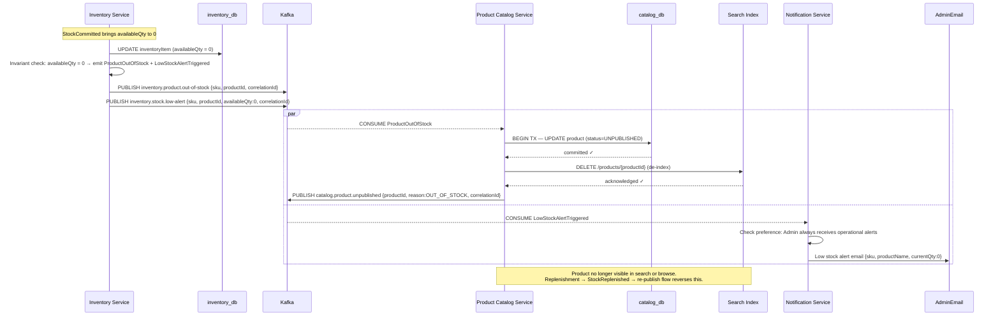

---

## 13. SD-11 — Notification Retry + DLQ Escalation

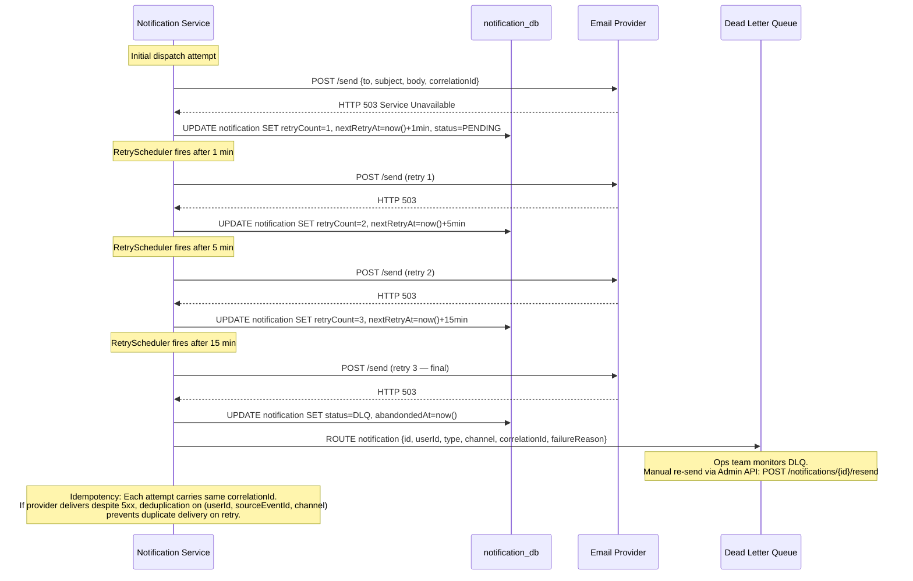

---

## 14. SD-12 — Admin: Manual Stock Replenishment

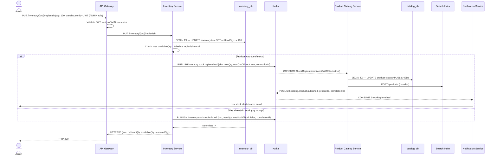

---

## 15. Timing and TTL Summary

| Flow | TTL / Timeout | What happens on expiry |
|---|---|---|
| Guest cart (Redis) | 30 minutes inactivity | Cart deleted; `CartAbandoned` event published → abandonment email |
| Authenticated cart (Redis) | 7 days | Cart deleted; no abandonment email for logged-in users |
| Payment intent (15 min) | 15 min after `OrderPlaced` | `PaymentExpired` event → Order fails → stock released → cart reactivated |
| Stock reservation | 15 min TTL on `StockReservation` row | `ReservationExpired` → `StockReleased` event |
| Refresh token | 7 days | Token invalid; user must re-login |
| Access token (JWT) | 15 min | Token rejected at gateway; client must call `/auth/refresh` |
| Notification retry back-off | 1 min → 5 min → 15 min | After 3rd failure → routed to DLQ |
| Return window | 30 days from `OrderDelivered` | `ReturnWindowExpired` event; return requests rejected after this |

---

## 16. Open Questions

| # | Question | Severity | Flow affected | Target ADR |
|---|---|---|---|---|
| OQ-SD-01 | In SD-06, Payment and Inventory consume `OrderPlaced` in parallel. If Inventory reservation fails and Payment is already AUTHORISED — which service detects and compensates? Order service must handle a `StockReservationFailed` arriving after `PaymentAuthorised`. | High | SD-06 / SD-08 | ADR-003 (saga) |
| OQ-SD-02 | In SD-06, should Cart validate stock before calling checkout, or rely on the saga? Sync pre-check reduces failure rate but adds Cart→Inventory coupling. | High | SD-05 / SD-06 | OQ-C3-01 |
| OQ-SD-03 | In SD-09, if the refund webhook from the gateway never arrives — when does the Order consider the refund resolved? Reconciliation job needed. | Medium | SD-09 | ADR-004 |
| OQ-SD-04 | In SD-11, should retry scheduling use in-process `@Scheduled` or a dedicated Kafka retry topic (more resilient on service restart)? | Medium | SD-11 | ADR-008 |
