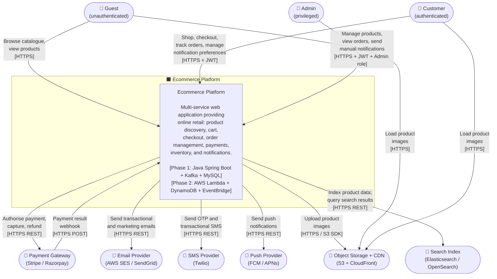

# System Context — High-Level Design

**Artefact type:** C4 Level 1 — System Context  
**Phase:** ARCH  
**Status:** Draft  
**Version:** 0.1  
**Date:** 2026-06-08  
**Author:** System Architect  
**Inputs:** `docs/requirements/event-storming.md` v0.3, `docs/requirements/non-functional-requirements.md`

---

## 1. Scope

This document defines the system boundary of the **Ecommerce Platform**, identifies all human actors and external system dependencies, and describes the nature of each interaction at a technology-agnostic level.

It does **not** show internal microservices, databases, or infrastructure — that is the responsibility of the C4 Level 2 Container diagram (`docs/hld/container-diagram.md`).

---

## 2. NFR Targets This Design Must Satisfy

| ID | Requirement | Target |
|---|---|---|
| NFR-AVAIL-001 | Overall platform uptime | 99.9% (≤ 8.7 h downtime / year) |
| NFR-AVAIL-002 | Order and Payment service uptime | 99.95% (≤ 4.4 h / year) |
| NFR-PERF-001 | Product search response time | p95 < 200 ms, p99 < 500 ms |
| NFR-PERF-004 | Order placement end-to-end | p99 < 500 ms |
| NFR-SCALE-001 | Concurrent active users | 10,000 (horizontal pod scaling) |
| NFR-SCALE-002 | Peak orders per minute | 500 orders / min (flash-sale scenario) |
| NFR-SEC-001 | Auth token algorithm | JWT RS256; access TTL 15 min; refresh TTL 7 days |

Failure of any external dependency (Payment Gateway, Email / SMS provider) must not bring down the platform — each must degrade gracefully as described in §5.

---

## 3. Actors

| Actor | Type | Description |
|---|---|---|
| **Guest** | Human — unauthenticated | Browses the catalogue, views product details, adds items to a session cart. Cannot place orders. |
| **Customer** | Human — authenticated | Full platform access: checkout, order tracking, notification preferences, returns. |
| **Admin** | Human — privileged | Manages products and pricing, views all orders, triggers manual notifications, monitors platform health. |

---

## 4. External Systems

| System | Technology options | Interaction direction | Protocol |
|---|---|---|---|
| **Payment Gateway** | Stripe / Razorpay | Bidirectional | HTTPS REST + Webhooks |
| **Email Provider** | AWS SES / SendGrid | Outbound only | HTTPS REST / SMTP |
| **SMS Provider** | Twilio | Outbound only | HTTPS REST |
| **Push Notification Provider** | Firebase FCM / Apple APNs | Outbound only | HTTPS REST |
| **Object Storage + CDN** | AWS S3 + CloudFront | Outbound (upload) / Inbound (read by browser) | HTTPS |
| **Search Index** | Elasticsearch / OpenSearch | Bidirectional | HTTPS REST |

---

## 5. C4 Level 1 — System Context Diagram

---

## 6. Interaction Descriptions

### 6.1 Guest → Platform

Guests interact exclusively over HTTPS with no authentication token. They can:
- Browse and search the product catalogue (read-only)
- View product detail pages (images served via CDN, not the platform API)
- Add items to a session-scoped cart (identified by a session cookie, stored in Redis with 30-minute TTL)

**Constraint:** Guest sessions must not require a database write on every page view — session state is Redis-only.

### 6.2 Customer → Platform

Customers interact over HTTPS with a short-lived JWT (RS256, 15-minute TTL). On login, a 7-day refresh token is issued and stored in Redis. They can perform all guest actions plus:
- Place and pay for orders (triggers the Order → Payment → Inventory saga)
- Track order status in real time
- Manage notification preferences (opt in / out of marketing emails and SMS)
- Request returns and cancellations

### 6.3 Admin → Platform

Admins carry a JWT with an `ADMIN` role claim, verified on every privileged request. They can:
- Create, update, and unpublish products and pricing
- View and manage all orders across customers
- Trigger manual notification sends (e.g., system-wide alerts)
- Access operational dashboards (served by the observability stack, not the platform API)

### 6.4 Platform → Payment Gateway (bidirectional)

The platform initiates synchronous HTTPS calls to the gateway to:
- Create a payment session / intent
- Capture an authorised payment
- Issue a refund

The Payment Gateway calls back to the platform via a signed webhook (`PaymentCaptured`, `PaymentFailed`, `RefundProcessed`). The platform must validate the webhook signature before processing.

**Failure mode:** If the gateway is unreachable, the platform returns HTTP 503 to the customer, does not persist the order, and logs the failure with a `correlationId`. No silent retries at the API layer — retry is handled by the Payment service's outbox relay.

### 6.5 Platform → Email / SMS / Push Providers (outbound only)

The Notification service dispatches all messages asynchronously after consuming domain events from Kafka (Phase 1) or EventBridge (Phase 2). The platform never waits on a provider response before returning to the customer.

- **Email:** Transactional (order confirmation, shipping, refund) and marketing (cart abandonment, promotions).
- **SMS:** OTP for login/registration; transactional shipping alerts.
- **Push:** Shipping updates; payment failure alerts (if the customer has consented).

**Failure mode:** Up to 3 retries with exponential back-off (1 min → 5 min → 15 min). After the third failure the notification is routed to the Dead Letter Queue and a `NotificationFailed` event is recorded. The customer-facing order flow is never blocked by a notification failure.

### 6.6 Platform ↔ Object Storage + CDN

Product images are uploaded by Admin via the platform API, which writes directly to S3. The CDN URL is stored as a product attribute. Customer and Guest browsers load images directly from CloudFront — the platform API is not in the image-serving path.

### 6.7 Platform ↔ Search Index

The Product Catalog service syncs product data to the search index on every create / update / unpublish event. Search queries from customers are proxied through the platform API (the client never calls the search index directly). 

**Decision deferred to ADR-010:** Whether MySQL 8 full-text search is sufficient for Phase 1 or whether a dedicated Elasticsearch cluster is required from day one.

---

## 7. Failure Modes and Mitigations

| External dependency | Failure scenario | Platform behaviour | Customer impact |
|---|---|---|---|
| Payment Gateway — unavailable | Gateway returns 5xx or times out (> 3 s) | Order not persisted; HTTP 503 returned; failure logged with `correlationId` | Cannot complete checkout; shown retry message |
| Payment Gateway — webhook lost | Webhook not delivered within 5 min | Reconciliation job polls gateway for payment status every 10 min | Order stays in `PAYMENT_PENDING` up to 10 min |
| Email Provider — unavailable | Provider returns 5xx | Notification retried up to 3× with back-off; routed to DLQ on 4th failure | Email delayed or lost; order is not affected |
| SMS Provider — unavailable | Provider returns 5xx | Same retry + DLQ as email | SMS delayed or lost; order is not affected |
| Push Provider — unavailable | Provider returns 5xx | Same retry + DLQ as email | Push delayed; not critical |
| Search Index — unavailable | Index query times out | Fallback to MySQL full-text search for the session | Slower search; reduced relevance |
| CDN — unavailable | Image requests return 4xx / 5xx | Browsers show broken image placeholder; API is unaffected | Product images not visible |

---

## 8. Security Boundaries

- All inbound traffic from actors arrives at an API Gateway / Ingress (Phase 1) or AWS API Gateway (Phase 2). No service is exposed directly to the internet.
- JWT tokens are validated at the gateway edge before requests reach any microservice.
- Webhook payloads from the Payment Gateway are validated using HMAC signature verification before being processed.
- Admin endpoints are protected by role-based access control (`ADMIN` claim check) in addition to JWT validation.
- No card data (PAN, CVV) is processed or stored by the platform. All payment data is tokenised by the Payment Gateway. (PCI-DSS scope reduction.)

---

## 9. Open Questions / ADR Candidates

| # | Question | Severity | Target ADR |
|---|---|---|---|
| OQ-SC-01 | Stripe vs Razorpay — which gateway for Phase 1? Razorpay favoured for INR market; Stripe for international. | Medium | ADR to be raised if scope requires multi-currency |
| OQ-SC-02 | Is Elasticsearch required from Phase 1, or is MySQL full-text search sufficient until Phase 2? | High | ADR-010 |
| OQ-SC-03 | Should the CDN also serve the API (via edge caching) or only static assets? | Low | Note in deployment architecture HLD |
| OQ-SC-04 | Admin dashboard — separate frontend app or embedded in the same SPA? Affects auth token scoping. | Medium | Clarify with Product Owner before IMPL |

---

## 10. Next Artefact

**SA-002 — C4 Level 2 Container Diagram** (`docs/hld/container-diagram.md`)

The Level 2 diagram will show all 7 microservices as containers, the API Gateway, Kafka broker, MySQL instances, Redis, and the communication paths between them. It depends on this document being accepted.
