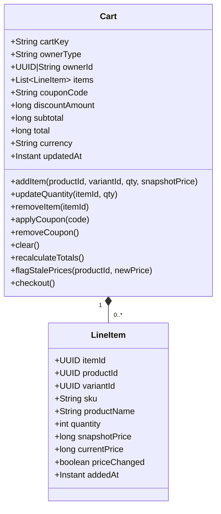
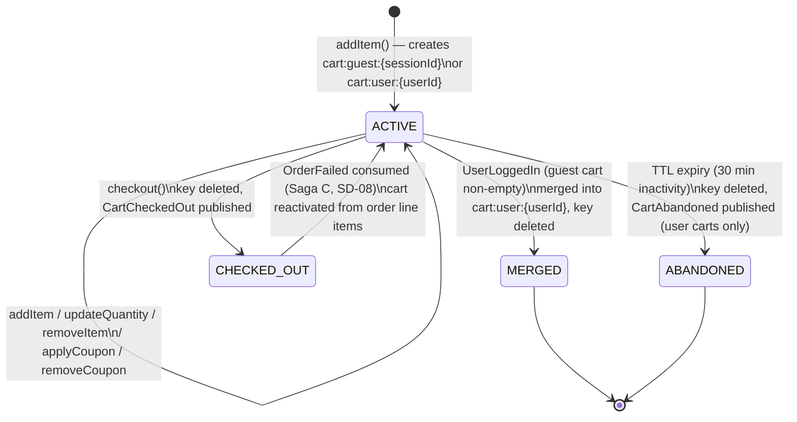
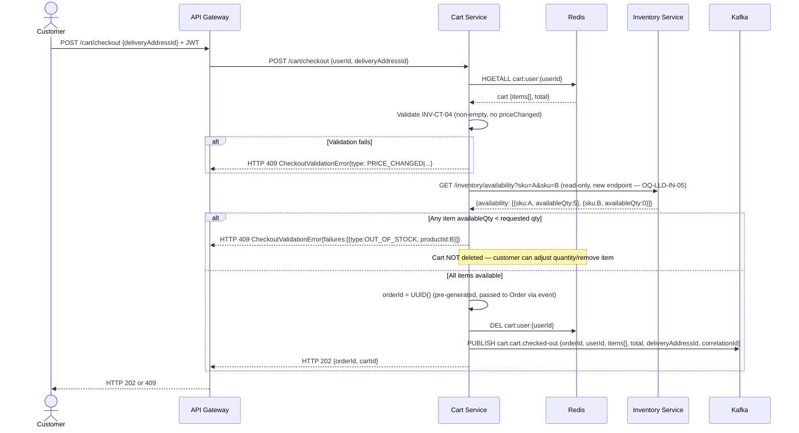
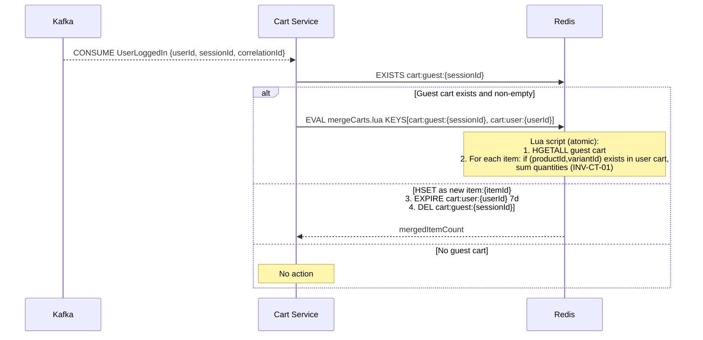

# Cart Service — Low-Level Design

**Artefact type:** LLD (C4 Level 4)
**Phase:** ARCH
**Bounded context:** Cart
**Status:** Draft
**Version:** 0.1
**Date:** 2026-06-11
**Author:** System Architect
**Inputs:**
- `docs/hld/container-diagram.md` v0.1 §3, §5, §6 (Redis Namespace Map), §8
- `docs/hld/component-diagrams.md` v0.1 §5
- `docs/hld/sequence-diagrams.md` v0.1 (SD-02, SD-05, SD-06, SD-08, §15, §16 OQ-SD-01/02)
- `docs/adr/ADR-0010-cart-storage.md` (Redis-only — partially superseded, see §7)
- `docs/adr/ADR-0008-database-per-service.md`
- `docs/lld/product-catalog-lld.md` (SA-013) — `ProductSummary`/`ProductDetail` API contract for price snapshot
- `docs/lld/inventory-lld.md` (SA-017) — `inventory.*` event catalogue, OQ-LLD-IN-05 (no API spec yet)
- `docs/requirements/use-cases/cart-use-cases.md`
- `docs/api-specs/cart-service-api.yaml`

---

## 1. Scope

This document is the implementation-ready design for the **Cart Service** — a
session/identity-scoped, Redis-resident aggregate with no relational schema, and the
**originating participant of Saga A** (`sequence-diagrams.md` SD-06 — checkout →
order placement) and a compensation target of **Saga C** (SD-08 — stock-unavailable
cart reactivation).

**Covers:**
- Aggregate model (`Cart`, `LineItem`) and Cart lifecycle (`ACTIVE → CHECKED_OUT /
  ABANDONED / MERGED`)
- Redis schema refinement (§7) — reconciles `ADR-0010` (JSON blob, 30d/24h TTL, no
  itemId) against `component-diagrams.md` §5 and `container-diagram.md` §6 (Redis
  Hash, 7d/30min TTL) and `cart-service-api.yaml` (requires per-item `itemId`)
- **Checkout stock-validation strategy** (§6) — resolves **OQ-C3-01** /
  **OQ-SD-02** ("should Cart validate stock synchronously before checkout?"),
  flagged in `sequence-diagrams.md` §16 as *"Architect — resolve before Cart LLD"*
- Sequence diagrams refining the Cart-side halves of SD-02 (guest merge), SD-05
  (add item), SD-06 (checkout), SD-08 (reactivation)
- Saga/event participation: published `cart.*` events, consumed events for
  reactivation and price-staleness flags
- API contract reconciliation (`cart-service-api.yaml`)
- Consistency strategy for a store with no transactions across keys

**Does not cover:**
- Order/Payment/Inventory internals — already finalised in their own LLDs
- Coupon/Promo Service implementation — `cart-use-cases.md` references an external
  "Coupon / Promo Service" actor, but no such bounded context exists in `CLAUDE.md`'s
  seven-context list. This LLD treats coupon validation as an **in-process static
  rule table** within Cart Service for Phase 1 (flagged **OQ-LLD-CT-06**)
- Tax calculation — `CartSummary.tax` exists in the API schema but no tax rule engine
  is defined anywhere (flagged **OQ-LLD-CT-07**)

---

## 2. NFR Targets

| NFR | Target | Source |
|---|---|---|
| NFR-PERF-003 | Add-to-cart responds in < 50 ms P99 (Redis GET/SET dominates; Catalog price lookup < 5 ms) | ADR-0010 |
| NFR-AVAIL-002 | 99.9% availability | NFR doc |
| NFR-CONS-003 | Guest cart merge is atomic — no partial merges on Redis failure mid-operation | ADR-0010 (Negative consequences) |
| NFR-SCALE-003 | 10K concurrent carts in memory (~50 MB) | ADR-0010 |

---

## 3. Aggregate Model



**Aggregate boundaries:**
- `Cart` is the sole aggregate. It has **no relational persistence** — Redis is the
  system of record (ADR-0010). There is no `cart_db`.
- `cartKey` is `cart:user:{userId}` for authenticated users or `cart:guest:{sessionId}`
  for guests — `ownerType ∈ {USER, GUEST}` distinguishes the two for merge/abandonment
  logic (§5).
- Each `LineItem` gets a server-generated `itemId` (UUID) at `addItem()` time. **This
  is new versus ADR-0010's `{variantId, qty, priceSnapshot, addedAt}` shape** — added
  because `cart-service-api.yaml`'s `PATCH/DELETE /cart/items/{itemId}` requires a
  stable per-line identifier independent of `variantId` (a customer could in principle
  add the same variant twice with different... no — INV-CT-01 below prevents that, but
  `itemId` is still needed as the URL-addressable resource ID). Tracked as
  **OQ-LLD-CT-05**.

**Invariants:**

| ID | Invariant |
|---|---|
| INV-CT-01 | At most one `LineItem` per `(productId, variantId)` pair — `addItem()` for an existing pair increments `quantity` rather than creating a duplicate row |
| INV-CT-02 | `quantity >= 1` — `updateQuantity(itemId, 0)` is equivalent to `removeItem(itemId)` |
| INV-CT-03 | `snapshotPrice` is immutable once set; only `currentPrice`/`priceChanged` are refreshed on cart read (§8 LLD-SD-01) |
| INV-CT-04 | `checkout()` requires `items.length > 0` and `priceChanged == false` for all items (per SD-06: "Validate: cart not empty, no stale-price flags") |

**Domain Events Published:**

| Event | Trigger | Payload (key fields) |
|---|---|---|
| `CartCheckedOut` | `Cart.checkout()` succeeds | `orderId (pre-generated), userId, items[], total, deliveryAddressId, correlationId` |
| `CartAbandoned` | TTL expiry on `cart:user:{userId}` (30 min inactivity, §7) | `userId, items[], lastUpdatedAt, correlationId` |

`CartAbandoned` is published **only for `cart:user:{*}` keys** — guest carts
(`cart:guest:{*}`) have no addressable user/email and expiring them is silent cleanup,
not a marketing trigger. Tracked as **OQ-LLD-CT-08** (UC-CT-10/UC-NT-05 don't make this
distinction explicit).

---

## 4. Component Structure (refines `component-diagrams.md` §5)

The existing component diagram's shape (`CartController` → `CartService` →
`Cart`/`LineItem` domain objects → `CartRepository` (Redis Hash adapter) +
`KafkaEventPublisher`) is **structurally correct**. This LLD adds:

- **`CouponValidator`** (new, application/) — in-process static rule lookup for
  `applyCoupon`/`removeCoupon` (§1 scope note, OQ-LLD-CT-06). Not present in
  `component-diagrams.md` §5.
- **`InventoryAvailabilityClient`** (new, infrastructure/) — synchronous REST client
  to Inventory's (not-yet-specified) `GET /inventory/availability?sku=...` endpoint,
  used only at checkout for the fail-fast pre-check (§6). Cross-references
  **OQ-LLD-IN-05** (`inventory-service-api.yaml` doesn't exist yet) — this LLD adds a
  new requirement to that future spec.
- `CartRepository` operates on **Redis Hash** per key (§7), not the JSON-blob
  full-replace described in ADR-0010 — matches `component-diagrams.md` §5's existing
  `"Redis Hash adapter"` annotation (ADR-0010 needs amending, **OQ-LLD-CT-02**).

`KafkaEventConsumer` (`KC`, line 206 of component-diagrams.md) already lists
`user-auth.* | catalog.* | order.* | payment.*` — this LLD confirms the specific
events consumed (§9.2): `UserLoggedIn` (merge), `ProductPriceUpdated` (stale-price
flag), `OrderFailed` (reactivation, SD-08), `OrderConfirmed`/`PaymentExpired`
(no Cart action needed — cart is already deleted at checkout).

---

## 5. Cart Lifecycle



`CHECKED_OUT → ACTIVE` (reactivation) is the only "resurrection" path — it recreates
`cart:user:{userId}` from the failed order's line items (SD-08), with a fresh 7-day
TTL.

---

## 6. Checkout Stock-Validation Strategy (resolves OQ-C3-01 / OQ-SD-02)

`sequence-diagrams.md` §16 flags this explicitly: *"Should `CartService` call
`InventoryService` synchronously at checkout to validate stock, or rely on eventual
consistency (reserve on `OrderPlaced`)? A sync call reduces oversell but adds
coupling."* — marked **"resolve before Cart LLD."**

### Options considered

| Option | Description | Trade-off |
|---|---|---|
| **A — Pure eventual consistency (status quo per SD-06)** | `checkout()` only validates cart-local invariants (non-empty, no stale prices). Stock is checked/reserved only when Inventory consumes `OrderPlaced` (SD-06); failure routes through Saga C (SD-08) — order created then cancelled, cart reactivated | Zero coupling to Inventory at checkout. But `cart-service-api.yaml`'s `409 CheckoutValidationError{type: OUT_OF_STOCK}` response **cannot be produced** — `/cart/checkout` always returns `202`/`200`, contradicting the API spec |
| **B — Synchronous reservation at checkout** | Cart calls Inventory to *reserve* stock before publishing `CartCheckedOut` | Strongest correctness, but couples Cart (a cache-only, schema-free service) to Inventory's transactional reservation logic, and duplicates the reservation step SD-06 already performs on `OrderPlaced` — two reservation paths to keep consistent |
| **C — Synchronous read-only availability pre-check + async reservation (recommended)** | Cart calls a new **read-only** `GET /inventory/availability?sku=...` (batch) for fail-fast UX — returns `409 {type: OUT_OF_STOCK}` immediately if any item is unavailable. The actual reservation **still happens asynchronously** via `OrderPlaced` consumption (SD-06), unchanged. Saga C (SD-08) remains the correctness backstop for the TOCTOU race between the pre-check and the reservation | Matches `cart-service-api.yaml`'s `409 OUT_OF_STOCK` contract (Option A can't). Adds one new lightweight, read-only, non-transactional sync call (low coupling — no shared transaction, no lock). Does not eliminate the race (stock could sell out between the pre-check and `OrderPlaced` consumption a few hundred ms later) — but that race is **already handled** by Saga C regardless of which option is chosen |

### Decision: Option C

- `POST /cart/checkout` calls `InventoryAvailabilityClient.checkAvailability(skus[])`
  (new sync, read-only call — §4) immediately after loading the cart from Redis.
- If any item reports `availableQty < requested qty`, return `409
  CheckoutValidationError{failures: [{type: OUT_OF_STOCK, productId, detail}]}`
  **without** publishing `CartCheckedOut` and **without** deleting the cart — matches
  `cart-service-api.yaml` exactly.
- If the pre-check passes, proceed exactly as SD-06 currently describes: publish
  `CartCheckedOut`, delete the Redis key, return `202`.
- **Saga C (SD-08) is unchanged** and remains the system's actual correctness
  guarantee — it handles both (a) the TOCTOU race this pre-check cannot close, and (b)
  any other order-placement failure unrelated to stock.

This also informs **OQ-SD-01** (Payment authorised but Inventory reservation later
fails): unchanged by this decision — Saga B/C compensation already covers it,
independent of Cart's pre-check.

**New requirement on Inventory's future API spec** (cross-ref **OQ-LLD-IN-05**):
`GET /inventory/availability?sku=sku1&sku=sku2&...` → `{availability: [{sku,
availableQty}]}` — read-only, no row locks, can be served from a replica.

---

## 7. Redis Schema (reconciles ADR-0010 vs. component-diagrams.md §5 / container-diagram.md §6)

### 7.1 Key structure — Redis Hash (not JSON blob)

ADR-0010 specifies a single JSON-blob value per `SET`/`GET`. `component-diagrams.md`
§5 (`CartRepository\nRedis Hash adapter`) and `container-diagram.md` §6 (Redis
Namespace Map: `cart:user:{userId} | Hash`) both specify a **Hash** — which this LLD
adopts, because it allows atomic per-item `HSET`/`HDEL` without a read-modify-write of
the entire cart (avoiding the "no transaction support across keys" risk ADR-0010
itself flags for the *merge* operation, and reducing it for ordinary item mutations
too). Tracked as **OQ-LLD-CT-02**.

```
HASH cart:user:{userId}                  TTL 7 days, sliding (refreshed on every write)
  meta            -> JSON {couponCode, discountAmount, currency, ownerType:"USER"}
  item:{itemId}   -> JSON {productId, variantId, sku, productName,
                            quantity, snapshotPrice, addedAt}

HASH cart:guest:{sessionId}              TTL 30 minutes, sliding
  meta            -> JSON {couponCode, discountAmount, currency, ownerType:"GUEST"}
  item:{itemId}   -> JSON (same shape)
```

### 7.2 TTL reconciliation

| Source | Authenticated TTL | Guest TTL |
|---|---|---|
| ADR-0010 | 30 days | 24 hours |
| `container-diagram.md` §6 | 7 days | 30 min |
| `sequence-diagrams.md` SD-05 / §15 | 7 days | 30 min (§15 "Guest cart ... 30 minutes inactivity") |

Two of three sources (and the more code-adjacent ones — the namespace map and the
sequence diagrams that drive SD-05/SD-08's `SET ... TTL 7 days` calls) agree on **7
days / 30 minutes**. This LLD adopts **7 days (auth) / 30 minutes (guest)** as
canonical. ADR-0010 needs a Negative-Consequences-style amendment note (same pattern
as ADR-0011's refresh-token amendment in `user-auth-lld.md` §6.1) — tracked as
**OQ-LLD-CT-01**.

### 7.3 Operations

| Operation | Redis commands |
|---|---|
| `getCart` | `HGETALL cart:{key}` |
| `addItem` (new pair) | `HSET cart:{key} item:{newItemId} {json}` + `EXPIRE cart:{key} {ttl}` |
| `addItem` (existing pair, INV-CT-01) | `HGET` matching item → `HSET` updated quantity |
| `updateQuantity` / `removeItem` | `HSET item:{itemId}` / `HDEL item:{itemId}` + `EXPIRE` |
| `applyCoupon`/`removeCoupon` | `HSET meta {...}` |
| `clear` / `checkout` (success) | `DEL cart:{key}` |
| Guest merge (SD-02) | `HGETALL cart:guest:{sessionId}` → for each `item:*`, `HSET cart:user:{userId} item:{newOrMergedItemId} {...}` (sum quantities per INV-CT-01) → `DEL cart:guest:{sessionId}` — **must run as a Lua script** for atomicity (ADR-0010 Negative consequences already calls this out) |

### 7.4 Redis-down behaviour (corrects `container-diagram.md` line 242)

`container-diagram.md`'s Failure Mode table states *"Redis down → Cart Service falls
back to DB read for cart (degraded performance)"* — this **directly contradicts**
ADR-0010 ("No MySQL table for cart data... Redis is the primary **and sole** store").
There is no DB to fall back to. The correct behaviour: Cart Service returns `503` for
all `/cart/**` endpoints while Redis is unreachable; ADR-0010's mitigation (RDB
snapshot every 60s) bounds data loss on Redis *restart*, it does not provide a
fallback *read path* during an outage. Tracked as **OQ-LLD-CT-03** — `container-
diagram.md`'s failure-mode table needs correcting.

---

## 8. Sequence Diagrams

### LLD-SD-01 — Add Item to Cart (refines SD-05)

```mermaid
sequenceDiagram
    actor Customer
    participant GW as API Gateway
    participant CS as Cart Service
    participant PC as Product Catalog Service
    participant Redis

    Customer->>GW: POST /cart/items {productId, variantId?, quantity:2} + JWT
    GW->>CS: POST /cart/items {..., userId from JWT}

    CS->>PC: GET /products/{productId} (sync — fetch price snapshot)
    PC-->>CS: HTTP 200 {sku, title, basePrice:49900, status:PUBLISHED}

    alt status != PUBLISHED
        CS-->>GW: HTTP 404 {code: PRODUCT_NOT_FOUND}
    end

    CS->>Redis: HGETALL cart:user:{userId}
    Redis-->>CS: existing items (or empty)

    alt Existing LineItem with same (productId, variantId) — INV-CT-01
        CS->>CS: quantity += requested qty
        CS->>Redis: HSET cart:user:{userId} item:{existingItemId} {...}
    else New LineItem
        CS->>CS: itemId = UUID(); snapshotPrice = 49900
        CS->>Redis: HSET cart:user:{userId} item:{itemId} {...}
    end

    CS->>Redis: EXPIRE cart:user:{userId} 7d
    CS->>CS: Recalculate subtotal/total
    CS-->>GW: HTTP 200 CartSummary
    GW-->>Customer: HTTP 200
```

### LLD-SD-02 — Checkout with Availability Pre-Check (refines SD-06 Cart portion, §6 Option C)



### LLD-SD-03 — Guest Cart Merge on Login (refines SD-02 Cart portion)



---

## 9. Saga / Event Participation Summary

### 9.1 Published Events (`cart.*`)

| Event | In `container-diagram.md` §5? | Notes |
|---|---|---|
| `CartCheckedOut` | ✅ Yes | Originates Saga A (SD-06). Pre-generates `orderId` so Order Service's `INSERT order` (SD-06) uses Cart's ID — avoids a round trip |
| `CartAbandoned` | ✅ Yes | Published only for `cart:user:{*}` TTL expiry (§3, OQ-LLD-CT-08) |

### 9.2 Consumed Events

| Event | Source | Handler |
|---|---|---|
| `UserLoggedIn` | User/Auth | LLD-SD-03 — guest cart merge |
| `ProductPriceUpdated` | Catalog | Set `priceChanged=true` on matching `LineItem.currentPrice` (lazy — applied on next `getCart`, per SD-05's note: *"Cart flags stale prices on ProductPriceUpdated event"*) |
| `OrderFailed` | Order (Saga C, SD-08) | Reactivate `cart:user:{userId}` from order line items, fresh 7-day TTL (§5) |

No saga-join state (`cart_saga_state`, ADR-0014 pattern) is needed — Cart's role in
Saga A ends the moment `CartCheckedOut` is published; it does not wait on any
downstream confirmation except the `OrderFailed` reactivation path, which is a
simple stateless consumer, not a join.

---

## 10. API Contract Reconciliation (`cart-service-api.yaml`)

| Area | Status | Notes |
|---|---|---|
| `GET /cart`, `DELETE /cart` | ✅ Matches §7 `HGETALL`/`DEL` | |
| `POST /cart/items` | ✅ Matches LLD-SD-01 | Spec's `AddItemRequest` uses `productId`/`variantId`, consistent with §3 |
| `PATCH/DELETE /cart/items/{itemId}` | ✅ Matches, given new `itemId` (§3, OQ-LLD-CT-05) | |
| `POST/DELETE /cart/coupon` | ⚠️ Partial | Endpoint shapes match, but `CouponValidator` (§4) logic is undefined — OQ-LLD-CT-06 |
| `POST /cart/checkout` → `409 CheckoutValidationError` | ✅ Now achievable via §6 Option C / LLD-SD-02 | Previously unachievable under SD-06 alone (Option A) |
| `CartSummary.tax` | ❌ Undefined | No tax engine specified anywhere — OQ-LLD-CT-07 |
| `X-Session-Token` header (guest) | ✅ Matches `cart:guest:{sessionId}` | Cart Service must validate/generate `sessionId` if absent — not detailed in any HLD artefact (minor, assumed standard session-cookie issuance at the Gateway) |

---

## 11. Consistency Strategy

| Concern | Strategy |
|---|---|
| Concurrent mutations to the same cart (e.g. two browser tabs) | Last-write-wins per Hash field (`HSET item:{itemId}`) — no optimistic lock. Acceptable: cart is single-user, low-stakes, and `recalculateTotals()` is idempotent given the current Hash state |
| Guest → user merge | Atomic via Lua script (§7.3, §8 LLD-SD-03) — closes ADR-0010's flagged gap |
| Price staleness | Lazy reconciliation on `getCart` (§9.2) — never blocks writes |
| Checkout vs. stock | Optimistic pre-check + async reservation + Saga C compensation (§6 Option C) |
| Cross-context refs | `productId`/`variantId`/`sku` are logical refs to `catalog_db` (no FK, ADR-0008); `userId` logical ref to `user_db` |

---

## 12. Phase 2 Delta

| Aspect | Phase 1 | Phase 2 |
|---|---|---|
| Storage | Redis Hash (ElastiCache or self-managed) | DynamoDB item with TTL attribute, `PK=CART#{userId|sessionId}`, `SK=ITEM#{itemId}` / `SK=META` |
| Compute | Spring Boot REST controller | API Gateway + Lambda |
| Events | Kafka `cart.*` | EventBridge `cart.*` — same payload shapes |
| Availability pre-check (§6) | Sync REST call to Inventory Service | Sync Lambda-to-Lambda invoke or DynamoDB read replica of Inventory's table |
| Abandonment (`CartAbandoned`) | Redis key-expiry notification (`keyspace notifications` → consumer) | DynamoDB Streams on TTL-delete |

---

## 13. Open Questions / Next Artefacts

| ID | Item | Owner | Status |
|---|---|---|---|
| OQ-LLD-CT-01 | TTL mismatch: ADR-0010 says 30d (auth)/24h (guest); `container-diagram.md` §6 and `sequence-diagrams.md` SD-05/§15 say 7d/30min. This LLD adopts 7d/30min (§7.2) — ADR-0010 needs an amendment note | Architect | Open |
| OQ-LLD-CT-02 | Storage shape mismatch: ADR-0010 says single JSON blob (full-replace `SET`/`GET`); `component-diagrams.md` §5 and `container-diagram.md` §6 say Redis Hash. This LLD adopts Hash (§7.1) — ADR-0010 needs an amendment note | Architect | Open |
| OQ-LLD-CT-03 | `container-diagram.md` line 242's "Redis down → falls back to DB read for cart" contradicts ADR-0010 ("no MySQL table, Redis is sole store"). Correct the failure-mode table to "503, no fallback path" (§7.4) | Architect | Open |
| OQ-LLD-CT-04 | **Resolved in this LLD** — checkout stock-validation strategy (OQ-C3-01/OQ-SD-02): adopted Option C, sync read-only availability pre-check + async reservation + Saga C backstop (§6) | Architect | **Resolved** |
| OQ-LLD-CT-05 | New `itemId` (UUID) per `LineItem`, not present in ADR-0010's data shape but required by `cart-service-api.yaml`'s `{itemId}` path param. ADR-0010 amendment should include this | Architect | Open |
| OQ-LLD-CT-06 | Coupon validation: `cart-use-cases.md` references an external "Coupon / Promo Service" not in `CLAUDE.md`'s 7 bounded contexts. This LLD treats it as in-process static rules (§1, §4) — confirm scope before implementation | Architect | Open |
| OQ-LLD-CT-07 | `CartSummary.tax` field has no defined calculation logic anywhere — needs a tax-rule artefact or explicit "0 for Phase 1" decision | Architect | Open |
| OQ-LLD-CT-08 | `CartAbandoned` should only fire for `cart:user:{*}` (addressable, has email/preferences), not `cart:guest:{*}` — `cart-use-cases.md` UC-CT-10 / `notification-use-cases.md` UC-NT-05 don't make this explicit (§3) | Architect | Open |
| OQ-LLD-IN-05 (cross-ref) | This LLD adds a new requirement to the not-yet-written `inventory-service-api.yaml`: `GET /inventory/availability?sku=...` (read-only, batch) — see §6 | Architect | Open (tracked in inventory-lld.md) |

| Next Artefact | Description |
|---|---|
| **Cross-cutting HLD sync PR #3** | Should now bundle: SA-013's OQ-LLD-PC-01..08 (search-strategy/ADR-0013 reconciliation) **and** SA-014's OQ-LLD-CT-01/02/03/05 (ADR-0010 amendment + container-diagram fix). Both LLDs flag ADR amendments of the same shape (HLD diagrams canonical, ADR needs a "Negative Consequences" addendum) — efficient to do in one PR |
| **`docs/lld/order-lld.md`, `docs/lld/payment-lld.md`, `docs/lld/inventory-lld.md`, `docs/lld/notification-lld.md`, `docs/lld/user-auth-lld.md`, `docs/lld/product-catalog-lld.md`, `docs/lld/cart-lld.md`** | **All seven bounded-context LLDs are now complete.** Per `WORKFLOW.md`, the next phase milestone is the **cross-cutting HLD sync PR #3** above, followed by a review pass to confirm no bounded context has unresolved blocking OQs before moving to Phase 1 implementation scaffolding (`phase1/<context>-service/` Maven modules) |
