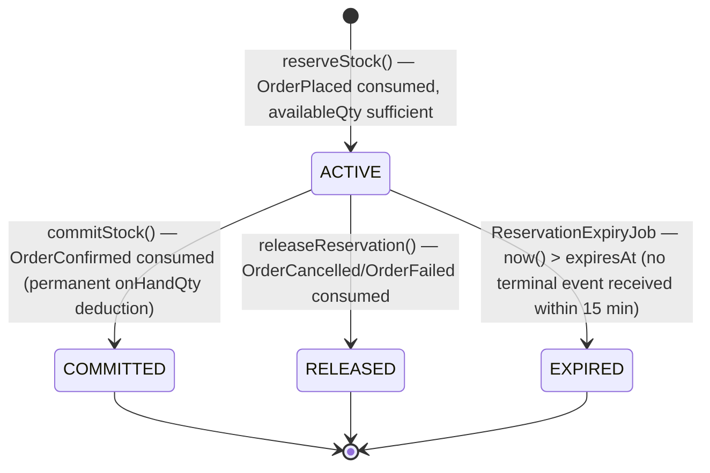
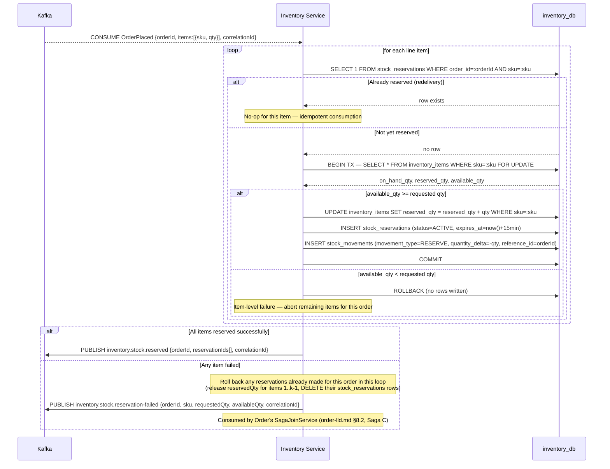
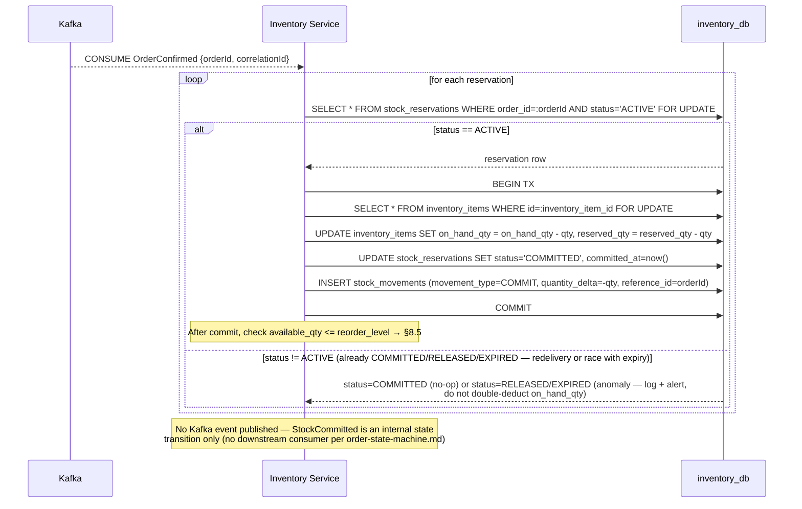
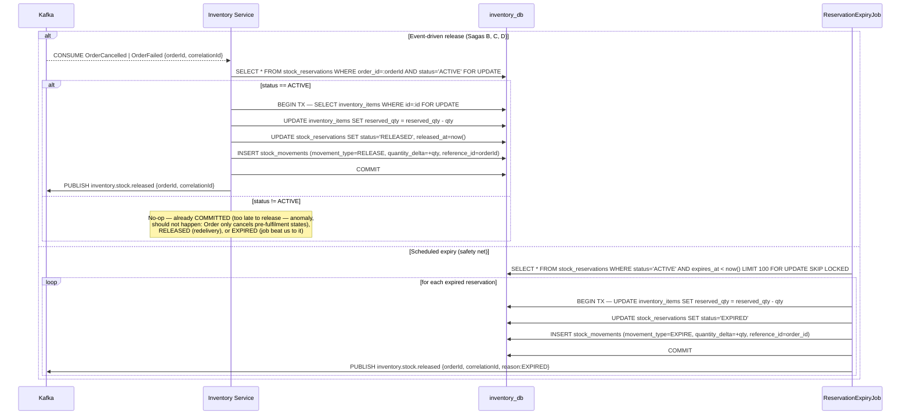
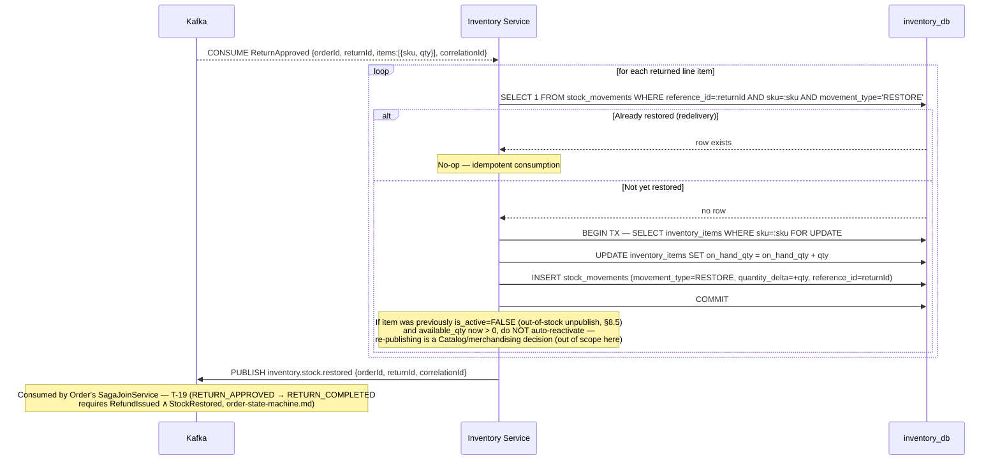
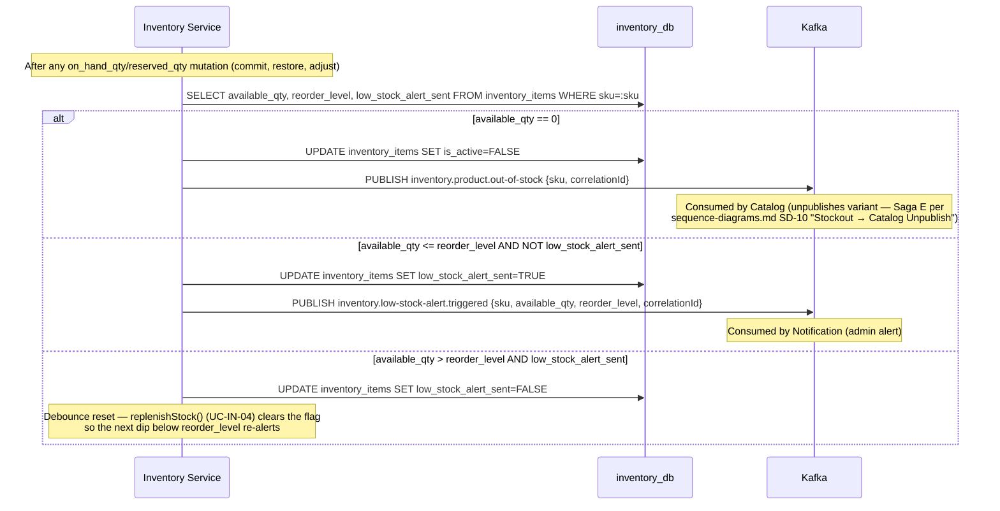

# Inventory Service — Low-Level Design

**Artefact type:** LLD (C4 Level 4)
**Phase:** ARCH
**Bounded context:** Inventory
**Status:** Draft
**Version:** 0.1
**Date:** 2026-06-11
**Author:** System Architect
**Inputs:**
- `docs/hld/container-diagram.md` v0.1 §3, §5
- `docs/hld/component-diagrams.md` v0.1 §8
- `docs/hld/er-diagrams.md` v0.1 §6, §8 (Schema Isolation Summary), §9 (OQ-ER-01)
- `docs/hld/sequence-diagrams.md` v0.1 (SD-06, SD-07, SD-08, SD-09, SD-10)
- `docs/hld/order-state-machine.md` (SA-006) — Sagas A, B, C, D, E
- `docs/lld/order-lld.md` (SA-015) — saga-join design (`order_saga_state`), §8.2
- `docs/lld/payment-lld.md` (SA-016) — sibling saga participant, §8.3/§9
- `docs/adr/ADR-0002-kafka-topic-partitioning.md`
- `docs/adr/ADR-0008-database-per-service.md`
- `docs/requirements/use-cases/inventory-use-cases.md`

---

## 1. Scope

This document is the implementation-ready design for the **Inventory Service** — the
third and final saga participant in the order lifecycle (Order LLD §8.2 and Payment
LLD §9 cover the other two halves of Sagas A–E).

**Covers:**
- Aggregate model (`InventoryItem`, `StockReservation`) and the `StockReservation`
  state machine
- `inventory_db` schema refinement (resolves **OQ-ER-01** — generated `available_qty`
  column)
- Concurrency strategy for stock reservation under contention (pessimistic row lock
  vs. optimistic `version` — see §6)
- Saga participation: consuming `OrderPlaced` / `OrderConfirmed` /
  `OrderCancelled` / `OrderFailed` / `ReturnApproved` / `ProductVariantAdded` /
  `ProductVariantRemoved`, and publishing `StockReserved` /
  `StockReservationFailed` / `StockReleased` / **`StockRestored`** (new — see §9.2) /
  `ProductOutOfStock` / `LowStockAlertTriggered`
- Sequence diagrams for reservation, commit, release (incl. TTL expiry), and
  return-driven restock
- The "no outbox" trade-off for saga-critical events (§10)

**Does NOT cover:**
- Order or Payment Service internals — see `order-lld.md` (SA-015) and
  `payment-lld.md` (SA-016), both done
- Product Catalog Service internals — see `catalog-lld.md` (SA-013, not yet written)
- Bulk availability check API contract details — `docs/api-specs/inventory-service-api.yaml`
  (not yet reconciled — flagged in §11)

---

## 2. NFR Targets This Design Must Satisfy

| ID | Requirement | Target | Design implication |
|---|---|---|---|
| NFR-CONS-001 | Cross-context eventual consistency | ≤ 2 s | `StockReserved`/`StockReservationFailed` must reach Order's `SagaJoinService` (order-lld.md §8.2) within budget — informs the no-outbox trade-off discussion in §10 |
| NFR-SCALE-002 | Concurrent checkout throughput on hot SKUs (flash-sale scenario) | ≥ 200 reservation attempts/sec on a single SKU, zero oversell | Pessimistic row lock (`SELECT ... FOR UPDATE`) on `inventory_items` during `reserveStock()` — see §6.2 |
| INV (inventory-use-cases.md) | `availableQuantity = onHandQuantity - reservedQuantity`, always `>= 0` | Hard invariant | Resolves OQ-ER-01: `available_qty` is a MySQL `GENERATED ALWAYS AS (on_hand_qty - reserved_qty) STORED` column with a `CHECK (available_qty >= 0)` — see §7.1 |
| Reservation TTL = 15 minutes (inventory-use-cases.md) | Auto-release on expiry | `ReservationExpiryJob` (`@Scheduled` every 30s, component-diagrams.md §8) — see §8.3 |

---

## 3. Aggregate Model

### 3.1 `InventoryItem` (Aggregate Root)

| Field | Type | Notes |
|---|---|---|
| `id` | UUID | Identity |
| `sku` | String, **UNIQUE** | Matches `catalog_db.products.sku` (logical ref, ADR-0008) |
| `productId` | UUID | Logical ref to `catalog_db` |
| `onHandQty` | int | `CHECK >= 0` |
| `reservedQty` | int | `CHECK >= 0` |
| `availableQty` | int, **computed** | `GENERATED ALWAYS AS (on_hand_qty - reserved_qty) STORED`, `CHECK >= 0` (resolves OQ-ER-01 — see §7.1) |
| `reorderLevel` | int | Default 10 — alert threshold |
| `isActive` | boolean | `FALSE` when Catalog removes the variant (`ProductVariantRemoved`) |
| `lowStockAlertSent` | boolean | Debounce flag — see §8.5 |
| `version` | long | Optimistic lock — used for **admin-path** writes only (§6.1) |

**Behaviours (commands):** `reserveStock(orderId, qty)`, `commitStock(orderId)`,
`releaseReservation(orderId)`, `restoreStock(returnId, qty)`, `replenishStock(qty)`,
`adjustInventory(delta, reasonCode, performedBy)`, `setReorderLevel(level)`,
`markOutOfStock()`, `triggerLowStockAlert()`.

**Invariants:**
- INV-IN-01: `available_qty = on_hand_qty - reserved_qty` (DB-enforced, §7.1)
- INV-IN-02: `available_qty >= 0` — a `reserveStock()` that would violate this is
  rejected, publishing `StockReservationFailed` instead (§8.1)
- INV-IN-03: at most one `ACTIVE` `StockReservation` per `(inventory_item_id, order_id)`
  pair (`stock_reservations.order_id` UNIQUE — one reservation per order, matching
  INV-02 from order-lld.md: one order = one payment = one reservation set)

### 3.2 `StockReservation` (Entity, child of `InventoryItem`)

| Field | Type | Notes |
|---|---|---|
| `id` | UUID | |
| `inventoryItemId` | UUID | FK (same schema, ADR-0008) |
| `orderId` | UUID | **UNIQUE** |
| `sku` | String | Denormalised for query convenience |
| `quantity` | int | `CHECK >= 1` |
| `status` | enum | `ACTIVE \| COMMITTED \| RELEASED \| EXPIRED` (§5) |
| `expiresAt` | timestamp | `created_at + 15 min` |

---

## 4. Component Structure (refines component-diagrams.md §8)

`component-diagrams.md` §8 already specifies the full package layout
(`InventoryController`, `InventoryService`, `ReservationExpiryJob`, `InventoryItem`,
`StockReservation`, `InventoryRepository`, `ReservationRepository`,
`KafkaEventPublisher`, `KafkaEventConsumer`) — this LLD makes **one addition**:

```
infrastructure/
└── persistence/
    └── StockMovementRepository    (JPA — append-only audit log, inventory_db.stock_movements)
```

Every mutating `InventoryService` operation (`reserveStock`, `commitStock`,
`releaseReservation`, `restoreStock`, `replenishStock`, `adjustInventory`) writes
exactly one `stock_movements` row in the same transaction as the `inventory_items`
update — this is the audit trail referenced by UC-IN-05 ("InventoryAdjusted event
logged") and is what makes `on_hand_qty`/`reserved_qty` reconstructable for
reconciliation.

`KafkaEventConsumer`'s consume list (component-diagrams.md §8) is extended with one
event:

| Event | Topic | Producer |
|---|---|---|
| `ReturnApproved` | `order.return.approved` | Order Service (Saga E — order-state-machine.md §"Saga E — Return Flow") |

(The other four — `OrderPlaced`, `OrderConfirmed`, `OrderCancelled`,
`ProductVariantAdded`/`ProductVariantRemoved` — are already listed.)

---

## 5. `StockReservation` State Machine



**Note on `EXPIRED`:** in the happy path (Saga A), `OrderConfirmed` arrives well
within 15 minutes and the reservation transitions `ACTIVE → COMMITTED` before expiry.
`EXPIRED` is the safety net for the case where Payment never receives a webhook and
the order is stuck in `PENDING_PAYMENT` indefinitely — the reservation self-releases
so the stock isn't permanently locked, independent of whatever eventually happens to
the order. `restoreStock()` (Saga E, return flow) does **not** reuse `StockReservation`
— it is a direct `on_hand_qty` increment with its own `stock_movements` row
(`movement_type = 'RESTORE'`, see §7.1 note), since the original reservation is long
since `COMMITTED`.

---

## 6. Concurrency Strategy: Pessimistic Lock vs. Optimistic `version`

`sequence-diagrams.md` SD-06 currently says `SELECT InventoryItem FOR UPDATE
(optimistic lock)` — this is **internally inconsistent** (`FOR UPDATE` is a
pessimistic row lock; `version` is the optimistic mechanism). This LLD resolves the
inconsistency by using **both, for different operation classes**:

| Operation class | Mechanism | Why |
|---|---|---|
| `reserveStock()`, `commitStock()`, `releaseReservation()`, `restoreStock()` (saga-triggered, high-contention on hot SKUs during flash sales) | **Pessimistic** `SELECT ... FOR UPDATE` on the `inventory_items` row | NFR-SCALE-002 (≥200 concurrent attempts/sec, zero oversell). Under heavy contention, optimistic retry storms (each failed `UPDATE ... WHERE version = :v` forcing a re-read-and-retry loop) would amplify load on exactly the SKU that's already hottest. A short-held row lock (single `UPDATE` inside the lock, transaction held for microseconds) bounds worst-case latency predictably. |
| `replenishStock()`, `adjustInventory()`, `setReorderLevel()` (admin-triggered, low-frequency, low-contention) | **Optimistic** `version` column, retry on `OptimisticLockException` | Admin operations are infrequent (UC-IN-04/05/06) — optimistic locking avoids holding a row lock during what may be a slower admin-initiated transaction (e.g., one that also writes `stock_movements` with a `performed_by` audit lookup), with negligible retry cost. |

**`sequence-diagrams.md` SD-06 should be corrected** to read `SELECT InventoryItem FOR
UPDATE (pessimistic lock)` — tracked as a follow-up (§11).

---

## 7. Database Schema — `inventory_db`

### 7.1 Core tables (refines er-diagrams.md §6 — resolves OQ-ER-01)

```mermaid
erDiagram
    inventory_items {
        CHAR(36)        id              PK
        VARCHAR(100)    sku             UK "matches catalog_db.products.sku — logical ref"
        CHAR(36)        product_id      "logical ref to catalog_db — no FK"
        INT             on_hand_qty     "CHECK on_hand_qty >= 0"
        INT             reserved_qty    "CHECK reserved_qty >= 0"
        INT             available_qty   "GENERATED ALWAYS AS (on_hand_qty - reserved_qty) STORED, CHECK >= 0 — OQ-ER-01 resolved"
        INT             reorder_level   "DEFAULT 10 — alert threshold"
        BOOLEAN         is_active       "DEFAULT TRUE — FALSE when ProductVariantRemoved consumed"
        BOOLEAN         low_stock_alert_sent "DEFAULT FALSE — debounce, §8.5"
        BIGINT          version         "optimistic lock — admin-path writes only (§6)"
        TIMESTAMP       created_at
        TIMESTAMP       updated_at
    }

    stock_reservations {
        CHAR(36)        id              PK
        CHAR(36)        inventory_item_id   FK
        CHAR(36)        order_id        UK "one reservation per order (INV-IN-03)"
        VARCHAR(100)    sku
        INT             quantity        "CHECK quantity >= 1"
        VARCHAR(50)     status          "ACTIVE | COMMITTED | RELEASED | EXPIRED"
        TIMESTAMP       expires_at      "created_at + 15 minutes"
        TIMESTAMP       committed_at    NULL
        TIMESTAMP       released_at     NULL
        TIMESTAMP       created_at
    }

    stock_movements {
        BIGINT          id              PK "auto_increment — append-only audit log"
        CHAR(36)        inventory_item_id   FK
        VARCHAR(100)    sku
        VARCHAR(50)     movement_type   "REPLENISH|RESERVE|COMMIT|RELEASE|RESTORE|ADJUST|EXPIRE"
        INT             quantity_delta  "positive = in, negative = out"
        VARCHAR(50)     reason_code     NULL "for ADJUST: DAMAGE|THEFT|AUDIT|EXPIRY|OTHER"
        CHAR(36)        reference_id    NULL "orderId, returnId, or adjustmentId"
        CHAR(36)        performed_by    NULL "userId for manual adjustments"
        TIMESTAMP       created_at
    }

    inventory_items ||--o{ stock_reservations : "has"
    inventory_items ||--o{ stock_movements : "logged by"
```

**Changes vs. `er-diagrams.md` §6:**
1. **OQ-ER-01 resolved**: `available_qty` is `GENERATED ALWAYS AS (on_hand_qty -
   reserved_qty) STORED` with `CHECK (available_qty >= 0)`. Decision: GENERATED over
   application-computed, because (a) MySQL 8 (the project's chosen version,
   CLAUDE.md) supports stored generated columns with `CHECK` constraints natively —
   no version-compatibility risk; (b) it makes INV-IN-01/02 **DB-enforced** rather
   than relying on every code path remembering to recompute and validate — a single
   missed recomputation in `adjustInventory()` or `restoreStock()` would silently
   violate the invariant if computed in the application layer; (c) the column is
   indexable (§7.2), which the low-stock query needs anyway.
2. `stock_movements.movement_type` gains `RESTORE` (Saga E — return-driven
   `on_hand_qty` increase, distinct from `REPLENISH` which is admin-initiated).

### 7.2 Indexes (unchanged from er-diagrams.md §6)

- `inventory_items(sku)` — UNIQUE, primary lookup
- `inventory_items(available_qty, reorder_level)` — low-stock query (§8.5)
- `stock_reservations(order_id)` — UNIQUE, saga lookup
- `stock_reservations(status, expires_at)` — `ReservationExpiryJob` poll (§8.3)
- `stock_movements(inventory_item_id, created_at DESC)` — audit history

---

## 8. Sequence Diagrams

### 8.1 LLD-SD-01 — Reserve Stock (`OrderPlaced` consumed, Saga A)



**Multi-item rollback note:** an order with N line items where item k fails must
release the reservations already committed for items `1..k-1` **before** publishing
`StockReservationFailed` — otherwise those SKUs remain reserved for an order that
will never be `CONFIRMED`, until `ReservationExpiryJob` eventually frees them (15 min
later). This is a correctness-now-vs-eventual trade-off: doing the release inline adds
latency to the failure path but keeps `reserved_qty` accurate immediately. Given
stock-unavailable is the less common path (Saga C), the inline release is preferred.

### 8.2 LLD-SD-02 — Commit Stock (`OrderConfirmed` consumed, Saga A completion)



**Race note:** if `ReservationExpiryJob` (§8.3) and `OrderConfirmed` consumption race
on the same reservation (the order was confirmed in the same window the reservation
was about to expire), the `FOR UPDATE` lock on `stock_reservations` serialises them —
whichever transaction commits first wins; the second sees `status != ACTIVE` and
no-ops with a logged anomaly (this should be rare enough that it warrants
investigation, not silent handling, if it ever fires).

### 8.3 LLD-SD-03 — Release Stock (`OrderCancelled`/`OrderFailed` consumed, Sagas B/C/D; or TTL expiry)



`FOR UPDATE SKIP LOCKED` lets multiple `ReservationExpiryJob` instances (if the
service is scaled horizontally) work the expiry queue concurrently without blocking
on each other's locked rows.

### 8.4 LLD-SD-04 — Return-Driven Restock (`ReturnApproved` consumed, Saga E)



**`StockRestored` is a new event** — not currently in `container-diagram.md` §5's
`inventory.*` topic list, which only lists `StockReservationFailed`, `StockReserved`,
`ProductOutOfStock`, `LowStockAlertTriggered`. `StockReleased` (published in §8.3,
and already used in SD-07/SD-09) is **also** missing from that list. Both gaps are
tracked in §11 — same pattern as `payment-lld.md`'s `PaymentVoided` gap.

### 8.5 LLD-SD-05 — Low Stock Alert / Out-of-Stock (triggered after §8.2 commit or §8.4 restore)



**Naming discrepancy noted:** `sequence-diagrams.md` SD-10 is titled "Stockout →
Catalog Unpublish (**Saga E**)", but `order-state-machine.md`'s **Saga E** is "Return
Flow" (consumed in §8.4 of this document). These are two different flows sharing the
label "Saga E" across two HLD documents — tracked as a reconciliation item in §11
(does not block this LLD, since both flows are independently well-defined here).

---

## 9. Saga Participation Summary

### 9.1 Consumed events

| Event | Topic | Action |
|---|---|---|
| `OrderPlaced` | `order.order.placed` | §8.1 — reserve stock per line item |
| `OrderConfirmed` | `order.order.confirmed` | §8.2 — commit reservation (permanent deduction) |
| `OrderCancelled` | `order.order.cancelled` | §8.3 — release active reservation |
| `OrderFailed` | `order.order.failed` | §8.3 — release active reservation (Sagas B, C) |
| `ReturnApproved` | `order.return.approved` | §8.4 — restore stock (Saga E) |
| `ProductVariantAdded` | `catalog.product.variant-added` | Create new `inventory_items` row (`on_hand_qty=0`, `is_active=TRUE`) |
| `ProductVariantRemoved` | `catalog.product.variant-removed` | `UPDATE inventory_items SET is_active=FALSE` |

### 9.2 Published events

| Event | Topic | Trigger | Status in container-diagram.md §5? |
|---|---|---|---|
| `StockReserved` | `inventory.stock.reserved` | §8.1 — all line items reserved | ✅ Listed |
| `StockReservationFailed` | `inventory.stock.reservation-failed` | §8.1 — any line item insufficient | ✅ Listed |
| `StockReleased` | `inventory.stock.released` | §8.3 — `OrderCancelled`/`OrderFailed`/TTL expiry | ❌ **Missing — add in follow-up (§11)** |
| **`StockRestored`** | `inventory.stock.restored` | §8.4 — `ReturnApproved` consumed | ❌ **Missing — add in follow-up (§11)** |
| `ProductOutOfStock` | `inventory.product.out-of-stock` | §8.5 — `available_qty == 0` | ✅ Listed |
| `LowStockAlertTriggered` | `inventory.low-stock-alert.triggered` | §8.5 — `available_qty <= reorder_level` | ✅ Listed |

`StockReserved` and `StockReservationFailed` are **saga-critical** — they are the two
events Order's `SagaJoinService` (order-lld.md §8.2) waits on for T-04/T-06.
`StockReleased` and `StockRestored` are consumed by Order for T-13/T-19 respectively
(order-state-machine.md). All four therefore warrant the same delivery-guarantee
scrutiny as Payment's events — see §10.

---

## 10. Consistency Strategy: The "No Outbox" Trade-off

`er-diagrams.md` §8 (Schema Isolation Summary) states Inventory has **no outbox** —
"Kafka publish acceptable loss" — alongside Catalog and Notification. This was a
reasonable default when Inventory's events were thought of as informational
(`ProductOutOfStock`, `LowStockAlertTriggered`).

**This LLD surfaces a trade-off the original schema-isolation table did not
consider**: `StockReserved`, `StockReservationFailed`, `StockReleased`, and
`StockRestored` are not informational — they are **saga-join inputs** consumed by
`order_saga_state` (order-lld.md §6.2) and the `RETURN_APPROVED → RETURN_COMPLETED`
transition (T-19). A lost `StockReserved` (e.g., Inventory commits its DB transaction
in §8.1 but crashes before the `KafkaEventPublisher.publish()` call completes) leaves
an order permanently stuck in `PENDING_PAYMENT` — `order_saga_state.payment_authorised
= TRUE` but `stock_reserved` never set, and no compensating timeout currently exists
for this specific case in `order-state-machine.md`.

| Option | Description | Trade-off |
|---|---|---|
| **A — Status quo (no outbox)** | Direct Kafka producer call after DB commit, `acks=all` + retries | Simple, no new table/relay process. Residual risk: a crash in the narrow window between DB commit and successful publish loses the event — low probability, high impact (stuck order with no automatic recovery) |
| **B — Add `inventory_outbox` for the 4 saga-critical events only** | Same transactional-outbox pattern as Order/Payment (er-diagrams.md §1), but scoped to `StockReserved`/`StockReservationFailed`/`StockReleased`/`StockRestored` only — `ProductOutOfStock`/`LowStockAlertTriggered` remain direct-publish | Closes the gap with the same proven pattern already used twice. Adds one table + `OutboxRelay` poller to a service whose schema-isolation entry currently says "None" — a documented deviation |
| **C — Rely on a stuck-order reconciliation job in Order Service** | Order Service periodically scans `orders WHERE status='PENDING_PAYMENT' AND created_at < now() - 15min` and re-queries Inventory's REST API for reservation status | Fixes the symptom without changing Inventory; but adds a new cross-service polling dependency and doesn't address `StockReleased`/`StockRestored` loss for cancellation/return flows |

**Recommendation: Option B.** The cost (one table, one relay job — both already
implemented twice in this codebase as a reusable pattern) is small relative to the
failure mode (an order stuck forever with no automated recovery path). This is
exactly the kind of "small window of loss... acceptable" framing in
`er-diagrams.md` §8 that doesn't hold once the events feed a saga join — the
schema-isolation table's "None" for Inventory should be corrected to
`inventory_outbox (StockReserved/StockReservationFailed/StockReleased/StockRestored
only)`. Tracked as **OQ-LLD-IN-01** (§11) — formalising this likely belongs in
**ADR-0014** (saga-join state tracking, flagged as pending in order-lld.md §14 and
payment-lld.md §11) since it's the same underlying concern (saga-join reliability)
viewed from Inventory's side.

---

## 11. Open Questions / Next Artefacts

| ID | Item | Owner | Status |
|---|---|---|---|
| OQ-ER-01 | `available_qty` GENERATED column vs. application-computed | Architect | **Resolved in this LLD** — GENERATED (§7.1) |
| OQ-LLD-IN-01 | Add `inventory_outbox` for `StockReserved`/`StockReservationFailed`/`StockReleased`/`StockRestored` (§10, Option B) — update `er-diagrams.md` §6 and §8 | Architect | **Resolved** — adopted in ADR-0014 (SA-019); `er-diagrams.md` §6/§8 and `component-diagrams.md` §8 updated in cross-cutting HLD sync PR (SA-020) |
| OQ-LLD-IN-02 | Add `StockReleased` and `StockRestored` to `container-diagram.md` §5 `inventory.*` topic row (§9.2) | Architect | **Resolved** — cross-cutting HLD sync PR (SA-020) |
| OQ-LLD-IN-03 | `sequence-diagrams.md` SD-06 says "FOR UPDATE (optimistic lock)" — fix to "(pessimistic lock)" per §6 | Architect | **Resolved** — cross-cutting HLD sync PR (SA-020) |
| OQ-LLD-IN-04 | "Saga E" naming collision: SD-10 ("Stockout → Catalog Unpublish") vs. order-state-machine.md ("Return Flow") — rename one of the two in its source HLD | Architect | Open |
| OQ-LLD-IN-05 | `docs/api-specs/inventory-service-api.yaml` does not yet exist — needs creation/reconciliation against `InventoryController`'s endpoints (component-diagrams.md §8) | Architect | Open |

| Next Artefact | Description |
|---|---|
| **`docs/lld/notification-lld.md`** (SA-018) | Completes the saga-participant chain — Notification is the consumer of every event published by Order, Payment, and Inventory (`OrderConfirmed`, `OrderFailed`, `PaymentFailed`, `RefundProcessed`, `StockReleased`, `LowStockAlertTriggered`, etc.). Writing it last lets it reference the now-finalised event catalogues from all three upstream LLDs |
| **`docs/adr/ADR-0014-saga-join-state-tracking.md`** | Still pending (order-lld.md §14, payment-lld.md §11) — should now also formalise OQ-LLD-IN-01 (inventory_outbox scope) as part of the saga-join reliability pattern |
