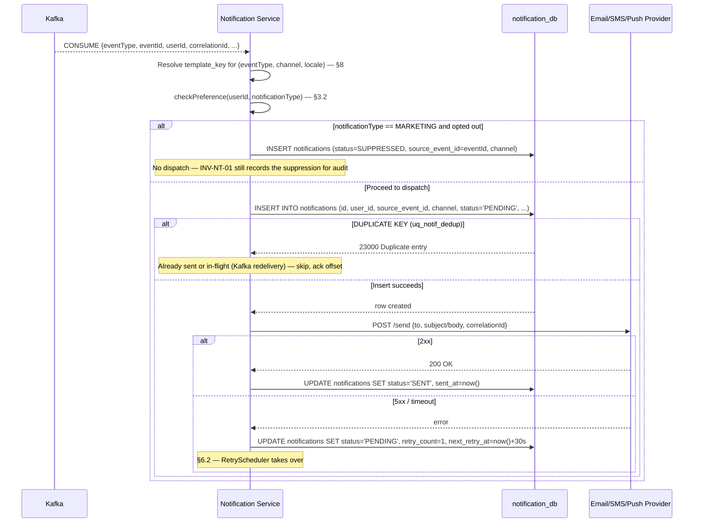
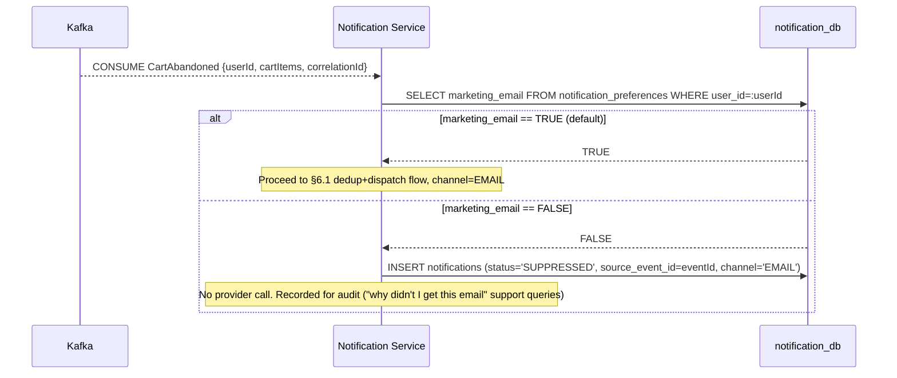

# Notification Service — Low-Level Design

**Artefact type:** LLD (C4 Level 4)
**Phase:** ARCH
**Bounded context:** Notification
**Status:** Draft
**Version:** 0.1
**Date:** 2026-06-11
**Author:** System Architect
**Inputs:**
- `docs/hld/container-diagram.md` v0.1 §3, §5
- `docs/hld/component-diagrams.md` v0.1 §9
- `docs/hld/er-diagrams.md` v0.1 §7, §9 (OQ-ER-03)
- `docs/hld/sequence-diagrams.md` v0.1 (SD-11)
- `docs/hld/order-state-machine.md` (SA-006) — domain event catalogue
- `docs/lld/order-lld.md` (SA-015), `docs/lld/payment-lld.md` (SA-016),
  `docs/lld/inventory-lld.md` (SA-017) — finalised event catalogues from all
  three saga participants
- `docs/adr/ADR-0012-notification-delivery-guarantee.md` — **authoritative source
  for retry/dedup design**
- `docs/adr/ADR-0002-kafka-topic-partitioning.md`
- `docs/requirements/use-cases/notification-use-cases.md`

---

## 1. Scope

This document is the implementation-ready design for the **Notification Service** —
the pure-consumer bounded context that terminates every saga flow defined in
`order-state-machine.md` and the LLDs for Order, Payment, and Inventory. It is
written last in the saga-participant chain specifically so it can consume the
**finalised** event catalogues from those three documents (including newly-added
events: `PaymentVoided`, `StockReleased`, `StockRestored`).

**Covers:**
- Aggregate model (`Notification`, `NotificationPreference`) and `notification_db`
  schema (refines er-diagrams.md §7; resolves **OQ-ER-03**)
- Consolidated **consumed-event catalogue** across all 6 upstream contexts
  (User/Auth, Cart, Order, Payment, Inventory) — the single source of truth for
  "what triggers which notification"
- Dedup + retry/DLQ implementation per ADR-0012, **reconciling** the conflicting
  retry schedules currently in `notification-use-cases.md`, `component-diagrams.md`
  §9, and `sequence-diagrams.md` SD-11 (see §6)
- Template resolution (`notification_templates`)
- Marketing-preference suppression logic
- Sequence diagrams for dispatch+dedup, retry/DLQ, and preference suppression

**Does NOT cover:**
- Upstream service internals — see `order-lld.md`, `payment-lld.md`,
  `inventory-lld.md` (all done), and `user-auth-lld.md` / `cart-lld.md` (not yet
  written)
- Email/SMS/push provider integration credentials/config — Phase 3 (CICD)
- `docs/api-specs/notification-service-api.yaml` — does not yet exist (flagged §11)

---

## 2. NFR Targets This Design Must Satisfy

| ID | Requirement | Target | Design implication |
|---|---|---|---|
| NFR-CONS-001 | Cross-context eventual consistency | ≤ 2 s | Consumer lag on `order.*`/`payment.*`/`inventory.*` topics kept low — `KafkaEventConsumer` has no synchronous fan-out to providers in the consume path itself (dispatch is queued, §5) |
| ADR-0012 | At-least-once delivery, no duplicate sends | `UNIQUE (user_id, source_event_id, channel)` | DB-enforced dedup — INSERT-then-send pattern (§6.1) |
| H-NT-1 (event-storming hotspot, referenced by er-diagrams.md §7) | Duplicate notification on Kafka replay | Zero duplicates | Same UNIQUE constraint — see §6.1 |
| NFR-AVAIL-002 | Order + Payment uptime | 99.95% | Notification failures must **never** block or retry-poison the upstream saga — Notification publishes nothing upstream (consumer-only, ADR-0012 Context); a stuck DLQ item cannot affect Order/Payment/Inventory |

---

## 3. Aggregate Model

### 3.1 `Notification` (Aggregate Root)

| Field | Type | Notes |
|---|---|---|
| `id` | UUID | Identity |
| `userId` | UUID | Logical ref to `user_db` |
| `sourceEventId` | String | The triggering Kafka event's `eventId` (UUID v4, set at publish time, preserved through outbox relay — ADR-0012) |
| `templateKey` | String | FK → `notification_templates.template_key` |
| `notificationType` | enum | `TRANSACTIONAL \| MARKETING \| OPERATIONAL` (er-diagrams.md §7) |
| `channel` | enum | `EMAIL \| SMS \| PUSH` |
| `status` | enum | `PENDING \| SENT \| FAILED \| DLQ \| SUPPRESSED` (er-diagrams.md §7 — canonical, see §6 reconciliation) |
| `retryCount` | int | `DEFAULT 0`, max 4 attempts total per ADR-0012 (§6) |
| `nextRetryAt` | timestamp, nullable | Drives `RetryScheduler` poll |
| `correlationId` | String | Propagated from the triggering event |
| `recipient` | String | Email address or phone number (resolved from `user_db` at dispatch time — logical ref, no FK) |
| `templateData` | JSON | Variables injected into the template |

**Behaviours (commands):** `dispatch()`, `retry()`, `routeToDLQ()`, `suppress()`,
`checkPreference()`, `resend()` (admin — UC-NT-11).

**Invariant INV-NT-01:** `(user_id, source_event_id, channel)` is unique — enforced
by the `notifications` table's `uq_notif_dedup` constraint (ADR-0012). The
`dispatch()` command's first action is always the deduplication INSERT (§6.1).

### 3.2 `NotificationPreference` (Entity, one row per user)

| Field | Type | Notes |
|---|---|---|
| `userId` | UUID, **UNIQUE** | Logical ref |
| `emailOptIn` / `smsOptIn` / `pushOptIn` | boolean | Channel-level opt-out — **only checked for `MARKETING` type** (§7.3) |
| `marketingEmail` / `marketingSms` | boolean | Marketing-specific opt-in, default `TRUE`/`FALSE` per er-diagrams.md §7 |

**Decision rule (notification-use-cases.md, restated):**
```
IF notificationType == TRANSACTIONAL or OPERATIONAL → always send (ignore preferences)
IF notificationType == MARKETING                    → check opt-in; status=SUPPRESSED if opted out
```

---

## 4. Component Structure (refines component-diagrams.md §9)

`component-diagrams.md` §9 already specifies the package layout
(`NotificationController`, `NotificationService`, `RetryScheduler`, `Notification`,
`NotificationPreference`, `NotificationRepository`, `PreferenceRepository`,
`EmailAdapter`/`SmsAdapter`/`PushAdapter`, `KafkaEventConsumer`). This LLD adds:

```
infrastructure/
└── persistence/
    └── TemplateRepository    (JPA — notification_db.notification_templates, §7)
```

and resolves one detail left implicit in §9: `RetryScheduler`'s back-off timing must
follow **ADR-0012's** schedule (immediate, +30s, +5min, +30min, then DLQ — §6), not
the "1min → 5min → 15min, max 3 retries" stated in component-diagrams.md §9's
one-line summary. That summary line is a follow-up correction (§11).

`KafkaEventConsumer`'s consume list (component-diagrams.md §9) is **superseded** by
the consolidated catalogue in §5 of this document, which adds three events not
present in §9's list: `PaymentVoided`, `StockReleased`, `StockRestored`, and
`ReturnApproved`/`ReturnCompleted` (Order).

---

## 5. Consolidated Consumed-Event Catalogue

This table is the single source of truth for "what triggers which notification" —
consolidating `notification-use-cases.md`'s UC table with the **finalised** event
catalogues from `order-lld.md` §9, `payment-lld.md` §9.2, and `inventory-lld.md`
§9.2.

| Event | Source context | Topic | UC | Channel(s) | Type | Notes |
|---|---|---|---|---|---|---|
| `UserRegistered` | User/Auth | `user-auth.user.registered` | UC-NT-07 | Email | TRANSACTIONAL | Welcome/verification |
| `CartAbandoned` | Cart | `cart.cart.abandoned` | UC-NT-05 | Email | MARKETING | +30 min after last cart activity; **respects preferences** (§3.2) |
| `OrderConfirmed` | Order | `order.order.confirmed` | UC-NT-01 | Email, SMS | TRANSACTIONAL | T-04 (Saga A happy path) |
| `OrderFailed` | Order | `order.order.failed` | — | Email | TRANSACTIONAL | "Item out of stock, cart restored" (Saga C, SD-08) or "Payment failed, cart restored" (Saga B, SD-07). **Gap**: not in notification-use-cases.md UC table — add as UC-NT-12 (§11) |
| `OrderCancelled` | Order | `order.order.cancelled` | — | Email | TRANSACTIONAL | Cancellation confirmation. Branches on whether `PaymentVoided` or `payment.refund.processed` also arrives (§7.2) — **Gap**: add as UC-NT-13 (§11) |
| `OrderShipped` | Order | `order.order.shipped` | UC-NT-02 | Email, Push | TRANSACTIONAL | T-11 |
| `OrderDelivered` | Order | `order.order.delivered` | — | Email | TRANSACTIONAL | T-15 — delivery confirmation. **Gap**: add as UC-NT-14 (§11) |
| `ReturnApproved` | Order | `order.return.approved` | — | Email | TRANSACTIONAL | T-17 — "Your return has been approved, refund in progress". **Gap**: add as UC-NT-15 (§11) |
| `ReturnCompleted` | Order | `order.return.completed` | — | Email | TRANSACTIONAL | T-19 — "Refund issued, return complete". **Gap**: add as UC-NT-16 (§11) |
| `PaymentFailed` | Payment | `payment.payment.failed` | UC-NT-03 | Email | TRANSACTIONAL | |
| `payment.refund.processed` | Payment | `payment.refund.processed` | UC-NT-04 | Email | TRANSACTIONAL | **Naming reconciliation**: `notification-use-cases.md` and `order-state-machine.md` call this `RefundIssued`; `payment-lld.md` §9.2 publishes `RefundProcessed` on topic `payment.refund.processed`. This LLD adopts `payment-lld.md`'s name as canonical (it's the more recently finalised, code-adjacent artefact) — flagged for upstream rename in §11 |
| `PaymentVoided` | Payment | `payment.payment.voided` | — | Email | TRANSACTIONAL | New event (payment-lld.md §9.2) — "Cancellation confirmed, no charge was made" (SD-09 else-branch). **Gap**: covered by UC-NT-13 |
| `LowStockAlertTriggered` | Inventory | `inventory.low-stock-alert.triggered` | UC-NT-06 | Email | OPERATIONAL | Admin-only recipient (resolved via an ops distribution address, not `user_db`) |

`StockReleased` and `StockRestored` (inventory-lld.md §9.2) are **not** consumed by
Notification directly — the customer-facing consequences of those events
(cancellation confirmation, return-completion confirmation) are already covered via
`OrderCancelled`/`ReturnCompleted` above. Listed here for completeness so the
catalogue is traceable against all three upstream LLDs.

---

## 6. Dedup, Retry, and DLQ (per ADR-0012 — reconciles three conflicting schedules)

### 6.1 Dedup (LLD-SD-01)



### 6.2 Retry / DLQ Schedule — Reconciliation

Three documents currently disagree on the retry schedule:

| Document | Schedule stated |
|---|---|
| `docs/adr/ADR-0012-notification-delivery-guarantee.md` (Status: **Accepted**) | Attempt 1 immediate, attempt 2 at +30s, attempt 3 at +5min, attempt 4 (final) at +30min — 4 total attempts, then DLQ |
| `docs/hld/component-diagrams.md` §9 | "Exponential back-off: 1min → 5min → 15min, Max 3 retries → DLQ" |
| `docs/hld/sequence-diagrams.md` SD-11 | 1min → 5min → 15min, 3 retries shown, then DLQ (matches component-diagrams.md, contradicts ADR-0012) |
| `docs/requirements/use-cases/notification-use-cases.md` | "retry up to 3 times (exponential back-off: 1m, 5m, 15m)" (matches component-diagrams.md/SD-11, contradicts ADR-0012) |

**This LLD adopts ADR-0012 as canonical** — it is the only `Status: Accepted` ADR
governing this behaviour, and per `agile-docs.md` §4, ADRs are the binding
architectural decision; HLD diagrams and RE-phase use-case docs that predate or
contradict an Accepted ADR are themselves the artefacts that need correcting. The
**3 documents above (component-diagrams.md §9, sequence-diagrams.md SD-11,
notification-use-cases.md)** all need their retry-schedule text updated to ADR-0012's
4-attempt (immediate/+30s/+5min/+30min) schedule — tracked as a single follow-up in
§11 (one PR, three small text edits).

### 6.3 `RetryScheduler` poll (implements ADR-0012's schedule)

```mermaid
sequenceDiagram
    participant RS as RetryScheduler
    participant NDB as notification_db
    participant Provider

    Note over RS: @Scheduled — polls every 15s
    RS->>NDB: SELECT * FROM notifications WHERE status='PENDING' AND next_retry_at <= now() AND retry_count < 4 LIMIT 100
    loop for each due notification
        RS->>Provider: POST /send (retry attempt = retry_count + 1)
        alt success
            RS->>NDB: UPDATE status='SENT', sent_at=now()
        else still failing AND retry_count + 1 < 4
            RS->>NDB: UPDATE retry_count += 1, next_retry_at = now() + {30s|5min|30min}[retry_count]
        else still failing AND retry_count + 1 == 4
            RS->>NDB: UPDATE status='DLQ', failed_at=now()
            RS->>NDB: (no Kafka publish — Notification is consumer-only, ADR-0012)
            Note over RS: notification.dlq is populated by writing status='DLQ' rows;<br/>ops tooling queries notification_db directly<br/>(ADR-0012 mentions a notification.dlq Kafka topic — reconciled<br/>here as a DB-status-based DLQ to avoid Notification publishing<br/>events, which would contradict its "consumer-only, no domain<br/>events published" pattern stated in component-diagrams.md §9.<br/>Flagged in §11.)
        end
    end

    Note over RS: Sweep job (ADR-0012 mitigation): rows status='PENDING'<br/>with next_retry_at NULL and updated_at > 10min ago → mark FAILED, re-queue<br/>(handles crash between provider success and status=SENT UPDATE)
```

**Resolved sub-question:** ADR-0012 mentions routing DLQ items to a
`notification.dlq` Kafka topic, but component-diagrams.md §9 and the Schema
Isolation Summary (er-diagrams.md §8) both describe Notification as
**publish-nothing**. This LLD resolves the tension in favour of the **no-publish**
architecture (consistent across two HLD documents and structurally simpler — DLQ
items are just `notifications` rows with `status='DLQ'`, queryable via
`notifications(status, next_retry_at)` index already defined in er-diagrams.md §7).
The Prometheus alert ADR-0012 specifies (`kafka_consumer_lag{topic="notification.dlq"}
> 0`) is replaced with a DB-metric alert: `notification_dlq_count{} > 0` (a
scheduled `SELECT COUNT(*) FROM notifications WHERE status='DLQ' AND
created_at > now() - interval 1 hour`, exported via Micrometer). ADR-0012's DLQ
*topic* mechanism is superseded by this DB-based approach — flagged in §11 for an
ADR amendment note (per agile-docs.md §4: "Never delete or renumber a superseded
ADR — link forward").

---

## 7. Marketing Suppression (LLD-SD-02)



`emailOptIn`/`smsOptIn`/`pushOptIn` (channel-level, distinct from
`marketingEmail`/`marketingSms`) are reserved for a future **global channel
kill-switch** (e.g., a user who wants zero SMS regardless of type) — not currently
exercised by any UC in `notification-use-cases.md`. Documented here so the schema
columns aren't mistaken for dead code; exercising them is out of scope for Phase 1.

---

## 8. Template Resolution

`notification_templates` (er-diagrams.md §7, unchanged) is keyed by
`template_key` (e.g., `ORDER_CONFIRMED_EMAIL`). Resolution at dispatch time:

```
template_key = "{EVENT_TYPE}_{CHANNEL}"   e.g. ORDER_CONFIRMED_EMAIL, ORDER_SHIPPED_PUSH

SELECT * FROM notification_templates
WHERE template_key = :template_key AND locale = :userLocale AND is_active = TRUE
-- fallback: locale = 'en' if userLocale not found
```

`templateData` (JSON column on `notifications`) holds the variables substituted into
`body_template` (Handlebars/Thymeleaf, er-diagrams.md §7) — e.g., for
`ORDER_CONFIRMED_EMAIL`: `{orderId, totalAmount, currency, items[]}` sourced directly
from the triggering Kafka event payload (no additional cross-service calls needed —
Order/Payment/Inventory events are already enriched with the data Notification needs,
per each LLD's event payload definitions).

---

## 9. Database Schema — `notification_db`

No structural changes to `er-diagrams.md` §7's three tables
(`notification_preferences`, `notification_templates`, `notifications`) — this LLD's
contribution is the **reconciliation work in §6** (retry schedule, DLQ mechanism) and
**OQ-ER-03's resolution** below. Indexes unchanged
(`notifications(user_id, created_at DESC)`, `notifications(status, next_retry_at)`,
`notifications(source_event_id, channel)`).

### OQ-ER-03 Resolution: `source_event_id` for Admin Manual Sends (UC-NT-11)

For Kafka-triggered notifications, `source_event_id` is the upstream event's `eventId`
(stable across retries, per ADR-0012). For **admin manual sends**
(`POST /notifications/send`, component-diagrams.md §9 `NotificationController`),
there is no upstream Kafka event.

**Resolution:** `source_event_id = "admin-{adminUserId}-{ULID}"` — a synthetic ID
generated fresh per admin send request, where the ULID component is
timestamp-sortable (useful for the notification history view, UC-NT-10) and
guarantees uniqueness. Each admin send is therefore **never** deduplicated against a
prior send — this is intentional: an admin explicitly clicking "send" twice means two
sends, unlike a Kafka redelivery which means the same logical event arriving twice.
The `uq_notif_dedup` constraint still applies (prevents the *same* admin-send request
from being double-processed if the controller's HTTP call is retried by the client
with the same idempotency key — admin API should accept a client-supplied
`X-Idempotency-Key` header, mapped to the ULID).

---

## 10. Phase 2 Delta (AWS Serverless)

| Phase 1 | Phase 2 equivalent | Key difference |
|---|---|---|
| `KafkaEventConsumer` on `order.*`/`payment.*`/`inventory.*`/`user-auth.*`/`cart.*` topics | EventBridge rules → SQS queue → Lambda | Driver: EventBridge's native multi-source fan-in removes the need for one consumer to subscribe to 5 different bounded contexts' topics — each context's EventBridge bus can route directly to Notification's queue with content-based filtering |
| `RetryScheduler` (`@Scheduled` poll) | SQS visibility timeout + redrive policy (maxReceiveCount=4, matching ADR-0012's 4 attempts) → SQS DLQ | Driver: SQS's native retry/DLQ primitives replace the DB-poll-based scheduler entirely — removes the §6.3 "DB-based DLQ" workaround, since SQS DLQ is the natural fit AWS provides (resolves the ADR-0012 amendment noted in §6.3 *for Phase 2 only* — Phase 1 keeps the DB-based approach) |
| `notifications` table (dedup) | DynamoDB table, PK=`userId`, SK=`sourceEventId#channel` (conditional `PutItem` for dedup) | Driver: same UNIQUE-constraint dedup semantics via DynamoDB conditional writes, consistent with ADR-pending DynamoDB single-table design for Phase 2 |
| SES/SendGrid/Twilio/FCM via `EmailAdapter`/`SmsAdapter`/`PushAdapter` | Same providers, invoked from Lambda | No change — provider adapters are infrastructure-layer and portable |

---

## 11. Open Questions / Next Artefacts

| ID | Item | Owner | Status |
|---|---|---|---|
| OQ-ER-03 | `source_event_id` scheme for admin manual sends | Architect | **Resolved in this LLD** — `admin-{adminUserId}-{ULID}` (§9) |
| OQ-LLD-NT-01 | Reconcile retry schedule across `component-diagrams.md` §9, `sequence-diagrams.md` SD-11, `notification-use-cases.md` to match ADR-0012's 4-attempt (immediate/+30s/+5min/+30min) schedule | Architect | **Resolved** — cross-cutting HLD sync PR (SA-020) |
| OQ-LLD-NT-02 | `payment.refund.processed` vs `RefundIssued` naming — rename `order-state-machine.md` T-19/Saga-E references and `notification-use-cases.md` UC-NT-04 to match `payment-lld.md`'s `RefundProcessed` | Architect | **Resolved** — cross-cutting HLD sync PR (SA-020) |
| OQ-LLD-NT-03 | ADR-0012 amendment note: DLQ is DB-status-based (`status='DLQ'` + Micrometer gauge), not a `notification.dlq` Kafka topic — add an amendment to ADR-0012 (do not renumber/delete) | Architect | Open |
| OQ-LLD-NT-04 | Add UC-NT-12 through UC-NT-16 to `notification-use-cases.md` for `OrderFailed`, `OrderCancelled`, `OrderDelivered`, `ReturnApproved`, `ReturnCompleted` (§5 gaps) | Architect | Open |
| OQ-LLD-NT-05 | `docs/api-specs/notification-service-api.yaml` does not exist — needs creation for `GET /notifications/history`, `PUT /notifications/preferences`, `POST /notifications/send`, `POST /notifications/{id}/resend` | Architect | Open |

### Next Artefacts

This completes the LLD set for all four saga-related/consumer contexts (Order,
Payment, Inventory, Notification). Three contexts remain in WORKFLOW.md's LLD table
(SA-012 User/Auth, SA-013 Product Catalog, SA-014 Cart) — all independent of the
saga choreography and can proceed in any order. However, **the four LLDs completed so
far have accumulated a consistent backlog of small cross-cutting follow-ups**
(container-diagram.md topic-map gaps, ADR-0014 saga-join pattern referenced by three
LLDs, retry-schedule reconciliation, event-naming mismatches):

| Artefact | Description |
|---|---|
| **`docs/adr/ADR-0014-saga-join-state-tracking.md`** | Highest-priority follow-up — referenced as pending by `order-lld.md` §14, `payment-lld.md` §11, and `inventory-lld.md` §11 (which adds the `inventory_outbox` scoping question, OQ-LLD-IN-01). Writing this ADR now, before starting SA-012, consolidates three LLDs' worth of "pending ADR" references into one Accepted decision |
| **Cross-cutting HLD sync PR** | Bundles: `container-diagram.md` §5 topic-map additions (`PaymentVoided`, `StockReleased`, `StockRestored`), `sequence-diagrams.md` SD-06 lock-type fix (OQ-LLD-IN-03), retry-schedule reconciliation (OQ-LLD-NT-01), and the `RefundIssued`/`RefundProcessed` naming fix (OQ-LLD-NT-02) |
| **`docs/lld/user-auth-lld.md`** (SA-012) | First of the three remaining independent-context LLDs, per WORKFLOW.md's table order |
