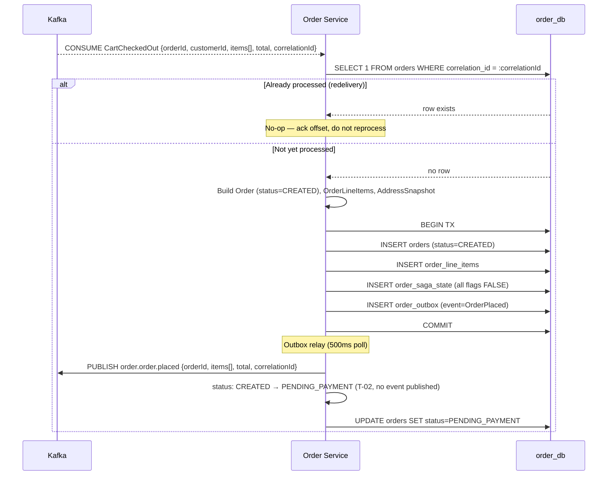
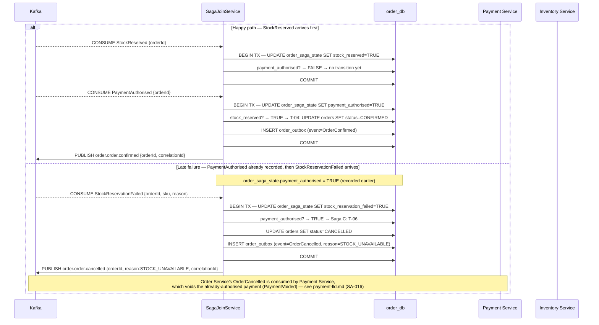
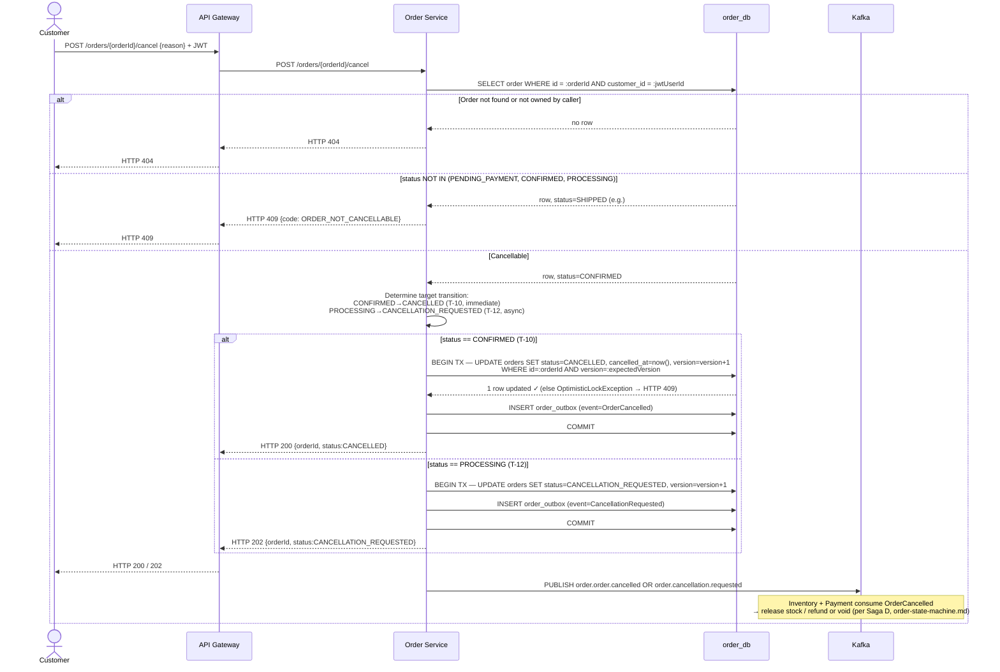
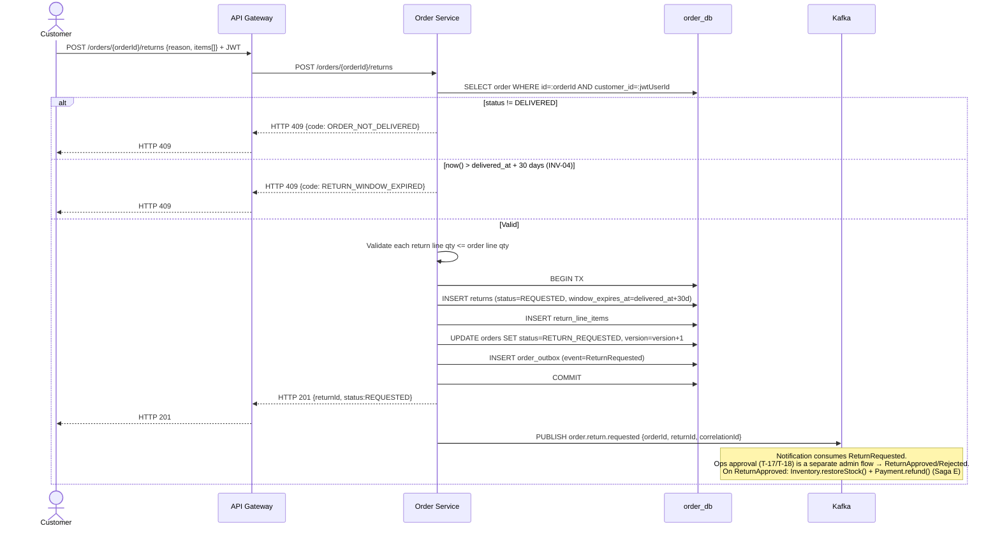

# Order Service — Low-Level Design

**Artefact type:** LLD (C4 Level 4)
**Phase:** ARCH
**Bounded context:** Order
**Status:** Draft
**Version:** 0.1
**Date:** 2026-06-11
**Author:** System Architect
**Inputs:**
- `docs/hld/container-diagram.md` v0.1 §3, §7, §9
- `docs/hld/component-diagrams.md` v0.1 §6
- `docs/hld/order-state-machine.md` (SA-006) — **authoritative source for states/transitions**
- `docs/hld/er-diagrams.md` v0.1 §4
- `docs/hld/sequence-diagrams.md` v0.1 (SD-06–SD-09)
- `docs/adr/ADR-0001-monetary-precision.md`
- `docs/adr/ADR-0002-kafka-topic-partitioning.md`
- `docs/adr/ADR-0006-microservices-vs-monolith.md`
- `docs/adr/ADR-0008-database-per-service.md`
- `docs/api-specs/order-service-api.yaml` v0.1.0-draft

---

## 1. Scope

This document is the implementation-ready design for the **Order Service** — the saga
coordinator for the checkout flow and the most architecturally complex bounded context
in the platform.

**Covers:**
- Aggregate model (`Order`, `OrderLineItem`, `Return`) and invariants
- `order_db` schema (refines `er-diagrams.md` §4 to be consistent with the SA-006 state
  machine and ADR-0001)
- Saga participation: how Order joins the parallel `PaymentAuthorised` /
  `StockReserved` responses (resolves OQ-SD-01) and drives all compensating transitions
- Sequence diagrams for order placement, saga join, customer cancellation, and returns
- API contract reconciliation against `order-service-api.yaml`
- Consistency strategy (outbox, idempotency, optimistic locking)

**Does NOT cover:**
- Payment Service or Inventory Service internals — see their respective LLDs
  (SA-016, SA-017, not yet written)
- Kafka topic-level configuration (partitions, retention) — see ADR-0002
- Kubernetes deployment manifests — see Phase 3 (`feature/DEV-order-*`)

---

## 2. NFR Targets This Design Must Satisfy

| ID | Requirement | Target | Design implication |
|---|---|---|---|
| NFR-PERF-004 | Order placement p99 | < 500 ms | `POST /orders` (internal, via `CartCheckedOut`) only persists `orders` + `order_outbox` row in one transaction — no synchronous calls to Payment/Inventory on the placement path |
| NFR-AVAIL-002 | Order + Payment uptime | 99.95% | Order Service has no hard synchronous dependency on Payment/Inventory; saga join is event-driven, so a slow downstream service degrades latency-to-CONFIRMED, not availability of the placement endpoint |
| NFR-CONS-001 | Cross-context eventual consistency | ≤ 2 s | Outbox relay poll ≤ 500 ms (container-diagram.md §7); saga join (§8.2) must complete within the 2 s window under normal load |
| NFR-SCALE-002 | Peak orders / min | 500 | `orders(correlation_id)` unique index makes `CartCheckedOut` consumption idempotent under Kafka redelivery at this volume |
| NFR-CONS-002 (new — see §13) | Saga join correctness | Exactly one `CONFIRMED` or `CANCELLED` transition per order, regardless of event arrival order | `order_saga_state` table (§6.2) tracks partial saga completion independent of event ordering |

---

## 3. Aggregate Model

### 3.1 `Order` (Aggregate Root)

| Field | Type | Notes |
|---|---|---|
| `id` | UUID | Identity |
| `customerId` | UUID | Logical ref to `user_db` |
| `status` | enum | One of the 12 states in `order-state-machine.md` (§5 below) |
| `lineItems` | `List<OrderLineItem>` | Child entities, immutable after `CREATED` |
| `totalAmount` | `Money` (BIGINT minor units + currency, ADR-0001) | Immutable after `CREATED` (INV-01) |
| `discountAmount` | `Money` | From cart's coupon application |
| `couponCode` | String, nullable | |
| `shippingAddress` | `AddressSnapshot` (value object) | Snapshot at order time — see OQ-ER-02 resolution in §13 |
| `correlationId` | UUID | Propagated from `CartCheckedOut`; used for idempotent consumption |
| `paymentRetryCount` | int | INV-03: capped at 3 |
| `version` | long | Optimistic lock (INV-07) |

**Behaviours (commands):** `place()`, `markPendingPayment()`, `confirm()`, `failPayment()`,
`retryPayment()`, `startProcessing()`, `requestCancellation()`, `cancel()`, `ship()`,
`markDelivered()`, `requestReturn()`.

Each command validates the current `status` against the transition table in
`order-state-machine.md` §"Transition Table" and throws
`IllegalStateTransitionException` if the transition is not legal (INV-05, INV-06).

### 3.2 `OrderLineItem` (Entity, child of `Order`)

| Field | Type | Notes |
|---|---|---|
| `id` | UUID | |
| `sku`, `productId`, `productName` | String / UUID / String | Snapshots — product may later change/be deleted |
| `unitPrice` | `Money` | Snapshotted at checkout (cart price snapshot, per `agile-docs.md` cross-ref to Cart LLD) |
| `quantity` | int | `>= 1` |
| `subtotal` | `Money` | `unitPrice * quantity`, computed once at creation, stored (not recomputed) |

### 3.3 `Return` (Aggregate Root — separate aggregate, same bounded context)

`Return` references `Order` by `orderId` (logical reference within the same schema —
a real FK is acceptable here since both tables live in `order_db`, unlike cross-service
references). It is modelled as its own aggregate because:
- It has its own lifecycle (`REQUESTED → APPROVED|REJECTED → COMPLETED`) independent of
  `Order`'s lifecycle once `DELIVERED` is reached.
- It has its own invariant (INV-04: 30-day window) that should not bloat the `Order`
  aggregate's transition logic.

| Field | Type | Notes |
|---|---|---|
| `id` | UUID | |
| `orderId` | UUID | One return per order (UK) |
| `status` | enum | `REQUESTED \| APPROVED \| REJECTED \| COMPLETED` |
| `reason` | text | |
| `windowExpiresAt` | timestamp | `deliveredAt + 30 days` (INV-04), computed at `Order.markDelivered()` time |
| `lineItems` | `List<ReturnLineItem>` | Each references an `OrderLineItem` + return quantity |

### 3.4 Aggregate Invariants

All 7 invariants (INV-01 through INV-07) from `order-state-machine.md` §"Aggregate
Invariants" apply unchanged. They are restated here for traceability and are the
acceptance criteria for the `OrderAggregate` unit test suite (Phase 3):

| # | Invariant | Test focus |
|---|---|---|
| INV-01 | `totalAmount` immutable after `CREATED` | No setter; constructor-only |
| INV-02 | One active payment per order | Enforced in `payment_db` (UK on `payments.order_id`) — Order Service does not duplicate this check, but the saga join (§8.2) assumes it |
| INV-03 | `paymentRetryCount <= 3` | `OrderAggregate.retryPayment()` throws if count would exceed 3 |
| INV-04 | Return window 30 days | `ReturnAggregate.requestReturn()` validates `now() <= windowExpiresAt` |
| INV-05 | `CANCELLATION_REQUESTED` only from `PROCESSING` | Guard in `OrderAggregate.requestCancellation()` |
| INV-06 | Terminal states admit no transitions | Guard in every command method: `if (status.isTerminal()) throw ...` |
| INV-07 | Optimistic lock on every mutation | `version` column; `@Version` JPA annotation |

---

## 4. Component Structure (refines component-diagrams.md §6)

```
com.ecommerce.order/
├── api/
│   ├── OrderController          (POST /orders, GET /orders, GET /orders/{id}, POST /orders/{id}/cancel)
│   ├── ReturnController          (POST /orders/{id}/returns)
│   └── AdminOrderController      (GET /admin/orders, PATCH /admin/orders/{id}/status)
├── application/
│   ├── OrderService               (placeOrder, confirmOrder, failOrder, cancelOrder, ...)
│   ├── ReturnService               (requestReturn, approveReturn, rejectReturn)
│   ├── SagaJoinService             (NEW — see §8.2; resolves OQ-SD-01)
│   └── OutboxRelay                 (500ms poll → Kafka publish)
├── domain/
│   ├── Order, OrderLineItem, OrderStatus (enum, 12 states)
│   ├── Return, ReturnLineItem, ReturnStatus (enum)
│   ├── Money (shared value object — common-money module, ADR-0001)
│   └── AddressSnapshot (value object)
├── infrastructure/
│   ├── persistence/
│   │   ├── OrderRepository, OrderSagaStateRepository (NEW), ReturnRepository, OutboxRepository
│   ├── messaging/
│   │   └── KafkaEventConsumer (CartCheckedOut, PaymentAuthorised, PaymentFailed,
│   │       PaymentExpired, StockReserved, StockReservationFailed)
│   └── scheduler/
│       ├── PaymentRetryScheduler   (Saga B timers — T-07/T-08)
│       └── ReturnWindowScheduler   (return-window-close timer)
└── config/
```

The two new components vs. `component-diagrams.md` §6 are **`SagaJoinService`** and
**`OrderSagaStateRepository`** — added to resolve OQ-SD-01 (see §8.2). All other
components match the HLD component diagram unchanged.

---

## 5. State Machine

`order-state-machine.md` (SA-006) is the **canonical and unchanged** source for the
12-state model, the transition table (T-01–T-19), saga boundaries (Sagas A–E), and
timer events. This LLD does not redefine it — `OrderStatus` enum and
`OrderAggregate`'s guard methods are a direct implementation of that document.

**Reconciliation note:** Two other artefacts currently show an older, simplified
7-state model (`PENDING|CONFIRMED|PROCESSING|SHIPPED|DELIVERED|CANCELLED|FAILED`):

- `er-diagrams.md` §4 — `orders.status` column comment
- `docs/api-specs/order-service-api.yaml` — `OrderSummary.status` enum
- `docs/requirements/use-cases/order-use-cases.md` — "Order State Machine" diagram (RE-phase artefact, predates SA-006)

These predate SA-006 (which is the most recent and most detailed state model). This
LLD adopts the SA-006 12-state model as ground truth. Updating `er-diagrams.md` and
`order-service-api.yaml` to match is tracked as a follow-up (§14).

---

## 6. Database Schema — `order_db`

### 6.1 Core tables (refines er-diagrams.md §4)

```mermaid
erDiagram
    orders {
        CHAR(36)        id                  PK
        CHAR(36)        customer_id         "logical ref to user_db — no FK"
        VARCHAR(50)     status              "12-state enum per order-state-machine.md"
        BIGINT          total_amount        "minor units — immutable after CREATED (INV-01)"
        BIGINT          discount_amount     "minor units"
        VARCHAR(3)      currency            "ISO 4217, e.g. INR (ADR-0001)"
        VARCHAR(100)    coupon_code         NULL
        VARCHAR(36)     correlation_id      UK "from CartCheckedOut — idempotent consumption"
        JSON            shipping_address    "snapshot — see OQ-ER-02"
        INT             payment_retry_count "DEFAULT 0, CHECK <= 3 (INV-03)"
        TIMESTAMP       confirmed_at        NULL
        TIMESTAMP       shipped_at          NULL
        TIMESTAMP       delivered_at        NULL
        TIMESTAMP       cancelled_at        NULL
        BIGINT          version             "optimistic lock (INV-07)"
        TIMESTAMP       created_at
        TIMESTAMP       updated_at
    }

    order_line_items {
        CHAR(36)        id              PK
        CHAR(36)        order_id        FK
        VARCHAR(100)    sku             "snapshot"
        CHAR(36)        product_id      "logical ref — no FK"
        VARCHAR(500)    product_name    "snapshot"
        BIGINT          unit_price      "minor units — snapshotted at checkout"
        INT             quantity        "CHECK quantity >= 1"
        BIGINT          subtotal        "minor units — unit_price * quantity, stored not derived"
        TIMESTAMP       created_at
    }

    order_saga_state {
        CHAR(36)        order_id              PK FK "1:1 with orders"
        BOOLEAN         payment_authorised    "DEFAULT FALSE"
        BOOLEAN         stock_reserved        "DEFAULT FALSE"
        BOOLEAN         stock_reservation_failed "DEFAULT FALSE"
        TIMESTAMP       payment_authorised_at    NULL
        TIMESTAMP       stock_reserved_at        NULL
        TIMESTAMP       updated_at
    }

    order_notes {
        CHAR(36)        id              PK
        CHAR(36)        order_id        FK
        CHAR(36)        author_id       "userId of note author"
        VARCHAR(50)     author_role     "CUSTOMER | ADMIN"
        TEXT            content
        TIMESTAMP       created_at
    }

    returns {
        CHAR(36)        id              PK
        CHAR(36)        order_id        FK UK "one return per order"
        VARCHAR(50)     status          "REQUESTED | APPROVED | REJECTED | COMPLETED"
        TEXT            reason
        TIMESTAMP       window_expires_at   "delivered_at + 30 days (INV-04)"
        TIMESTAMP       approved_at     NULL
        TIMESTAMP       rejected_at     NULL
        TIMESTAMP       created_at
        TIMESTAMP       updated_at
    }

    return_line_items {
        CHAR(36)        id              PK
        CHAR(36)        return_id       FK
        CHAR(36)        order_line_id   FK
        INT             quantity        "CHECK quantity >= 1 AND <= order_line qty"
    }

    order_outbox {
        BIGINT          id              PK "auto_increment"
        CHAR(36)        aggregate_id    "orderId"
        VARCHAR(100)    event_type      "OrderPlaced | OrderConfirmed | ..."
        JSON            payload
        VARCHAR(36)     correlation_id
        BOOLEAN         published       "DEFAULT FALSE"
        TIMESTAMP       created_at
        TIMESTAMP       published_at    NULL
    }

    orders ||--o{ order_line_items : "contains"
    orders ||--|| order_saga_state : "tracks"
    orders ||--o{ order_notes : "has"
    orders ||--o| returns : "may have"
    returns ||--o{ return_line_items : "specifies"
    orders ||--o{ order_outbox : "produces"
```

**Changes vs. `er-diagrams.md` §4:**
1. Added `currency` column (ADR-0001 — `Money` is amount + currency, not amount alone).
2. Added `payment_retry_count` (INV-03 — was missing).
3. Replaced 7-state `status` comment with the 12-state SA-006 enum.
4. **New table `order_saga_state`** — see §6.2.

### 6.2 `order_saga_state` — resolving OQ-SD-01

Per `sequence-diagrams.md` OQ-SD-01: in Saga A, Payment and Inventory consume
`OrderPlaced` **in parallel** and respond independently. The Order Service must:
1. Transition to `CONFIRMED` only when **both** `PaymentAuthorised` and
   `StockReserved` have arrived (T-04).
2. Correctly compensate if `StockReservationFailed` arrives **after**
   `PaymentAuthorised` was already recorded (Saga C must still fire — void the
   payment that already succeeded).

`order_saga_state` is a 1:1 side table (not part of the `Order` aggregate's public
API) written to by `SagaJoinService` on each event consumption:

| Event consumed | Write | Then check |
|---|---|---|
| `PaymentAuthorised` | `payment_authorised = TRUE`, `payment_authorised_at = now()` | If `stock_reserved = TRUE` → T-04 (CONFIRMED). If `stock_reservation_failed = TRUE` → Saga C (void payment, T-06) |
| `StockReserved` | `stock_reserved = TRUE`, `stock_reserved_at = now()` | If `payment_authorised = TRUE` → T-04 (CONFIRMED) |
| `StockReservationFailed` | `stock_reservation_failed = TRUE` | If `payment_authorised = TRUE` → Saga C immediately (void payment, T-06). Else: wait — `PaymentFailed`/`PaymentAuthorised` will arrive and re-check |
| `PaymentFailed` | (no saga_state write) | T-05 directly (PAYMENT_FAILED) — Inventory's reservation has a 15-min TTL and self-expires (no immediate compensation needed) |

This makes the saga join **commutative**: regardless of which of the two events
arrives first, the second event's handler performs the state-dependent check and
drives the correct transition. All writes to `order_saga_state` + the resulting
`orders.status` update + `order_outbox` insert happen in a **single DB transaction**
per event consumption.

### 6.3 Indexes

- `orders(customer_id, created_at DESC)` — order history query
- `orders(status)` — admin order management
- `orders(correlation_id)` — **UNIQUE** — idempotency check on `CartCheckedOut`
- `order_outbox(published, created_at)` — outbox relay poll
- `returns(order_id)` — UNIQUE

---

## 7. API Contract Reference

`docs/api-specs/order-service-api.yaml` defines the customer-facing and admin REST
surface (`/orders`, `/orders/{id}`, `/orders/{id}/cancel`, `/orders/{id}/returns`,
`/admin/orders/**`). The endpoint set and request/response shapes are accepted as-is
**except** for two ADR-0001 violations identified during this LLD:

| Issue | Current spec | Required by ADR-0001 | Fields affected |
|---|---|---|---|
| Money encoding | `type: number, format: double` | `type: integer, format: int64` (minor units) + separate `currency: string` field | `OrderSummary.total`, `OrderLineItem.unitPrice`, `OrderLineItem.lineTotal`, `OrderDetail.subtotal`, `OrderDetail.discountAmount`, `OrderDetail.tax` |
| Status enum | 7-state (`PENDING...FAILED`) | 12-state SA-006 enum | `OrderSummary.status`, `UpdateOrderStatusRequest.status` |

These are spec-only fixes (no behavioural change) and are tracked as a follow-up PR
to `order-service-api.yaml` (§14) — kept out of this LLD's diff to keep the change
reviewable.

**Internal (Kafka-only) surface** — not in the OpenAPI spec, consumed/produced per
`order-state-machine.md` §"Domain Events Catalogue":

| Direction | Event | Topic |
|---|---|---|
| Consume | `CartCheckedOut` | `cart.cart.checked-out` |
| Consume | `PaymentAuthorised`, `PaymentFailed`, `PaymentExpired` | `payment.payment.*` |
| Consume | `StockReserved`, `StockReservationFailed` | `inventory.stock.*` |
| Produce (via outbox) | `OrderPlaced`, `OrderConfirmed`, `OrderCancelled`, `PaymentRetryInitiated`, `CancellationRequested`, `CancellationRejected`, `OrderShipped`, `OrderDelivered`, `ReturnRequested`, `ReturnApproved`, `ReturnRejected`, `ReturnCompleted` | `order.order.*`, `order.return.*` |

---

## 8. Sequence Diagrams

### 8.1 LLD-SD-01 — `CartCheckedOut` → `OrderPlaced` (idempotent consumption)



### 8.2 LLD-SD-02 — Saga Join (resolves OQ-SD-01)

Two scenarios shown via `alt`: the happy-path ordering and the "late stock failure
after payment success" ordering that OQ-SD-01 raised.



### 8.3 LLD-SD-03 — Customer Cancellation (sync API + async compensation)



### 8.4 LLD-SD-04 — Return Request (T-16, INV-04)



---

## 9. Consistency Strategy

| Mechanism | Applied where | Purpose |
|---|---|---|
| **Transactional outbox** | Every `orders` status mutation writes a corresponding `order_outbox` row in the same transaction | At-least-once delivery to Kafka without XA (container-diagram.md §7) |
| **Idempotent consumption** | `orders.correlation_id` UNIQUE; `CartCheckedOut` redelivery is a no-op (§8.1) | Kafka at-least-once safety |
| **Optimistic locking** | `orders.version`; every status-changing UPDATE includes `WHERE version = :expected` | INV-07 — prevents lost updates from concurrent saga events + customer actions (e.g., cancel race with `PaymentAuthorised`) |
| **Saga join state** | `order_saga_state` table (§6.2) | Makes the parallel Payment/Inventory saga branch commutative — resolves OQ-SD-01 |
| **Eventual consistency window** | NFR-CONS-001 (≤ 2s) | Customer sees `PENDING_PAYMENT` status briefly after placement; UI should poll or use WebSocket/SSE for status updates (out of scope — Cart/Frontend LLD) |

**Concurrent mutation example:** if a customer calls `POST /orders/{id}/cancel` at the
exact moment `PaymentAuthorised` arrives via Kafka, both paths attempt
`UPDATE orders ... WHERE version = :expected`. Whichever commits first wins; the
second receives an `OptimisticLockException`. The Kafka consumer retries (the saga
join handler re-reads the row, sees `CANCELLED`, and — per INV-06 — takes the
compensation branch instead of T-04). The HTTP path, on retry-after-conflict, re-reads
and returns the now-current status to the customer.

---

## 10. Caching Policy

**Order Service does not use Redis.** Unlike Cart (session-scoped, high-churn) or
Payment (idempotency keys), Order's read patterns (`GET /orders`, `GET /orders/{id}`)
are customer-scoped and low-frequency enough that direct `order_db` reads with the
indexes in §6.3 meet NFR-PERF targets. This is stated explicitly per
`system-design.md` convention to avoid an implicit "why isn't there a cache here"
question in review.

---

## 11. Related ADRs

| ADR | Relevance |
|---|---|
| ADR-0001 — Monetary precision | `total_amount`, `unit_price`, `subtotal`, `discount_amount` are `BIGINT` minor units + `currency` (§6.1) |
| ADR-0002 — Kafka topic/partitioning | `order.*` topics partitioned by `orderId`; saga join (§8.2) relies on ordered delivery per partition |
| ADR-0006 — Microservices vs monolith | Order owns `order_db` exclusively; no cross-schema joins |
| ADR-0008 — Database per service | `customer_id`, `product_id`, `sku` are logical refs only (no FK to other schemas) |
| ADR-0009 — Payment idempotency | Order Service's `OrderCancelled` triggers Payment's idempotent void/refund (`auth-{orderId}` / `ref-{orderId}-{returnId}`) |

---

## 12. Phase 2 Delta (AWS Serverless)

Per `order-state-machine.md` §"Phase 2 Delta" — the key change is **saga
orchestration**: the `order_saga_state` table and `SagaJoinService` (§6.2, §8.2) are
replaced by an **AWS Step Functions** execution using `.waitForTaskToken` with a
parallel branch for `PaymentAuthorised` + `StockReserved`. The commutative-event
design in §8.2 maps directly onto Step Functions' parallel state — both branches
write to the same execution's state regardless of arrival order, and the state
machine definition encodes the same Saga C late-failure handling as a catch/retry
branch. This is the clearest Phase 1 → Phase 2 architectural delta in the entire
platform and will be the centrepiece of the Phase 2 Order Lambda comparison doc.

---

## 13. Open Questions

| ID | Question | Owner | Status |
|---|---|---|---|
| OQ-SD-01 (carried from sequence-diagrams.md) | Saga join ordering | Architect | **Resolved in this LLD** — see §6.2, §8.2 (`order_saga_state` table) |
| OQ-SM-01 (carried from order-state-machine.md) | Should `CANCELLATION_REQUESTED` be customer-visible or mapped to `PROCESSING` in the API? | Architect + PM | Open — affects `order-service-api.yaml` status enum fix (§14) |
| OQ-SM-02 (carried) | SLA for Fulfilment to respond to a cancel request (`CANCELLATION_REQUESTED` timeout) | PM + Ops | Open — needed before Phase 3 implements the timeout scheduler |
| OQ-ER-02 (carried) | `shipping_address` as JSON snapshot vs dedicated table | Architect | **Resolved — kept as JSON** (§6.1); not queryable, but order addresses are never searched/filtered, only displayed |
| OQ-LLD-OR-01 (new) | `NFR-CONS-002` (saga join correctness) is introduced in §2 but not yet in `non-functional-requirements.md` | Architect | Open — add to NFR doc in follow-up |

---

## 14. Next Artefacts

| Artefact | Description |
|---|---|
| **`docs/adr/ADR-0014-saga-join-state-tracking.md`** | ADR formalising the `order_saga_state` design (§6.2) as the Phase 1 saga-join pattern — referenced by Payment and Inventory LLDs |
| **`docs/hld/er-diagrams.md` §4 update** | Sync `order_db` section with §6.1 of this LLD (add `currency`, `payment_retry_count`, `order_saga_state`, 12-state enum) |
| **`docs/api-specs/order-service-api.yaml` update** | Fix money fields to integer minor units + `currency`; fix `status` enum to 12-state SA-006 model (pending OQ-SM-01) |
| **`docs/lld/payment-lld.md`** (SA-016) | Next LLD — Payment is the other saga participant and consumes `OrderCancelled`/`OrderConfirmed` produced by this design |
