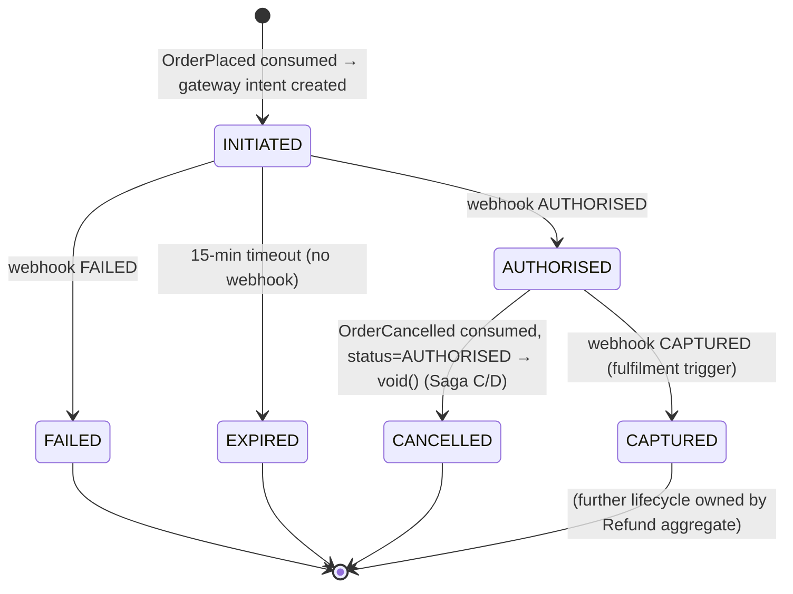
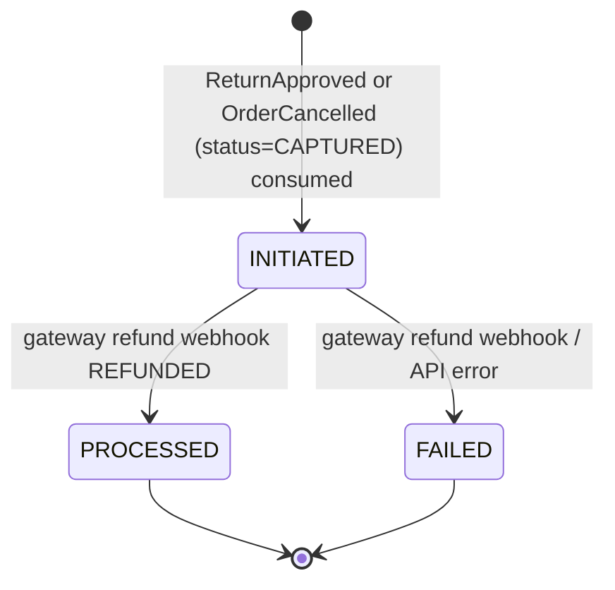
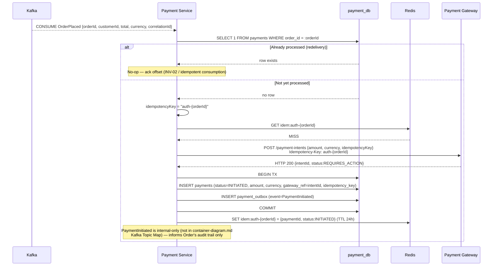
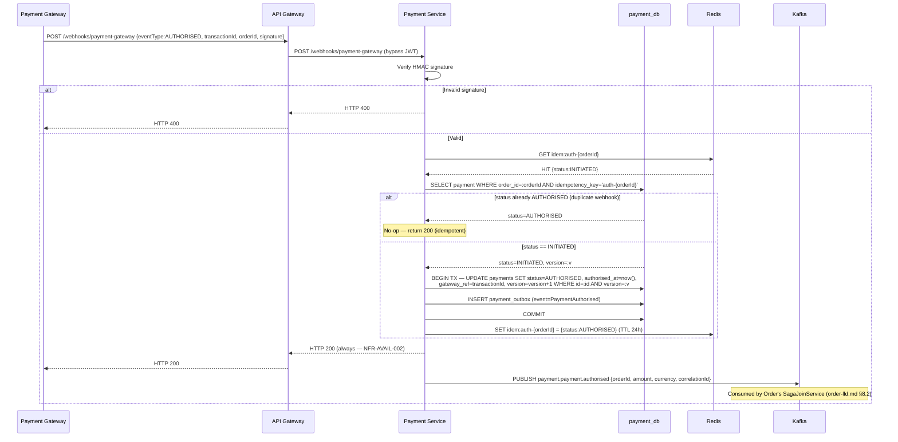
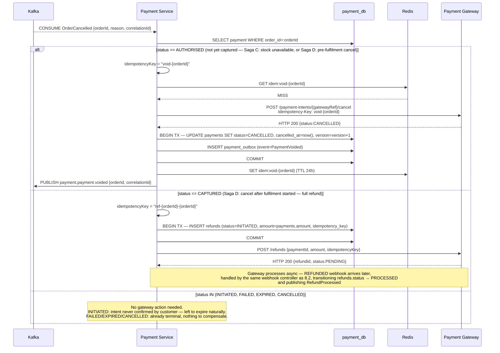
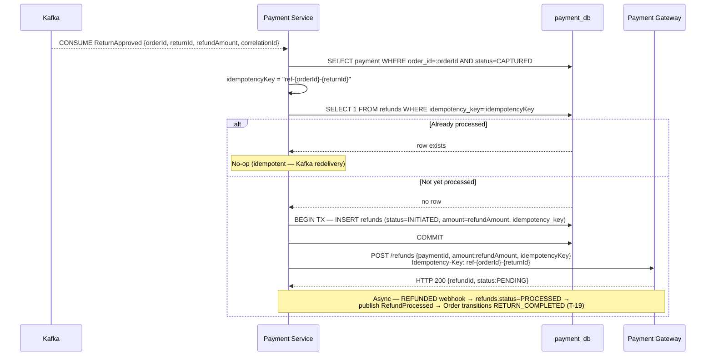

# Payment Service — Low-Level Design

**Artefact type:** LLD (C4 Level 4)
**Phase:** ARCH
**Bounded context:** Payment
**Status:** Draft
**Version:** 0.1
**Date:** 2026-06-11
**Author:** System Architect
**Inputs:**
- `docs/hld/container-diagram.md` v0.1 §3, §5, §7
- `docs/hld/component-diagrams.md` v0.1 §7
- `docs/hld/er-diagrams.md` v0.1 §5
- `docs/hld/sequence-diagrams.md` v0.1 (SD-06, SD-07, SD-09)
- `docs/hld/order-state-machine.md` (SA-006) — Sagas A–E, transition table
- `docs/lld/order-lld.md` (SA-015) — saga-join design (`order_saga_state`), §8.2/§8.3
- `docs/adr/ADR-0001-monetary-precision.md`
- `docs/adr/ADR-0002-kafka-topic-partitioning.md`
- `docs/adr/ADR-0009-payment-idempotency.md` — **authoritative source for idempotency design**
- `docs/requirements/use-cases/payment-use-cases.md`
- `docs/api-specs/payment-service-api.yaml` v0.1.0-draft

---

## 1. Scope

This document is the implementation-ready design for the **Payment Service** — the
second saga participant in the checkout flow (Order LLD §8.2 covers the first half of
the join; this LLD covers Payment's side of Sagas A, B, C, D, and E).

**Covers:**
- Aggregate model (`Payment`, `Refund`) and their **separate** state machines
  (reconciling `payment-use-cases.md`'s combined diagram — see §5)
- `payment_db` schema (refines `er-diagrams.md` §5: adds `currency`, per ADR-0001)
- Idempotency implementation per ADR-0009 (Redis fast path + MySQL UNIQUE backstop)
- Saga participation: consuming `OrderPlaced` / `OrderCancelled` / `ReturnApproved`,
  and publishing `PaymentAuthorised` / `PaymentFailed` / `PaymentExpired` /
  **`PaymentVoided`** (new — see §9.2) / `RefundProcessed` / `RefundFailed`
- Sequence diagrams: payment initiation, webhook-driven authorisation, cancellation
  compensation (void vs refund branch), and return-triggered refund
- API contract reconciliation against ADR-0001

**Does NOT cover:**
- Order Service or Inventory Service internals — see `order-lld.md` (SA-015, done)
  and `inventory-lld.md` (SA-017, not yet written)
- Payment Gateway integration details (Stripe vs Razorpay client config) — Phase 3
- Kafka topic-level configuration — see ADR-0002

---

## 2. NFR Targets This Design Must Satisfy

| ID | Requirement | Target | Design implication |
|---|---|---|---|
| NFR-PERF-004 | Order placement p99 | < 500 ms | Payment initiation is triggered by consuming `OrderPlaced` asynchronously — never blocks the customer-facing checkout response (container-diagram.md §7) |
| NFR-AVAIL-002 | Order + Payment uptime | 99.95% | Webhook endpoint (`/webhooks/payment-gateway`) always returns `200` (per `payment-service-api.yaml`) even on internal processing errors that are retryable — prevents the gateway from disabling the webhook after repeated non-2xx |
| NFR-CONS-001 | Cross-context eventual consistency | ≤ 2 s | `payment_outbox` relay ≤ 500 ms; webhook → `PaymentAuthorised` → Order's saga join (order-lld.md §8.2) must complete within budget |
| Zero duplicate charges (event-storming.md, Payment Priority 5) | — | Hard requirement | ADR-0009 idempotency keys (deterministic, `{operation}-{orderId}` / `ref-{orderId}-{returnId}`) — see §6 |
| INV-02 (order-state-machine.md) | One active payment per order | `payments.order_id` UNIQUE | Enforced at DB level; `OrderPlaced` redelivery is a no-op (§8.1) |

---

## 3. Aggregate Model

### 3.1 `Payment` (Aggregate Root)

| Field | Type | Notes |
|---|---|---|
| `id` | UUID | Identity |
| `orderId` | UUID | **UNIQUE** — one payment per order (INV-02) |
| `customerId` | UUID | Logical ref to `user_db` |
| `status` | enum | `INITIATED \| AUTHORISED \| CAPTURED \| FAILED \| EXPIRED \| CANCELLED` (Payment-only states — see §5) |
| `amount` | `Money` (BIGINT minor units + `currency`, ADR-0001) | Must equal `orders.total_amount` at the time `OrderPlaced` was consumed |
| `gatewayRef` | String, nullable | Gateway's `intentId` |
| `gatewayToken` | String, nullable | Tokenised payment method ref — never raw card data (PCI-DSS) |
| `idempotencyKey` | String, **UNIQUE** | `auth-{orderId}` (ADR-0009) |
| `gateway` | enum | `STRIPE \| RAZORPAY` |
| `version` | long | Optimistic lock |

**Behaviours (commands):** `initiate()`, `authorise()`, `capture()`, `fail()`,
`expire()`, `void()`.

### 3.2 `Refund` (Aggregate Root — separate aggregate, same bounded context)

`Refund` is modelled as its own aggregate, not a sub-entity of `Payment`, because:
- It has its own lifecycle (`INITIATED → PROCESSED | FAILED`) that is independent of
  `Payment`'s lifecycle (a `CAPTURED` payment can have zero, one, or multiple partial
  refunds).
- Mixing both lifecycles into one state machine — as `payment-use-cases.md`'s diagram
  currently does — produces invalid composite states (e.g., a `Payment` cannot be
  simultaneously `CAPTURED` and `REFUND_INITIATED`; only its `Refund` child is in that
  state). See §5.

| Field | Type | Notes |
|---|---|---|
| `id` | UUID | |
| `paymentId` | UUID | FK (same schema — real FK acceptable, ADR-0008) |
| `orderId` | UUID | Logical ref — denormalised for query convenience |
| `status` | enum | `INITIATED \| PROCESSED \| FAILED` |
| `amount` | `Money` | `CHECK amount > 0`; `SUM(refunds.amount WHERE status != FAILED) <= payments.amount` (application-enforced) |
| `idempotencyKey` | String, **UNIQUE** | `ref-{orderId}-{returnId}` (ADR-0009) |
| `reason` | text, nullable | |

---

## 4. Component Structure (refines component-diagrams.md §7)

```
com.ecommerce.payment/
├── api/
│   ├── WebhookController          (POST /webhooks/payment-gateway — HMAC verified, always 200)
│   └── PaymentController           (GET /payments/{id}, GET /payments/order/{orderId},
│                                     POST /payments/{id}/refunds, GET /payments/{id}/refunds/{refundId})
├── application/
│   ├── PaymentService               (initiate, authorise, capture, fail, expire, void)
│   ├── RefundService                 (initiateRefund, markProcessed, markFailed)
│   ├── IdempotencyService             (Redis-first, MySQL-backstop check — ADR-0009)
│   └── OutboxRelay                    (500ms poll → Kafka publish)
├── domain/
│   ├── Payment, PaymentStatus (enum, 6 states — §5.1)
│   ├── Refund, RefundStatus (enum, 3 states — §5.2)
│   └── Money (shared value object — common-money module, ADR-0001)
├── infrastructure/
│   ├── persistence/
│   │   ├── PaymentRepository, RefundRepository, OutboxRepository (JPA — payment_db)
│   ├── messaging/
│   │   └── KafkaEventConsumer (OrderPlaced ← Order, OrderCancelled ← Order,
│   │       ReturnApproved ← Order)
│   ├── cache/
│   │   └── IdempotencyCache (Redis adapter — key: idem:{idempotencyKey}, TTL 24h, ADR-0009)
│   └── client/
│       └── PaymentGatewayClient (HTTP — createIntent, capture, void, refund)
└── config/
```

Matches `component-diagrams.md` §7 unchanged — no new components required (unlike
Order LLD, which needed `SagaJoinService`). Payment's saga participation is
**stateless per event**: each of `OrderPlaced` / `OrderCancelled` / `ReturnApproved`
maps to one deterministic action, with no cross-event join required.

---

## 5. State Machines (reconciles payment-use-cases.md)

`payment-use-cases.md`'s single combined state diagram conflates `Payment` and
`Refund` lifecycles. This LLD splits them, consistent with `er-diagrams.md` §5's two
separate `status` columns (`payments.status`, `refunds.status`):

### 5.1 `Payment` state machine



### 5.2 `Refund` state machine (independent aggregate)



**Reconciliation note:** `payment-use-cases.md`'s diagram should be updated to show
these two separate machines (tracked in §11). The 6-state `Payment` enum here matches
`er-diagrams.md` §5 `payments.status` exactly; the 3-state `Refund` enum matches
`refunds.status` exactly.

---

## 6. Idempotency (per ADR-0009 — implementation detail)

ADR-0009 already specifies the deterministic key scheme and processing flow
(Redis → MySQL → gateway, in that order). This LLD adds the **operation-to-key
mapping** used by each saga-triggered action:

| Saga trigger | Operation | Idempotency key |
|---|---|---|
| `OrderPlaced` consumed | Authorise | `auth-{orderId}` |
| Webhook `CAPTURED` | Capture | `cap-{orderId}` |
| `OrderCancelled` consumed, `Payment.status == AUTHORISED` | Void | `void-{orderId}` |
| `OrderCancelled` consumed, `Payment.status == CAPTURED` | Refund (full) | `ref-{orderId}-{orderId}` (no return — full-order refund uses orderId as its own returnId) |
| `ReturnApproved` consumed | Refund (partial/full) | `ref-{orderId}-{returnId}` |

`IdempotencyService.checkAndExecute(key, action)` implements the Redis → MySQL →
gateway flow exactly as described in ADR-0009 §"Processing flow" — this LLD does not
restate it, only maps saga events to keys.

---

## 7. Database Schema — `payment_db`

### 7.1 Core tables (refines er-diagrams.md §5)

```mermaid
erDiagram
    payments {
        CHAR(36)        id              PK
        CHAR(36)        order_id        UK "one payment per order (INV-02)"
        CHAR(36)        customer_id     "logical ref — no FK"
        VARCHAR(50)     status          "INITIATED|AUTHORISED|CAPTURED|FAILED|EXPIRED|CANCELLED"
        BIGINT          amount          "minor units — must equal orders.total_amount"
        VARCHAR(3)      currency        "ISO 4217 (ADR-0001) — was missing in er-diagrams.md"
        VARCHAR(255)    gateway_ref     NULL "Payment Gateway's intentId"
        VARCHAR(255)    gateway_token   NULL "tokenised card ref — NOT card data"
        VARCHAR(255)    idempotency_key UK "auth-{orderId} | void-{orderId} | cap-{orderId}"
        VARCHAR(50)     gateway         "STRIPE | RAZORPAY"
        TIMESTAMP       initiated_at
        TIMESTAMP       authorised_at   NULL
        TIMESTAMP       captured_at     NULL
        TIMESTAMP       failed_at       NULL
        TIMESTAMP       expired_at      NULL
        TIMESTAMP       cancelled_at    NULL "NEW — set on void() (Saga C/D)"
        BIGINT          version         "optimistic lock"
        TIMESTAMP       created_at
        TIMESTAMP       updated_at
    }

    refunds {
        CHAR(36)        id              PK
        CHAR(36)        payment_id      FK
        CHAR(36)        order_id        "logical ref — no FK"
        VARCHAR(50)     status          "INITIATED|PROCESSED|FAILED"
        BIGINT          amount          "minor units — CHECK amount > 0"
        VARCHAR(3)      currency        "ISO 4217 — matches payments.currency"
        VARCHAR(255)    gateway_refund_ref   NULL
        VARCHAR(255)    idempotency_key     UK "ref-{orderId}-{returnId}"
        TEXT            reason          NULL
        TIMESTAMP       initiated_at
        TIMESTAMP       processed_at    NULL
        TIMESTAMP       failed_at       NULL
        TIMESTAMP       created_at
        TIMESTAMP       updated_at
    }

    payment_outbox {
        BIGINT          id              PK "auto_increment"
        CHAR(36)        aggregate_id    "paymentId or refundId"
        VARCHAR(100)    event_type      "PaymentAuthorised | PaymentFailed | PaymentExpired | PaymentVoided | RefundProcessed | RefundFailed"
        JSON            payload
        VARCHAR(36)     correlation_id
        BOOLEAN         published       "DEFAULT FALSE"
        TIMESTAMP       created_at
        TIMESTAMP       published_at    NULL
    }

    payments ||--o{ refunds : "may have"
    payments ||--o{ payment_outbox : "produces"
    refunds ||--o{ payment_outbox : "produces"
```

**Changes vs. `er-diagrams.md` §5:**
1. Added `currency` to both `payments` and `refunds` (ADR-0001 — `Money` is amount + currency).
2. Added `cancelled_at` to `payments` (new terminal transition via `void()`, §5.1).
3. `payment_outbox.event_type` now explicitly lists `PaymentVoided` (new event — §9.2).

### 7.2 Indexes (unchanged from er-diagrams.md §5)

- `payments(order_id)` — UNIQUE, primary lookup
- `payments(idempotency_key)` — UNIQUE, deduplication
- `payments(gateway_ref)` — webhook lookup by gateway intent ID
- `refunds(payment_id)` — fetch all refunds for a payment
- `refunds(idempotency_key)` — UNIQUE
- `payment_outbox(published, created_at)` — outbox relay poll

---

## 8. Sequence Diagrams

### 8.1 LLD-SD-01 — Payment Initiation (`OrderPlaced` consumption, Saga A)



### 8.2 LLD-SD-02 — Webhook-Driven Authorisation (idempotent, ADR-0009)



### 8.3 LLD-SD-03 — `OrderCancelled` Compensation (Sagas C & D — resolves PaymentVoided gap)



This diagram resolves the gap identified in `order-lld.md` §8.2 (late-failure
scenario): when Order publishes `OrderCancelled{reason: STOCK_UNAVAILABLE}` after
`PaymentAuthorised` was already recorded, Payment Service consumes it here, finds
`status == AUTHORISED`, and emits **`PaymentVoided`** — a new event not previously
listed in `container-diagram.md` §5's Kafka Topic Map (tracked in §11).

### 8.4 LLD-SD-04 — Return-Triggered Refund (Saga E)



---

## 9. Saga Participation Summary

### 9.1 Consumed events

| Event | Topic | Action |
|---|---|---|
| `OrderPlaced` | `order.order.placed` | §8.1 — initiate payment |
| `OrderCancelled` | `order.order.cancelled` | §8.3 — void (AUTHORISED) or refund (CAPTURED) |
| `ReturnApproved` | `order.return.approved` | §8.4 — partial/full refund |

### 9.2 Published events

| Event | Topic | Trigger | Status in container-diagram.md §5? |
|---|---|---|---|
| `PaymentAuthorised` | `payment.payment.authorised` | Webhook AUTHORISED (§8.2) | ✅ Listed |
| `PaymentFailed` | `payment.payment.failed` | Webhook FAILED | ✅ Listed |
| `PaymentExpired` | `payment.payment.expired` | 15-min timeout, no webhook | ✅ Listed |
| **`PaymentVoided`** | `payment.payment.voided` | `OrderCancelled` consumed, `status==AUTHORISED` (§8.3) | ❌ **Missing — add in follow-up (§11)** |
| `RefundProcessed` | `payment.refund.processed` | Refund webhook REFUNDED | ✅ Listed |
| `RefundFailed` | `payment.refund.failed` | Refund webhook/API error | ✅ Listed |

`PaymentVoided` is consumed by Notification (cancellation confirmation, no-refund
case — matches `sequence-diagrams.md` SD-09's `else Payment was AUTHORISED` branch)
and informationally by Order (already transitioned to `CANCELLED` via its own
`OrderCancelled` outbox event — Payment does not need to call back into Order).

---

## 10. API Contract Reference

`docs/api-specs/payment-service-api.yaml` defines `POST /payments`,
`GET /payments/{id}`, `GET /payments/order/{orderId}`,
`POST /payments/{id}/refunds`, `GET /payments/{id}/refunds/{refundId}`, and
`POST /webhooks/payment-gateway`. The endpoint set is accepted as-is **except**:

| Issue | Current spec | Required fix | Fields affected |
|---|---|---|---|
| Money encoding | `type: number, format: double` | `type: integer, format: int64` (minor units) — `currency` already present as a sibling field, just needs to apply consistently | `InitiatePaymentRequest.amount`, `PaymentDetail.amount`, `InitiateRefundRequest.amount`, `RefundResponse.amount`, `PaymentWebhookPayload.amount` |
| Combined status enum | `PaymentDetail.status: [INITIATED, AUTHORISED, CAPTURED, FAILED, REFUND_INITIATED, REFUNDED]` | Split per §5: `PaymentDetail.status` uses the 6-state Payment enum (`...EXPIRED, CANCELLED` instead of `REFUND_INITIATED, REFUNDED`); refund state lives only in the nested `refunds[].status` (already a separate `RefundResponse.status` enum — just remove the overlap from `PaymentDetail.status`) | `PaymentDetail.status` |
| Missing webhook event types | `PaymentWebhookPayload.eventType: [AUTHORISED, CAPTURED, FAILED, REFUNDED]` | Add `EXPIRED` and `VOIDED`(gateway-confirmed cancel) to support §8.3/§5.1 transitions | `PaymentWebhookPayload.eventType` |

Also note: `POST /payments` (`initiatePayment`, customer-facing/sync) exists in the
spec as a manual-trigger alternative, but per §8.1 the **primary** path is the
internal `OrderPlaced` consumer. The spec's description already says "Initiate
payment for an order" without clarifying this — recommend adding a note that this
endpoint is for admin/retry use only, not the checkout critical path (kept out of
this LLD's diff).

---

## 11. Open Questions / Next Artefacts

| ID | Item | Owner | Status |
|---|---|---|---|
| OQ-LLD-PM-01 | Add `PaymentVoided` to `container-diagram.md` §5 Kafka Topic Map (`payment.*` row) | Architect | Open — small follow-up PR |
| OQ-LLD-PM-02 | Update `payment-use-cases.md` state diagram to show split Payment/Refund machines (§5) | Architect | Open |
| OQ-LLD-PM-03 | Fix `payment-service-api.yaml` per §10 (money fields, status enum split, webhook eventType) | Architect | Open — bundle with `order-service-api.yaml` fix from order-lld.md §14 |
| OQ-LLD-PM-04 | `docs/adr/ADR-0014-saga-join-state-tracking.md` (flagged in order-lld.md §14, not yet written) — once written, this LLD's §9 should cross-reference it | Architect | Open |

| Next LLD | Description |
|---|---|
| **`docs/lld/inventory-lld.md`** (SA-017) | Third saga participant — consumes `OrderPlaced`/`OrderConfirmed`/`OrderCancelled`, publishes `StockReserved`/`StockReservationFailed`/`StockReleased`. Completes the Saga A–D picture started by Order (SA-015) and Payment (this document) |
