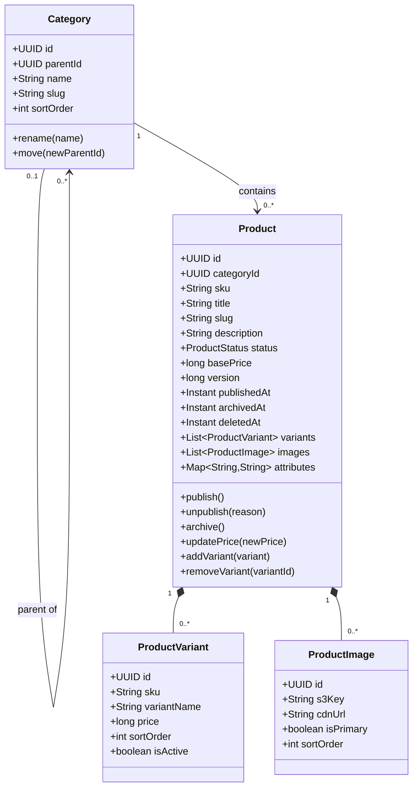
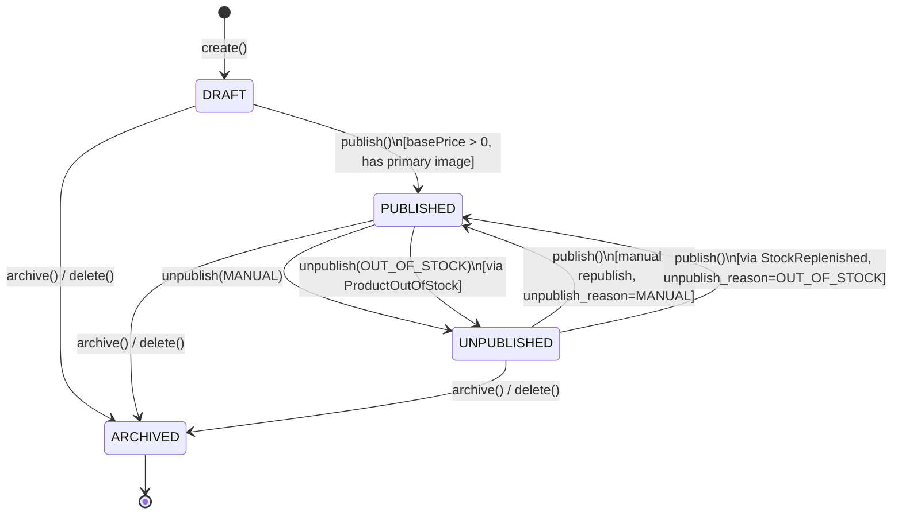
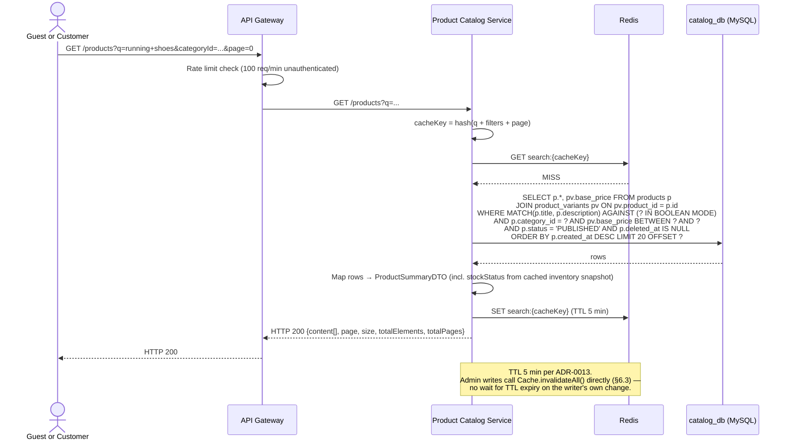
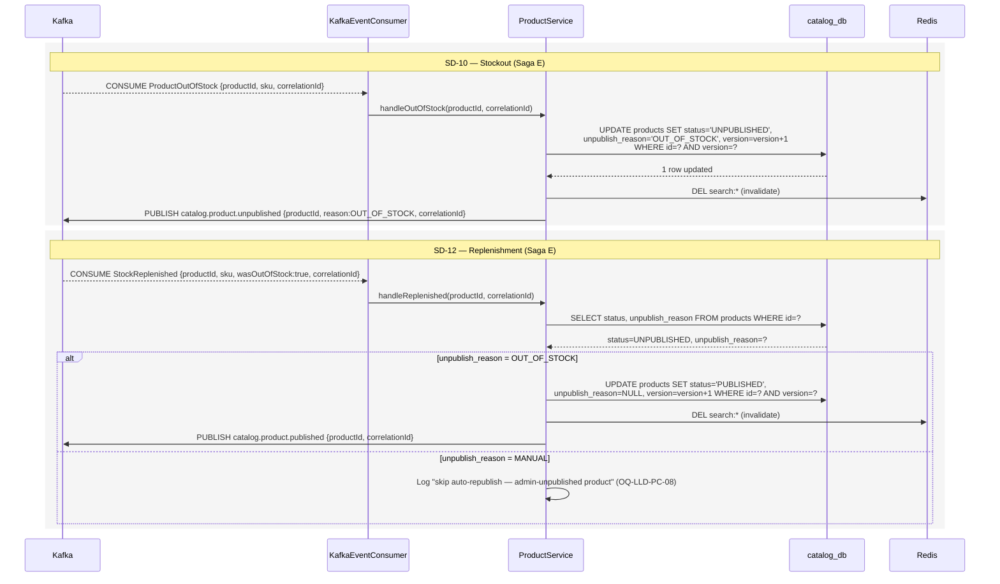

# Product Catalog Service — Low-Level Design

**Artefact type:** LLD (C4 Level 4)
**Phase:** ARCH
**Bounded context:** Product Catalog
**Status:** Draft
**Version:** 0.1
**Date:** 2026-06-11
**Author:** System Architect
**Inputs:**
- `docs/hld/container-diagram.md` v0.1 §3, §5, §8
- `docs/hld/component-diagrams.md` v0.1 §4
- `docs/hld/er-diagrams.md` v0.1 §3, §8 (Schema Isolation Summary)
- `docs/hld/sequence-diagrams.md` v0.1 (SD-04, SD-10, SD-12)
- `docs/adr/ADR-0001-monetary-value-representation.md`
- `docs/adr/ADR-0002-kafka-topic-partitioning.md`
- `docs/adr/ADR-0008-database-per-service.md`
- `docs/adr/ADR-0013-catalog-search-strategy.md` (authoritative — search strategy)
- `docs/lld/inventory-lld.md` (SA-017) — `inventory.*` event catalogue (consumed events)
- `docs/requirements/use-cases/product-catalog-use-cases.md`
- `docs/api-specs/catalog-service-api.yaml`

---

## 1. Scope

This document is the implementation-ready design for the **Product Catalog Service** —
the system of record for products, categories, variants, and pricing, and a
participant (alongside Inventory) in **Saga E** (`sequence-diagrams.md` SD-10/SD-12 —
stockout unpublish / replenishment republish).

**Covers:**
- Aggregate model (`Product`, `Category`) and the `Product` lifecycle state machine
  (`DRAFT | PUBLISHED | UNPUBLISHED | ARCHIVED`)
- `catalog_db` schema refinement (categories, products, product_variants,
  product_images, product_attributes)
- **Search strategy reconciliation** (§6) — `component-diagrams.md` §4 and
  `sequence-diagrams.md` SD-04/SD-10/SD-12 describe an Elasticsearch-backed search
  index, but **ADR-0013 (Accepted)** mandates MySQL full-text search for Phase 1 with
  Elasticsearch deferred to Phase 2. This LLD adopts ADR-0013 as canonical and flags
  the conflicting HLD artefacts for a follow-up cross-cutting sync PR
- Sequence diagrams refining SD-04 (search), and the Catalog-side halves of SD-10/SD-12
- Saga/event participation: published `catalog.*` events, consumed `inventory.*` events
- API contract reconciliation (`catalog-service-api.yaml`)
- Consistency strategy (optimistic locking, search-cache invalidation)

**Does not cover:**
- Cart price-snapshot logic (`docs/lld/cart-lld.md`, SA-014 — next artefact)
- Inventory stock-level management (`docs/lld/inventory-lld.md`, SA-017 — already
  finalised; this LLD only reconciles against its published event catalogue)
- Phase 2 OpenSearch implementation details (sketched at a high level in §12 only)

---

## 2. NFR Targets

| NFR | Target | Source |
|---|---|---|
| NFR-PERF-002 | Product search P99 < 200 ms for 20 results | ADR-0013 |
| NFR-SCALE-002 | 10K–50K products, < 1K concurrent search requests (Phase 1) | ADR-0013 |
| NFR-AVAIL-001 | 99.9% availability | NFR doc |
| NFR-CONS-002 | Read-your-writes for admin product edits (no stale cache after `PUT`/`PATCH`) | This LLD §6.3 |

---

## 3. Aggregate Model



**Aggregate boundaries:**
- `Product` is the aggregate root for variants, images, and attributes — all
  modified only through `Product` methods, persisted in one transaction.
- `Category` is a separate aggregate. `Product.categoryId` is a **logical reference**
  (no FK enforced at the aggregate-invariant level beyond DB referential integrity
  within `catalog_db` — both tables live in the same schema, so a DB-level FK is
  acceptable here, unlike cross-service references per ADR-0008).
- `version` (BIGINT) — optimistic lock on `Product`, per ADR-0001's monetary-update
  pattern (price changes are the most frequent source of concurrent writes).

**Invariants:**

| ID | Invariant |
|---|---|
| INV-PC-01 | `basePrice > 0` is required before transitioning to `PUBLISHED` (er-diagrams.md §3 comment) |
| INV-PC-02 | A product cannot be `PUBLISHED` if it has zero `product_images` with `is_primary = TRUE` (UX requirement — flagged as **OQ-LLD-PC-09**, not yet codified in any HLD artefact) |
| INV-PC-03 | `sku` is platform-wide unique across `products` and `product_variants` (er-diagrams.md unique constraints) |
| INV-PC-04 | Soft-deleted products (`deleted_at IS NOT NULL`) are immutable — no further `update`/`publish`/`unpublish` calls accepted |

**Domain Events Published** (see §9 for full reconciliation):

| Event | Trigger | Payload (key fields) |
|---|---|---|
| `ProductCreated` | `ProductService.create()` | `productId, sku, categoryId, status:DRAFT` |
| `ProductPublished` | `Product.publish()` | `productId, sku, correlationId` |
| `ProductUnpublished` | `Product.unpublish(reason)` | `productId, sku, reason:MANUAL\|OUT_OF_STOCK, correlationId` |
| `ProductPriceUpdated` | `Product.updatePrice()` | `productId, sku, oldPrice, newPrice` |
| `ProductVariantAdded` | `Product.addVariant()` | `productId, variantId, sku` |
| `ProductVariantRemoved` | `Product.removeVariant()` | `productId, variantId` |

---

## 4. Component Structure (refines `component-diagrams.md` §4)

The existing component diagram's shape (`ProductController`/`CategoryController`/
`SearchController` → `ProductService`/`CategoryService`/`SearchService` →
`ProductRepository`/`CategoryRepository`/`SearchIndexAdapter`/`S3ImageAdapter` →
`catalog_db`/Elasticsearch/S3) is **structurally correct** with one exception:

- `SearchIndexAdapter` (`ESA`) and the `ES["Search Index (Elasticsearch)"]` external
  node should not exist in the Phase 1 component diagram per ADR-0013 (§6 below).
  `SearchService` calls `ProductRepository` directly (MySQL `MATCH ... AGAINST`) plus
  a `SearchCacheAdapter` (Redis). This is **OQ-LLD-PC-01**.

No outbox/`OutboxRelay` is required — `er-diagrams.md` §8 marks Catalog's events as
"Kafka publish acceptable loss," consistent with `container-diagram.md` line 206
("Why only Order and Payment?" — Catalog's events are not saga-join inputs on the
*publishing* side; see §9.2 for the one saga-critical *consuming* path).

`KafkaEventConsumer` (`KC`) needs to add `StockReplenished ← Inventory` alongside the
existing `ProductOutOfStock ← Inventory` — see §9.2 / **OQ-LLD-PC-05**.

---

## 5. Product State Machine



| ID | Transition | Trigger | Notes |
|---|---|---|---|
| T-PC-01 | `DRAFT → PUBLISHED` | Admin `POST /products/{id}/publish` (UC-PC-08) | Guard: INV-PC-01, INV-PC-02 |
| T-PC-02 | `PUBLISHED → UNPUBLISHED` (manual) | Admin `POST /products/{id}/unpublish` | Sets `unpublish_reason = MANUAL` |
| T-PC-03 | `PUBLISHED → UNPUBLISHED` (system) | Consume `ProductOutOfStock` (SD-10) | Sets `unpublish_reason = OUT_OF_STOCK`, publishes `ProductUnpublished{reason:OUT_OF_STOCK}` |
| T-PC-04 | `UNPUBLISHED → PUBLISHED` (manual) | Admin `POST /products/{id}/publish` | Allowed regardless of `unpublish_reason` — admin override |
| T-PC-05 | `UNPUBLISHED → PUBLISHED` (system) | Consume `StockReplenished{wasOutOfStock:true}` (SD-12) | **Only fires if `unpublish_reason = OUT_OF_STOCK`** — see invariant below |
| T-PC-06 | `{DRAFT,PUBLISHED,UNPUBLISHED} → ARCHIVED` | Admin `DELETE /products/{id}` (UC-PC-11) | Soft delete, sets `deleted_at`; terminal (INV-PC-04) |

**Invariant guarding T-PC-05 (new — `unpublish_reason` column):**

SD-12 shows the Inventory Service publishing `StockReplenished{wasOutOfStock:true}`
whenever `availableQty` transitions from 0 to >0, and the Catalog Service
unconditionally republishing on receipt. This is a latent bug: if an admin manually
unpublished a product (T-PC-02, e.g. for a quality recall) **and** that product also
happened to be at zero stock, a subsequent stock replenishment would silently
republish a product the admin deliberately hid.

This LLD adds `products.unpublish_reason ENUM('MANUAL','OUT_OF_STOCK') NULL` (§7) and
restricts T-PC-05 to fire **only when `unpublish_reason = OUT_OF_STOCK`**. If
`unpublish_reason = MANUAL`, a `StockReplenished{wasOutOfStock:true}` event for that
product is consumed and logged but does not change `status`. Tracked as
**OQ-LLD-PC-08** — needs reflecting in SD-12 (`sequence-diagrams.md`).

---

## 6. Search Strategy Reconciliation (ADR-0013 vs. HLD diagrams)

**ADR-0013 is `Status: Accepted` (2026-06-08) and is the most recent, explicit
architectural decision on search.** It mandates:

- MySQL `FULLTEXT` index on `products(title, description)`, queried via
  `MATCH ... AGAINST ... IN BOOLEAN MODE`, combined with `WHERE`/`ORDER BY` for
  category/price/sort filters
- Redis cache, key `search:{hashOf(query+filters+page)}`, **TTL 5 minutes**
- Cache invalidation via pattern delete `search:*` on `ProductCreated` /
  `PriceUpdated`
- Elasticsearch explicitly **deferred to Phase 2**

However, the following HLD artefacts still describe an Elasticsearch-backed Phase 1
design and reference the **old ADR numbering ("ADR-010")**:

| Artefact | Conflict |
|---|---|
| `component-diagrams.md` §4 | `ESA["SearchIndexAdapter"]`, `ES["Search Index (Elasticsearch)"]` external node, `SearchS --> ESA`, `KP`/`ESA --> ES` edges |
| `sequence-diagrams.md` SD-04 | `participant ES as Search Index (Elasticsearch)`, `PC->>ES: POST /products/_search`, cache TTL **60s** (vs. ADR-0013's 5 min) |
| `sequence-diagrams.md` SD-10 | `participant ES as Search Index`, `PC->>ES: DELETE /products/{productId} (de-index)` |
| `sequence-diagrams.md` SD-12 | `participant ES as Search Index`, `PC->>ES: POST /products (re-index)` |
| `er-diagrams.md` §3 | Index comment: `` `products(title)` FULLTEXT — MySQL full-text search fallback (per ADR-010)`` — wrong column list (`title` only, not `title, description`) and stale ADR reference |
| `container-diagram.md` line 244 | "Product Catalog falls back to MySQL full-text search (per ADR-010)" — same stale reference, and phrased as a *fallback* rather than the Phase 1 *primary* strategy |

**Resolution adopted in this LLD:** ADR-0013 is canonical. §4 (component structure),
§7 (schema), and §8 (sequence diagrams) below are written against MySQL FTS + Redis,
with no Elasticsearch. The six conflicts above are tracked as **OQ-LLD-PC-01** through
**OQ-LLD-PC-03** (§13) for a follow-up cross-cutting HLD sync PR — following the same
pattern as the ADR-0011/Redis reconciliation in `user-auth-lld.md` §6.1.

### 6.3 Cache Consistency (NFR-CONS-002)

An admin `PATCH /products/{id}` or `/price` must not be masked by a stale 5-minute
search cache entry. `ProductService.update()` / `updatePrice()` / `publish()` /
`unpublish()` all trigger `SearchCacheAdapter.invalidateAll()` (`DEL search:*`) in the
same request — synchronous, not event-driven, so the admin's own write is immediately
reflected. The `ProductPriceUpdated`/`ProductCreated` → cache-invalidation wiring
described in ADR-0013 is a *defence in depth* for invalidation triggered by **other**
instances in a multi-instance deployment (each instance has its own... no — Redis is
shared, so this is purely belt-and-braces for missed direct-invalidation paths, e.g. a
direct DB write via an admin tool bypassing the service layer).

---

## 7. Database Schema — `catalog_db`

```sql
CREATE TABLE categories (
    id          CHAR(36)     PRIMARY KEY,
    parent_id   CHAR(36)     NULL,
    name        VARCHAR(255) NOT NULL,
    slug        VARCHAR(255) NOT NULL,
    sort_order  INT          NOT NULL DEFAULT 0,
    created_at  TIMESTAMP    NOT NULL DEFAULT CURRENT_TIMESTAMP,
    updated_at  TIMESTAMP    NOT NULL DEFAULT CURRENT_TIMESTAMP ON UPDATE CURRENT_TIMESTAMP,
    deleted_at  TIMESTAMP    NULL,

    CONSTRAINT uq_categories_slug UNIQUE (slug),
    CONSTRAINT fk_categories_parent FOREIGN KEY (parent_id) REFERENCES categories(id)
);

CREATE TABLE products (
    id               CHAR(36)     PRIMARY KEY,
    category_id      CHAR(36)     NOT NULL,
    sku              VARCHAR(100) NOT NULL,
    title            VARCHAR(500) NOT NULL,
    slug             VARCHAR(500) NOT NULL,
    description      TEXT         NULL,
    status           VARCHAR(50)  NOT NULL DEFAULT 'DRAFT',  -- DRAFT|PUBLISHED|UNPUBLISHED|ARCHIVED
    unpublish_reason VARCHAR(20)  NULL,                       -- MANUAL|OUT_OF_STOCK (NULL unless UNPUBLISHED)
    base_price       BIGINT       NOT NULL DEFAULT 0,         -- paise; must be > 0 to publish (INV-PC-01)
    version          BIGINT       NOT NULL DEFAULT 0,         -- optimistic lock
    published_at     TIMESTAMP    NULL,
    archived_at      TIMESTAMP    NULL,
    created_at       TIMESTAMP    NOT NULL DEFAULT CURRENT_TIMESTAMP,
    updated_at       TIMESTAMP    NOT NULL DEFAULT CURRENT_TIMESTAMP ON UPDATE CURRENT_TIMESTAMP,
    deleted_at       TIMESTAMP    NULL,

    CONSTRAINT uq_products_sku UNIQUE (sku),
    CONSTRAINT uq_products_slug UNIQUE (slug),
    CONSTRAINT fk_products_category FOREIGN KEY (category_id) REFERENCES categories(id),
    CONSTRAINT chk_products_unpublish_reason CHECK (
        (status = 'UNPUBLISHED' AND unpublish_reason IS NOT NULL)
        OR (status <> 'UNPUBLISHED' AND unpublish_reason IS NULL)
    )
);

CREATE TABLE product_variants (
    id           CHAR(36)     PRIMARY KEY,
    product_id   CHAR(36)     NOT NULL,
    sku          VARCHAR(100) NOT NULL,
    variant_name VARCHAR(255) NOT NULL,        -- e.g. 'Red / XL'
    price        BIGINT       NULL,            -- paise; overrides base_price if set
    sort_order   INT          NOT NULL DEFAULT 0,
    is_active    BOOLEAN      NOT NULL DEFAULT TRUE,
    created_at   TIMESTAMP    NOT NULL DEFAULT CURRENT_TIMESTAMP,
    updated_at   TIMESTAMP    NOT NULL DEFAULT CURRENT_TIMESTAMP ON UPDATE CURRENT_TIMESTAMP,

    CONSTRAINT uq_variants_sku UNIQUE (sku),
    CONSTRAINT fk_variants_product FOREIGN KEY (product_id) REFERENCES products(id)
);

CREATE TABLE product_images (
    id          CHAR(36)      PRIMARY KEY,
    product_id  CHAR(36)      NOT NULL,
    s3_key      VARCHAR(1000) NOT NULL,
    cdn_url     VARCHAR(1000) NOT NULL,
    is_primary  BOOLEAN       NOT NULL DEFAULT FALSE,
    sort_order  INT           NOT NULL DEFAULT 0,
    created_at  TIMESTAMP     NOT NULL DEFAULT CURRENT_TIMESTAMP,

    CONSTRAINT fk_images_product FOREIGN KEY (product_id) REFERENCES products(id)
);

CREATE TABLE product_attributes (
    id          CHAR(36)      PRIMARY KEY,
    product_id  CHAR(36)      NOT NULL,
    attr_key    VARCHAR(100)  NOT NULL,
    attr_value  VARCHAR(500)  NOT NULL,

    CONSTRAINT fk_attributes_product FOREIGN KEY (product_id) REFERENCES products(id)
);

-- Indexes
CREATE UNIQUE INDEX uq_products_sku        ON products(sku);
CREATE UNIQUE INDEX uq_products_slug       ON products(slug);
CREATE INDEX idx_products_category_status  ON products(category_id, status);
CREATE INDEX idx_products_status_published ON products(status, published_at);
CREATE FULLTEXT INDEX ft_products_search    ON products(title, description); -- ADR-0013
CREATE UNIQUE INDEX uq_variants_sku         ON product_variants(sku);
CREATE INDEX idx_images_product_primary     ON product_images(product_id, is_primary);
```

**Schema deltas vs. `er-diagrams.md` §3** (tracked as **OQ-LLD-PC-03**):
1. Added `products.unpublish_reason` column + `chk_products_unpublish_reason`
   constraint (§5).
2. `ft_products_search` is `(title, description)`, not `(title)` — matches ADR-0013's
   decision SQL exactly.

---

## 8. Sequence Diagrams

### LLD-SD-01 — Product Search (refines SD-04 per ADR-0013, no Elasticsearch)



### LLD-SD-02 — Stockout Unpublish / Replenishment Republish (Catalog half of SD-10/SD-12)



---

## 9. Saga / Event Participation Summary

### 9.1 Published Events (`catalog.*`)

| Event | In `container-diagram.md` §5? | In `component-diagrams.md` §4 `KP`? |
|---|---|---|
| `ProductCreated` | ❌ No | ❌ No |
| `ProductPublished` | ❌ No | ✅ Yes |
| `ProductUnpublished` | ❌ No | ✅ Yes |
| `ProductPriceUpdated` | ✅ Yes | ✅ Yes |
| `ProductVariantAdded` | ✅ Yes | ✅ Yes |
| `ProductVariantRemoved` | ✅ Yes | ✅ Yes |

`container-diagram.md` §5's `catalog.*` row currently lists only
`ProductPriceUpdated`, `ProductVariantAdded`, `ProductVariantRemoved` — but
`ProductPublished`/`ProductUnpublished` are load-bearing for **Saga E** (SD-10/SD-12)
and already appear in `component-diagrams.md` §4's `KP` node. `ProductCreated` is
referenced informally (e.g. ADR-0013's cache-invalidation trigger list) but appears in
neither HLD topic map nor the component diagram. Tracked as **OQ-LLD-PC-04**.

### 9.2 Consumed Events (`inventory.*`)

| Event | Consumed by | Handler |
|---|---|---|
| `ProductOutOfStock` | `KafkaEventConsumer` | T-PC-03 (§5) — unpublish |
| `StockReplenished` | `KafkaEventConsumer` (**not yet in `component-diagrams.md` §4 `KC`**) | T-PC-05 (§5) — conditional republish |

`StockReplenished` (`inventory.stock.replenished`, used in SD-12) does **not** appear
in `container-diagram.md` §5's post-SA-020 `inventory.*` event list
(`StockReservationFailed`, `StockReserved`, `StockReleased`, `StockRestored`,
`ProductOutOfStock`, `LowStockAlertTriggered`) or in `inventory-lld.md`'s published-
event catalogue. Either `inventory-lld.md` is missing this event, or SD-12 should be
using one of the existing `inventory.*` events (`StockRestored`?) under a different
name. **This is a cross-LLD naming gap — tracked as OQ-LLD-PC-05** and should be
resolved by referring back to `inventory-lld.md`'s author context before the next
cross-cutting sync PR.

This consumed path (`StockReplenished`/`StockRestored` → conditional republish) is
**not** a saga-join input for `order_saga_state` — it is a Saga E side-effect only, so
no `catalog_outbox` is required (consistent with §4).

---

## 10. API Contract Reconciliation (`catalog-service-api.yaml`)

| Area | Status | Notes |
|---|---|---|
| `GET /products` (search/list) | ✅ Matches LLD-SD-01 | `q`, `categoryId`, `minPrice`, `maxPrice`, `sortBy`, `page`, `size` all map to §8 query |
| `POST /products`, `GET/PATCH/DELETE /products/{id}` | ✅ Matches §3/§5 | |
| `POST /products/{id}/publish`, `/unpublish` | ✅ Matches T-PC-01/02/04 | Spec doesn't model `unpublish_reason` in the request body — `unpublish` should accept an implicit `reason=MANUAL` (system-triggered unpublish via T-PC-03 is event-driven, not via this endpoint) |
| `PATCH /products/{id}/price` | ✅ Matches T-PriceUpdate | |
| `GET /categories`, `POST /categories` | ⚠️ Partial | UC-PC-10 ("Manage Categories") implies update/delete/move, but spec has no `PATCH/DELETE /categories/{id}` — **OQ-LLD-PC-07** |
| Variant management (UC-PC-07) | ❌ Missing | No `/products/{id}/variants` endpoints in the spec at all — `ProductVariant` schema exists but is read-only (nested in `ProductDetail`) — **OQ-LLD-PC-07** |
| `ProductSummary.status` enum | ⚠️ Mismatch | Spec enum is `[DRAFT, PUBLISHED, UNPUBLISHED, DELETED]`; aggregate model (§3) and `er-diagrams.md` §3 use `ARCHIVED`, not `DELETED` — **OQ-LLD-PC-06** |

---

## 11. Consistency Strategy

| Concern | Strategy |
|---|---|
| Concurrent product edits (price update vs. publish) | Optimistic lock on `products.version` — `UPDATE ... WHERE id=? AND version=?`; 409 on mismatch, client retries |
| Search result freshness | Redis cache, 5-min TTL (ADR-0013) + synchronous invalidation on writer's own change (§6.3) |
| Category tree edits | `Category` aggregate is independently locked (own `version` not modeled in er-diagrams — **out of scope**, categories change rarely; FK constraint `fk_products_category` prevents orphaned products) |
| Saga E (stockout/replenish) | Eventually consistent — `products.status` lags `inventory_items.available_qty` by Kafka consumer-lag (typically <1s). Acceptable: SD-10's note states "Product no longer visible in search or browse" is the intended UX, not a hard real-time guarantee |
| Cross-service refs | `category_id` is intra-schema FK (same `catalog_db`); no cross-service FKs (ADR-0008) |

---

## 12. Phase 2 Delta

| Aspect | Phase 1 | Phase 2 |
|---|---|---|
| Compute | Spring Boot REST controllers | API Gateway + Lambda (Java 21 SnapStart) |
| Datastore | `catalog_db` (MySQL, relational) | DynamoDB single-table: `PK=PRODUCT#{id}`, `SK=METADATA` / `SK=VARIANT#{id}` / `SK=IMAGE#{id}` |
| Search | MySQL FULLTEXT + Redis (ADR-0013 Phase 1) | OpenSearch, synced via EventBridge consumer on `catalog.product.*` (ADR-0013 migration path §"Migration Path to Elasticsearch") |
| Events | Kafka `catalog.*` | EventBridge `catalog.*` — same payload shapes |
| Categories | Self-referencing FK table | Adjacency list via DynamoDB `GSI1: PK=CATEGORY#{parentId}` |

---

## 13. Open Questions / Next Artefacts

| ID | Item | Owner | Status |
|---|---|---|---|
| OQ-LLD-PC-01 | `component-diagrams.md` §4 (`SearchIndexAdapter`/`ES`) and `sequence-diagrams.md` SD-04/SD-10/SD-12 describe Elasticsearch; ADR-0013 (Accepted) mandates MySQL FTS for Phase 1. Adopted ADR-0013 in this LLD (§6, §8) — diagrams need updating in a cross-cutting sync PR | Architect | **Resolved** — cross-cutting HLD sync PR (SA-021) |
| OQ-LLD-PC-02 | SD-04's Redis cache TTL is 60s; ADR-0013 specifies 5 min. Align SD-04 to ADR-0013 in the same sync PR | Architect | **Resolved** — cross-cutting HLD sync PR (SA-021) |
| OQ-LLD-PC-03 | `er-diagrams.md` §3: fix `ft_products_search` to `(title, description)` (not `title` only) and fix stale "ADR-010" reference → "ADR-0013"; same fix for `container-diagram.md` line 244 | Architect | **Resolved** — cross-cutting HLD sync PR (SA-021) |
| OQ-LLD-PC-04 | Add `ProductPublished`/`ProductUnpublished` (and consider `ProductCreated`) to `container-diagram.md` §5 `catalog.*` topic row (§9.1) | Architect | **Resolved** — cross-cutting HLD sync PR (SA-021) |
| OQ-LLD-PC-05 | `StockReplenished`/`inventory.stock.replenished` (used in SD-12) does not appear in `container-diagram.md` §5's `inventory.*` list or `inventory-lld.md`'s published-event catalogue — naming/existence gap to resolve against Inventory's event catalogue (§9.2) | Architect | **Resolved** — cross-cutting HLD sync PR (SA-021) |
| OQ-LLD-PC-06 | `catalog-service-api.yaml` `ProductSummary.status` enum uses `DELETED`; aggregate/schema use `ARCHIVED` — align naming (§10) | Architect | **Resolved** — cross-cutting HLD sync PR (SA-021) |
| OQ-LLD-PC-07 | `catalog-service-api.yaml` missing variant management endpoints (UC-PC-07) and category update/delete/move endpoints (UC-PC-10) (§10) | Architect | **Resolved** — cross-cutting HLD sync PR (SA-021) |
| OQ-LLD-PC-08 | New `unpublish_reason` column (§5, §7) needs reflecting in `sequence-diagrams.md` SD-12's conditional-republish logic | Architect | **Resolved** — cross-cutting HLD sync PR (SA-021) |
| OQ-LLD-PC-09 | INV-PC-02 ("no publish without a primary image") is a UX requirement not yet codified in any HLD use-case or invariant doc — confirm with product requirements before enforcing as a hard `publish()` guard | Architect | Open |

| Next Artefact | Description |
|---|---|
| **`docs/lld/cart-lld.md`** (SA-014) | Cart's line-item price-snapshot logic (SD-05) reads `GET /products/{sku}` from this service — now that `catalog_db`'s `products`/`product_variants` schema (§7) and the `ProductSummary`/`ProductDetail` API contract (§10) are finalised, Cart can reference them directly |
| **Cross-cutting HLD sync PR #3** | Bundles OQ-LLD-PC-01 through OQ-LLD-PC-08 — the search-strategy reconciliation (ADR-0013), `catalog.*`/`inventory.*` topic-map gaps, and API-spec alignment. Largest reconciliation bundle yet; recommend scoping as its own PR before Cart LLD lands more cross-references |
