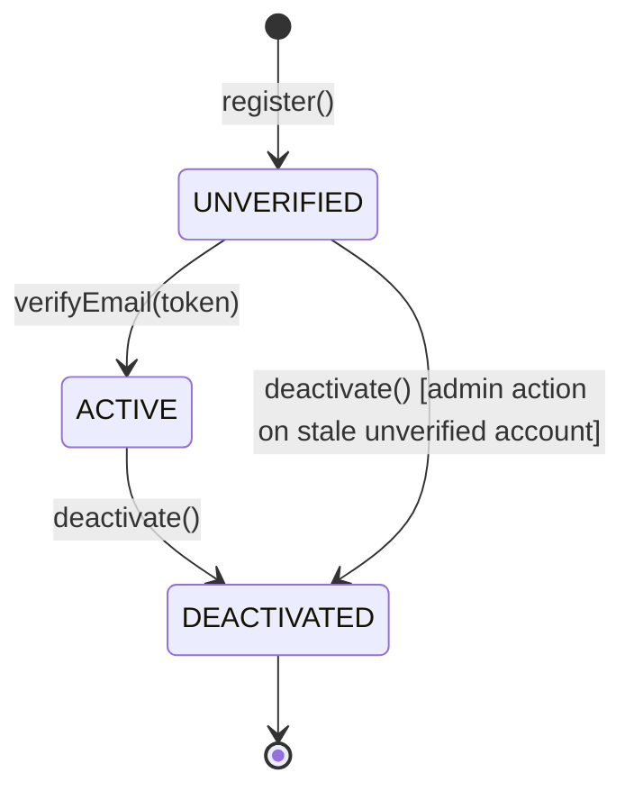
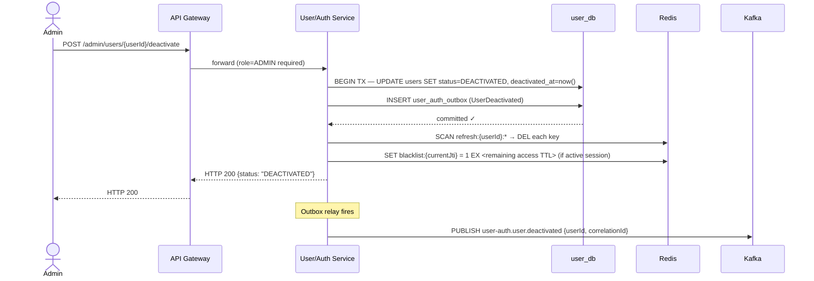

# User/Auth Service — Low-Level Design

**Artefact type:** LLD (C4 Level 4)
**Phase:** ARCH
**Bounded context:** User / Auth
**Status:** Draft
**Version:** 0.1
**Date:** 2026-06-11
**Author:** System Architect
**Inputs:**
- `docs/hld/container-diagram.md` v0.1 §3, §5, §6
- `docs/hld/component-diagrams.md` v0.1 §3
- `docs/hld/er-diagrams.md` v0.1 §2, §8
- `docs/hld/sequence-diagrams.md` v0.1 (SD-01, SD-02, SD-03)
- `docs/adr/ADR-0002-kafka-topic-partitioning.md`
- `docs/adr/ADR-0008-database-per-service.md`
- `docs/adr/ADR-0011-jwt-strategy.md` — **authoritative source for token design**
- `docs/requirements/non-functional-requirements.md` (NFR-SEC-001, NFR-SEC-006)
- `docs/api-specs/user-service-api.yaml` v0.1.0-draft

---

## 1. Scope

This document is the implementation-ready design for the **User/Auth Service** — the
identity provider for the platform and the upstream-most bounded context (no inbound
domain-event dependencies; every other context that needs user identity does so via a
logical reference, never a cross-schema query).

**Covers:**
- Aggregate model (`User`, `UserAddress`) and invariants
- `user_db` schema (refines `er-diagrams.md` §2)
- Authentication/session design — reconciles ADR-0011's JWT/refresh-token decision
  against the Redis-based implementation already shown in `component-diagrams.md` §3
  and `sequence-diagrams.md` SD-02/SD-03
- Sequence diagrams for registration, login, and refresh-token rotation (refines SD-01–SD-03)
- Saga/event participation: published `user-auth.*` events and topic-map reconciliation
- API contract reconciliation against `user-service-api.yaml`
- Consistency strategy (outbox, optimistic locking, rate limiting)

**Does NOT cover:**
- Cart guest-session merge logic on `UserLoggedIn` — see Cart LLD (SA-014, not yet written)
- Notification template content for verification/reset emails — see `notification-lld.md` §5
- Phase 2 Cognito migration implementation details — §12 covers only the high-level delta;
  a dedicated ADR is raised if Phase 2 work begins

---

## 2. NFR Targets This Design Must Satisfy

| ID | Requirement | Target | Design implication |
|---|---|---|---|
| NFR-SEC-001 | Authentication | JWT RS256, 15-min access token, 7-day refresh, asymmetric key rotation | §6 reconciles ADR-0011's token design with the Redis session store; §6.3 covers JWKS rotation |
| NFR-SEC-006 | API rate limiting | 100 req/min/IP (unauth), 500 req/min/user (auth) | `rate:{userId}:{endpoint}` / `rate:{ip}:register` Redis counters (§6.4), enforced in `AuthService` before DB/bcrypt work |
| NFR-AVAIL-001 | Overall uptime | 99.9% | `users(email)` unique index is the only hot-path read; no synchronous calls to other services on login/register |
| NFR-SCALE-001 | Concurrent users | 10,000 | Stateless JWT verification (no Auth round-trip per request, ADR-0011); Redis cluster absorbs session/rate-limit traffic |
| NFR-CONS-001 | Cross-context eventual consistency | ≤ 2 s | `user_auth_outbox` relay (≤ 500 ms poll, container-diagram.md §7) publishes `UserRegistered`/`UserLoggedIn`/`UserDeactivated` within the window |

---

## 3. Aggregate Model

### 3.1 `User` (Aggregate Root)

| Field | Type | Notes |
|---|---|---|
| `id` | UUID | Identity |
| `email` | `Email` (value object) | Unique platform-wide; lowercased and validated on construction; immutable after creation |
| `passwordHash` | `PasswordHash` (value object) | bcrypt, cost ≥ 12; exposes only `matches(rawPassword)` — never serialised |
| `status` | enum | `UNVERIFIED \| ACTIVE \| DEACTIVATED` (§5) |
| `role` | enum | `CUSTOMER \| ADMIN \| INVENTORY_MANAGER` (per `er-diagrams.md` §2 and `user-service-api.yaml`) |
| `fullName` | String | |
| `addresses` | `List<UserAddress>` | Child entities, owned by `User` |
| `emailVerifiedAt` | Instant, nullable | Set by `verifyEmail()` |
| `deactivatedAt` | Instant, nullable | Set by `deactivate()` |
| `version` | long | Optimistic lock (concurrent profile updates) |
| `createdAt` / `updatedAt` | Instant | |
| `deletedAt` | Instant, nullable | Soft delete (er-diagrams.md §2) |

**Behaviours (commands):** `register(email, rawPassword, fullName)`, `verifyEmail(token)`,
`login(rawPassword)`, `changePassword(currentRaw, newRaw)`, `requestPasswordReset()`,
`resetPassword(tokenHash, newRaw)`, `deactivate()`, `addAddress(address)`,
`setDefaultAddress(addressId)`, `removeAddress(addressId)`.

Each command validates the current `status` against the transition rules in §5 and
throws `IllegalStateTransitionException` on an illegal transition (e.g., `login()` on a
`DEACTIVATED` account, or `verifyEmail()` on an already-`ACTIVE` account).

### 3.2 `UserAddress` (Entity, child of `User`)

| Field | Type | Notes |
|---|---|---|
| `id` | UUID | |
| `line1`, `line2`, `city`, `state`, `pincode`, `country` | String | `country` defaults `'IN'` |
| `isDefault` | boolean | Exactly one address per user may be default (INV-UA-01) |
| `createdAt` / `updatedAt` / `deletedAt` | Instant | Soft delete |

**INV-UA-01:** Setting `isDefault = true` on one address atomically clears the flag on
all other addresses of the same user — enforced inside `User.setDefaultAddress()`, never
at the DB layer (no partial unique index on `(user_id, is_default)` — MySQL 8 cannot
express "at most one TRUE per group" as a constraint).

### 3.3 Value Objects

| Value Object | Validation | Notes |
|---|---|---|
| `Email` | RFC 5322 format; lowercased on construction | Immutable after `User` creation |
| `PasswordHash` | Raw password ≥ 8 chars, bcrypt cost ≥ 12 | Never exposed outside the aggregate |
| `UserId` | UUID v4 | Assigned on creation |

### 3.4 Domain Events (published via `user_auth_outbox`)

| Event | Trigger | Payload | Consumers |
|---|---|---|---|
| `UserRegistered` | `register()` | `userId, email, correlationId` | Notification (welcome/verification email) |
| `UserLoggedIn` | successful `login()` | `userId, sessionId, correlationId` | Cart (guest-cart merge, SD-02) |
| `UserDeactivated` | `deactivate()` | `userId, correlationId` | Notification, Cart (clear cart) |
| `PasswordResetRequested` | `requestPasswordReset()` | `userId, email, resetTokenHash, expiresAt, correlationId` | Notification (reset email) |

`EmailVerified` is **not** published as a domain event — `verifyEmail()` is a
synchronous, idempotent state transition (`UNVERIFIED → ACTIVE`) with no downstream
consumers; the client receives confirmation directly in the `200` response (SD-01).

---

## 4. Component Structure (refines component-diagrams.md §3)

`component-diagrams.md` §3 already shows the target component layout (`AuthController`,
`UserController`, `AuthService`, `UserService`, `UserRepository`,
`RefreshTokenRepository`/`TokenBlacklistRepository`/`RateLimitRepository` as Redis
adapters, `KafkaEventPublisher`). This LLD adds:

- **`EmailVerificationService`** (application layer, not shown in component-diagrams.md
  §3) — owns `sendVerification()` / `verify()`, backed by a new
  `EmailVerificationRepository` (JPA, `email_verifications` table). Flagged as
  **OQ-LLD-UA-04** (component-diagrams.md §3 update).
- **`PasswordResetService`** (application layer) — owns `requestReset()` / `resetPassword()`,
  backed by `PasswordResetRepository` (JPA, `password_reset_tokens` table). Same
  OQ-LLD-UA-04.
- **`OutboxRelay`** — `user_db` already lists `user_auth_outbox` (er-diagrams.md §2,
  §8), but component-diagrams.md §3's `infra/` subgraph does not yet show an
  `OutboxRelay` component or `OutboxRepository`, unlike Order/Payment/Inventory (§7, §8
  of component-diagrams.md). Same OQ-LLD-UA-04.

---

## 5. State Machine — `User.status`



| Transition | From | To | Trigger | Notes |
|---|---|---|---|---|
| T-UA-01 | `UNVERIFIED` | `ACTIVE` | `POST /auth/verify-email` | Sets `emailVerifiedAt`. Idempotent: re-verifying an already-`ACTIVE` account returns `200` (no-op), not an error — verification links may be clicked twice (email client prefetch) |
| T-UA-02 | `ACTIVE` | `DEACTIVATED` | `POST /admin/users/{id}/deactivate` (UC-UA-09) or self-service account closure | Publishes `UserDeactivated`; revokes all refresh-token sessions (§6.2) and blacklists the current access token's `jti` |
| T-UA-03 | `UNVERIFIED` | `DEACTIVATED` | Admin action on stale unverified accounts | Same side effects as T-UA-02 |

**Login guard (not a state transition):** `login()` is permitted only when
`status = ACTIVE`. `UNVERIFIED` → `403` ("verify your email first");
`DEACTIVATED` → `403` ("account deactivated"). This is the email-enumeration-safe
variant — both `403` responses are distinguishable from `401` (wrong password), but
**not** from each other in a way that confirms account existence (both say "account not
active").

`DEACTIVATED` is terminal — no reactivation flow exists in `user-auth-use-cases.md`.
Reactivation, if needed, is an admin-only data-fix operation outside the API surface
(flagged as **OQ-LLD-UA-05**).

---

## 6. Authentication & Session Strategy (reconciles ADR-0011)

### 6.1 Reconciliation: refresh-token storage

**ADR-0011**'s Decision table specifies refresh tokens as "Opaque (UUID), 7 days,
`HttpOnly; Secure` cookie" — that describes **client-side** storage. ADR-0011's
*Negative consequences* section additionally states refresh tokens are stored as "a DB
row in `refresh_tokens`" with "Index on `token` (UNIQUE) and `user_id`".

`component-diagrams.md` §3, `sequence-diagrams.md` SD-02 and SD-03, and
`container-diagram.md` §6 (Redis Namespace Map) all implement **server-side refresh
token storage in Redis** — `refresh:{userId}:{tokenId}` (TTL 7 days) — with **no**
`refresh_tokens` table in `er-diagrams.md` §2.

This LLD adopts the **Redis-based design as canonical** (it is the more recently
finalised, code-adjacent set of artefacts — consistent with the naming-reconciliation
precedent in `notification-lld.md` §5):

- `user_db` does **not** have a `refresh_tokens` table (§7 below matches
  `er-diagrams.md` §2 as-is — no schema change needed).
- `container-diagram.md` §3's `user_db` row, which lists "User, role, address,
  refresh_token tables", is **incorrect** and needs correction to drop "refresh_token
  tables" — flagged as **OQ-LLD-UA-01**.
- ADR-0011's *Negative consequences* bullet about a `refresh_tokens` DB row is
  **superseded** — flagged as **OQ-LLD-UA-02** (ADR-0011 amendment note, same pattern
  as ADR-0012/OQ-LLD-NT-03: amend, do not renumber/delete).

**Why Redis over a DB table is the right call:** refresh tokens are inherently
TTL-bound (7 days) and looked up by a single key (`userId` + `tokenId`) on every
`/auth/refresh` call — a textbook Redis access pattern. A MySQL table would need a
nightly sweep job for expired rows (as the superseded draft of this LLD specified);
Redis TTL makes that job unnecessary.

### 6.2 Session lifecycle

| Operation | Redis action | Notes |
|---|---|---|
| Login (SD-02) | `SET refresh:{userId}:{tokenId} = tokenHash EX 604800` | One key per active session/device — supports multi-device login natively (resolves OQ-UA-02 from the superseded draft: logout is per-device by default) |
| Refresh (SD-03) | `DEL refresh:{userId}:{oldTokenId}` then `SET refresh:{userId}:{newTokenId} ... EX 604800` | Rotation — old token single-use (ADR-0011) |
| Logout (single device) | `DEL refresh:{userId}:{tokenId}`; `SET blacklist:{jti} = 1 EX <remaining access TTL>` | |
| Logout (all devices) / `deactivate()` (T-UA-02/03) | `SCAN` + `DEL refresh:{userId}:*`; blacklist current `jti` | Used by `UserDeactivated` and "stolen refresh token reuse detected" (SD-03 note) |
| Password change | Same as "logout all devices" | All sessions invalidated per UC-UA-06 postcondition |

### 6.3 JWKS / key rotation

Per ADR-0011: `GET /auth/.well-known/jwks.json` serves the RSA public key set.
Rotation procedure: publish new public key alongside the old in the JWKS response →
sign new tokens with the new key → remove the old key after the 15-minute access-token
TTL has fully elapsed for all previously-issued tokens.

### 6.4 Rate limiting (NFR-SEC-006)

| Key | TTL | Rule |
|---|---|---|
| `rate:{userId}:login` | 15 min sliding | 5 failed attempts → account locked 15 min |
| `rate:{ip}:register` | 1 hour sliding | 10 attempts/hour → `429` |
| `rate:{userId}:{endpoint}` (general) | 1 min sliding | 500 req/min/user (NFR-SEC-006) |
| `rate:{ip}:*` (unauthenticated) | 1 min sliding | 100 req/min/IP (NFR-SEC-006), enforced at API Gateway per container-diagram.md §8 |

---

## 7. Database Schema — `user_db`

`er-diagrams.md` §2 already defines `users`, `user_addresses`, `email_verifications`,
`password_reset_tokens`, and `user_auth_outbox` — this LLD adopts that schema unchanged
(no `refresh_tokens` table, per §6.1).

### 7.1 Implementation notes (refines er-diagrams.md §2)

```sql
CREATE TABLE users (
    id                CHAR(36)      NOT NULL PRIMARY KEY,
    email             VARCHAR(255)  NOT NULL,
    password_hash     VARCHAR(255)  NOT NULL,
    status            VARCHAR(20)   NOT NULL DEFAULT 'UNVERIFIED',
    role              VARCHAR(20)   NOT NULL DEFAULT 'CUSTOMER',
    full_name         VARCHAR(255)  NOT NULL,
    email_verified_at DATETIME(3)   NULL,
    deactivated_at    DATETIME(3)   NULL,
    version           BIGINT        NOT NULL DEFAULT 0,
    created_at        DATETIME(3)   NOT NULL DEFAULT CURRENT_TIMESTAMP(3),
    updated_at        DATETIME(3)   NOT NULL DEFAULT CURRENT_TIMESTAMP(3) ON UPDATE CURRENT_TIMESTAMP(3),
    deleted_at        DATETIME(3)   NULL,
    CONSTRAINT uq_users_email UNIQUE (email),
    CONSTRAINT chk_users_status CHECK (status IN ('UNVERIFIED','ACTIVE','DEACTIVATED')),
    CONSTRAINT chk_users_role   CHECK (role IN ('CUSTOMER','ADMIN','INVENTORY_MANAGER')),
    INDEX idx_users_status (status)
);

CREATE TABLE user_addresses (
    id          CHAR(36)      NOT NULL PRIMARY KEY,
    user_id     CHAR(36)      NOT NULL,
    line1       VARCHAR(255)  NOT NULL,
    line2       VARCHAR(255)  NULL,
    city        VARCHAR(100)  NOT NULL,
    state       VARCHAR(100)  NOT NULL,
    pincode     VARCHAR(20)   NOT NULL,
    country     VARCHAR(100)  NOT NULL DEFAULT 'IN',
    is_default  BOOLEAN       NOT NULL DEFAULT FALSE,
    created_at  DATETIME(3)   NOT NULL DEFAULT CURRENT_TIMESTAMP(3),
    updated_at  DATETIME(3)   NOT NULL DEFAULT CURRENT_TIMESTAMP(3) ON UPDATE CURRENT_TIMESTAMP(3),
    deleted_at  DATETIME(3)   NULL,
    CONSTRAINT fk_addr_user FOREIGN KEY (user_id) REFERENCES users(id),
    INDEX idx_addr_user (user_id)
);

CREATE TABLE email_verifications (
    id          CHAR(36)      NOT NULL PRIMARY KEY,
    user_id     CHAR(36)      NOT NULL,
    token       VARCHAR(255)  NOT NULL,
    expires_at  DATETIME(3)   NOT NULL,
    used_at     DATETIME(3)   NULL,
    created_at  DATETIME(3)   NOT NULL DEFAULT CURRENT_TIMESTAMP(3),
    CONSTRAINT fk_everif_user FOREIGN KEY (user_id) REFERENCES users(id),
    UNIQUE KEY uq_everif_token (token)
);

CREATE TABLE password_reset_tokens (
    id          CHAR(36)      NOT NULL PRIMARY KEY,
    user_id     CHAR(36)      NOT NULL,
    token_hash  VARCHAR(255)  NOT NULL,
    expires_at  DATETIME(3)   NOT NULL,
    used_at     DATETIME(3)   NULL,
    created_at  DATETIME(3)   NOT NULL DEFAULT CURRENT_TIMESTAMP(3),
    CONSTRAINT fk_pwreset_user FOREIGN KEY (user_id) REFERENCES users(id),
    UNIQUE KEY uq_pwreset_token_hash (token_hash)
);

CREATE TABLE user_auth_outbox (
    id              BIGINT        NOT NULL AUTO_INCREMENT PRIMARY KEY,
    aggregate_id    CHAR(36)      NOT NULL,
    event_type      VARCHAR(100)  NOT NULL,
    payload         JSON          NOT NULL,
    correlation_id  VARCHAR(36)   NOT NULL,
    published       BOOLEAN       NOT NULL DEFAULT FALSE,
    created_at      DATETIME(3)   NOT NULL DEFAULT CURRENT_TIMESTAMP(3),
    published_at    DATETIME(3)   NULL,
    INDEX idx_outbox_unpublished (published, created_at)
);
```

**`token_hash` (not `token`) for `password_reset_tokens`:** the reset token is emailed
to the user as plaintext but stored as a SHA-256 hash — a DB compromise does not leak
usable reset tokens. `email_verifications.token` is stored as plaintext because it has
a much shorter blast radius (verification only transitions `UNVERIFIED → ACTIVE`, no
credential change) — this asymmetry is intentional, not an oversight.

### 7.2 Cleanup jobs

- `DELETE FROM email_verifications WHERE expires_at < NOW() - INTERVAL 7 DAY`
- `DELETE FROM password_reset_tokens WHERE expires_at < NOW() - INTERVAL 7 DAY`
- `DELETE FROM user_auth_outbox WHERE published = TRUE AND published_at < NOW() - INTERVAL 7 DAY`

(No `refresh_tokens` cleanup job — Redis TTL handles expiry, per §6.1.)

### 7.3 Indexes (unchanged from er-diagrams.md §2)

- `users(email)` — unique, hot path on every login
- `users(status)` — admin filtering, login guard
- `email_verifications(token)` — unique, lookup on verify
- `password_reset_tokens(token_hash)` — unique, lookup on reset
- `user_auth_outbox(published, created_at)` — outbox relay poll

---

## 8. Sequence Diagrams

This LLD does not redraw SD-01–SD-03 (`sequence-diagrams.md` §3–§5) — they already
match the design in §6. This section adds one flow not yet diagrammed at HLD level:
account deactivation and its session-revocation side effects (T-UA-02/03, §6.2).

### 8.1 LLD-SD-01 — Admin Deactivation (T-UA-02)



---

## 9. Saga / Event Participation Summary

### 9.1 Published events

| Event | Topic | Consumers | Status |
|---|---|---|---|
| `UserRegistered` | `user-auth.user.registered` | Notification | ✅ In `container-diagram.md` §5 |
| `UserLoggedIn` | `user-auth.user.logged-in` | Cart | ✅ In `container-diagram.md` §5 |
| `UserDeactivated` | `user-auth.user.deactivated` | Notification, Cart | ✅ In `container-diagram.md` §5 |
| `PasswordResetRequested` | `user-auth.user.password-reset-requested` | Notification | ❌ Missing from `container-diagram.md` §5's `user-auth.*` "Key events" list — flagged as **OQ-LLD-UA-03** |

User/Auth has **no consumed events** — it is the upstream-most context (no
`KafkaEventConsumer` in component-diagrams.md §3), consistent with the bounded-context
table in `CLAUDE.md`.

### 9.2 No saga participation

User/Auth is not part of Sagas A–E (`order-state-machine.md`) — `UserLoggedIn` triggers
a best-effort, non-transactional cart merge (SD-02) with no compensating action and no
saga-join requirement. ADR-0014's saga-join side-table pattern does not apply here.

---

## 10. API Contract Reconciliation (`user-service-api.yaml`)

| Area | `user-service-api.yaml` | This LLD | Reconciliation |
|---|---|---|---|
| `UserResponse.status` enum | `[UNVERIFIED, ACTIVE, DEACTIVATED]` | §5 state machine | ✅ Match — no change |
| `UserResponse.role` enum | `[CUSTOMER, ADMIN, INVENTORY_MANAGER]` | §3.1 | ✅ Match — no change |
| `POST /auth/register` → `RegisterResponse` | returns `userId` | §3.4 `UserRegistered` payload | ✅ Match |
| `POST /auth/login` → `TokenResponse` | `accessToken`, `expiresIn`, `tokenType: Bearer` | ADR-0011 access-token TTL (900s) | ✅ Match |
| Refresh-token transport | Not modelled in OpenAPI schema (cookie-based, per ADR-0011) | §6.2 | ✅ Expected — `HttpOnly` cookies are out of OpenAPI's request/response body model; no fix needed |
| `POST /admin/users/{userId}/deactivate` (§8.1, UC-UA-09) | Added in DEV-006, plus `GET /admin/users` for admin search | §8.1 | ✅ Resolved — see **OQ-LLD-UA-06** for the remaining `jti`-blacklist gap |

---

## 11. Consistency Strategy

| Operation | Strategy | Reason |
|---|---|---|
| Registration | Synchronous DB write (`users` + `user_auth_outbox` row) in one transaction | Atomicity — `UserRegistered` must not be lost if the outbox insert fails |
| Email verification / password reset | Synchronous DB write (mark token used + update `users.status`/`password_hash`) in one transaction | Token must be single-use; partial application would leave an inconsistent state |
| Login | Synchronous read (`users` by email) + bcrypt verify | Must reflect current `status`/`password_hash` — no caching of credentials |
| Profile / address updates | Optimistic lock (`users.version`) | Concurrent `PUT /users/me` from multiple devices — last-writer loses with `409`, not silently overwritten |
| Domain events | Async via `user_auth_outbox` relay → Kafka (≤ 500 ms poll, container-diagram.md §7) | Notification/Cart consumption can be eventually consistent (NFR-CONS-001) |
| Session state (refresh tokens, blacklist, rate limits) | Redis, synchronous writes on the request path | Must take effect before the response is returned (e.g., logout must immediately invalidate) |

---

## 12. Phase 2 Delta (AWS Serverless)

| Concern | Phase 1 | Phase 2 |
|---|---|---|
| Identity store | MySQL `users`/`user_addresses` | Cognito User Pool (credentials) + DynamoDB (profile/addresses) |
| Token issuance | Custom JWT RS256 (User/Auth-issued) | Cognito-issued JWT RS256 |
| Refresh token storage | Redis (`refresh:{userId}:{tokenId}`, §6.1) | Cognito-managed refresh token rotation |
| JWKS endpoint | `GET /auth/.well-known/jwks.json` | Cognito JWKS URL — other services change only their `JWKS_URI` config |
| Rate limiting | Redis counters (§6.4) | Cognito built-in throttling + API Gateway usage plans |
| Outbox relay | Spring `@Scheduled` poller on `user_auth_outbox` | DynamoDB Streams → EventBridge (no relay process) |

The token *format* (JWT RS256) and verification *pattern* (JWKS) are unchanged across
phases — this is the explicit Phase 1→2 learning artefact per `CLAUDE.md`'s "Phase
comparison" guidance: only the **issuer** and **storage** change, not the contract that
downstream services rely on.

---

## 13. Open Questions / Next Artefacts

| ID | Item | Owner | Status |
|---|---|---|---|
| OQ-LLD-UA-01 | `container-diagram.md` §3 `user_db` row lists "refresh_token tables" — incorrect per §6.1 (Redis-based); remove from the "Owns" column | Architect | Open — small follow-up, bundle with next cross-cutting sync |
| OQ-LLD-UA-02 | `ADR-0011`'s *Negative consequences* section describes a `refresh_tokens` DB table that does not exist in the implemented design (§6.1) — add an amendment note (do not renumber/delete), same pattern as ADR-0012/OQ-LLD-NT-03 | Architect | Open |
| OQ-LLD-UA-03 | Add `PasswordResetRequested` to `container-diagram.md` §5 `user-auth.*` topic row "Key events" (§9.1) | Architect | Open — small follow-up PR |
| OQ-LLD-UA-04 | `component-diagrams.md` §3 missing: `EmailVerificationService`, `PasswordResetService`, `OutboxRelay`/`OutboxRepository` for `user_auth_outbox` (§4) | Architect | Open |
| OQ-LLD-UA-05 | No reactivation flow for `DEACTIVATED` accounts (§5) — confirm this is intentional (admin data-fix only) or needs a UC | PM | Open |
| OQ-LLD-UA-06 | `POST /admin/users/{userId}/deactivate` (§8.1, UC-UA-09) missing from `user-service-api.yaml` | Architect | Resolved (DEV-006) — endpoint and `GET /admin/users` added to `user-service-api.yaml`. §8.1's "blacklist `currentJti`" step is not implemented: the service has no record of a deactivated user's active access-token `jti`, so it expires naturally (≤15 min). Confirm this is acceptable or needs a jti-tracking design. |
| OQ-LLD-UA-07 | `docs/hld/deployment-architecture.md` §7 specifies a centralised `phase1/k8s/base/user-auth-service/...` Kustomize layout, but the Phase 3 scaffold (DEV-EPIC-000) created per-service `phase1/user-service/k8s/{base,overlays}`, matching `CLAUDE.md`'s repo-structure section ("Each service ... owns its ... `k8s/` manifests"). DEV-007/86exxgxnz implemented the per-service layout. Architect to reconcile `deployment-architecture.md` §7 (centralised layout assumes a shared `ecommerce` namespace + ingress that don't exist yet) — likely amend §7 to "per-service `k8s/`, aggregated by a root `phase1/k8s/overlays/*` that references each service's overlay" | Architect | Open |

### Next Artefacts

User/Auth is the first of the three remaining independent-context LLDs (SA-012, this
document). Per WORKFLOW.md's table order, the next two are:

| Artefact | Description |
|---|---|
| **`docs/lld/product-catalog-lld.md`** (SA-013) | Product Catalog — independent of saga choreography; can proceed immediately |
| **`docs/lld/cart-lld.md`** (SA-014) | Cart — references `UserLoggedIn` (§9.1, this LLD) for guest-cart merge (SD-02); should follow Catalog so its product-snapshot fields can reference the finalised `products` schema |
| **Cross-cutting HLD sync PR #2** | Bundles OQ-LLD-UA-01/02/03 (small text fixes) — can be combined with any similar small gaps surfaced while writing SA-013/SA-014, following the SA-020 precedent |
