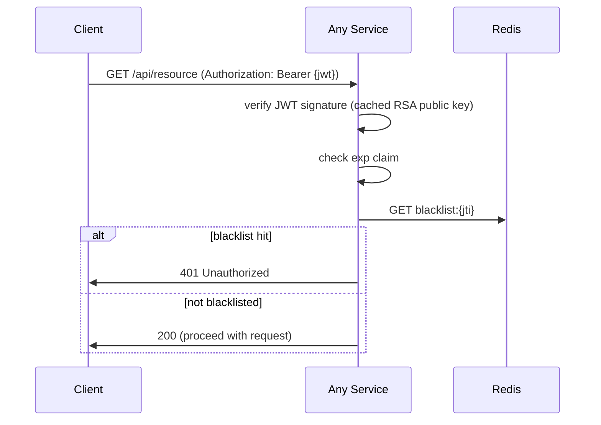

# LLD: User / Auth Service

**Artefact type:** Low-Level Design  
**Phase:** ARCH  
**Bounded context:** User / Auth  
**Status:** Draft  
**Last updated:** 2026-06-08  
**Dependencies:** SA-001, SA-002, SA-003, SA-004, SA-005, ADR-0008, ADR-0011  

---

## 1. Aggregate Model

### Aggregate Root: `User`

The `User` aggregate is the single consistency boundary for identity and authentication.

```
User (Aggregate Root)
├── id: UserId (CHAR(36) UUID)
├── email: Email (value object — validated, lowercased, immutable after creation)
├── passwordHash: PasswordHash (value object — bcrypt, never exposed outside aggregate)
├── status: UserStatus (UNVERIFIED | ACTIVE | DEACTIVATED)
├── role: UserRole (CUSTOMER | ADMIN)
├── version: Long (optimistic lock)
├── createdAt: Instant
├── updatedAt: Instant
│
├── addresses: List<UserAddress>   (child entity, owned by User)
│   ├── id: AddressId
│   ├── label: String (HOME | WORK | OTHER)
│   ├── line1, line2, city, state, pincode, country
│   └── isDefault: Boolean
│
└── [domain behaviours]
    ├── register(email, rawPassword) → raises UserRegistered
    ├── verifyEmail(token) → UNVERIFIED → ACTIVE; raises EmailVerified
    ├── changePassword(currentRaw, newRaw) → validates current, re-hashes
    ├── requestPasswordReset() → raises PasswordResetRequested
    ├── resetPassword(token, newRaw) → validates token, re-hashes
    ├── deactivate() → ACTIVE → DEACTIVATED; raises UserDeactivated
    └── addAddress(address) / setDefaultAddress(addressId)
```

### Value Objects

| Value Object | Validation | Notes |
|---|---|---|
| `Email` | RFC 5322 format; lowercase on construction | Immutable after User creation |
| `PasswordHash` | Min 8 chars on raw; bcrypt cost 12 | Exposes only `matches(rawPassword)` |
| `UserId` | UUID v4 | Assigned on creation; never changed |

### Domain Events

| Event | Trigger | Payload | Consumers |
|---|---|---|---|
| `UserRegistered` | `register()` | userId, email, timestamp | Notification (welcome email) |
| `EmailVerified` | `verifyEmail()` | userId, email, timestamp | Notification (confirmation) |
| `PasswordResetRequested` | `requestPasswordReset()` | userId, email, resetToken, expiresAt | Notification (reset email) |
| `UserDeactivated` | `deactivate()` | userId, timestamp | Notification, Cart (clear cart) |

All events are published via `user_auth_outbox` (transactional outbox — ADR-0003).

---

## 2. Domain Services

### `AuthenticationService`

Handles login and token lifecycle. Not part of the User aggregate (stateless, cross-cutting).

```
authenticate(email, rawPassword):
  → load User by email
  → validate passwordHash.matches(rawPassword)
  → check status == ACTIVE
  → generate access token (JWT RS256, 15 min TTL)
  → generate refresh token (UUID, store in refresh_tokens table)
  → publish login event to Redis (rate limiting hook)
  → return TokenPair

refresh(refreshToken):
  → lookup refresh_tokens by token value
  → validate not expired, not revoked
  → DELETE old refresh_tokens row
  → generate new access + new refresh token
  → return new TokenPair

logout(userId, accessTokenJti):
  → DELETE refresh_tokens for userId (all devices) or specific token
  → SET Redis: blacklist:{jti} = "1" EX {remaining_access_ttl}
```

### `EmailVerificationService`

```
sendVerification(userId, email):
  → generate token (UUID, store in email_verifications table, 24h TTL)
  → INSERT user_auth_outbox (EmailVerificationRequested event)

verify(token):
  → lookup email_verifications by token
  → validate not expired, not used
  → User.verifyEmail(token)
  → mark token as used
  → INSERT user_auth_outbox (EmailVerified event)
```

---

## 3. DB Schema (user_db)

> Cross-reference: SA-005 ER Diagrams. Reproduced here with implementation notes.

```sql
-- Core identity
CREATE TABLE users (
    id                CHAR(36)      NOT NULL PRIMARY KEY,
    email             VARCHAR(255)  NOT NULL,
    password_hash     VARCHAR(255)  NOT NULL,
    status            VARCHAR(20)   NOT NULL DEFAULT 'UNVERIFIED',
    role              VARCHAR(20)   NOT NULL DEFAULT 'CUSTOMER',
    version           BIGINT        NOT NULL DEFAULT 0,
    created_at        DATETIME(3)   NOT NULL DEFAULT CURRENT_TIMESTAMP(3),
    updated_at        DATETIME(3)   NOT NULL DEFAULT CURRENT_TIMESTAMP(3) ON UPDATE CURRENT_TIMESTAMP(3),
    CONSTRAINT uq_users_email UNIQUE (email),
    CONSTRAINT chk_users_status CHECK (status IN ('UNVERIFIED','ACTIVE','DEACTIVATED')),
    CONSTRAINT chk_users_role CHECK (role IN ('CUSTOMER','ADMIN'))
);

-- Addresses
CREATE TABLE user_addresses (
    id          CHAR(36)      NOT NULL PRIMARY KEY,
    user_id     CHAR(36)      NOT NULL,
    label       VARCHAR(20)   NOT NULL DEFAULT 'HOME',
    line1       VARCHAR(255)  NOT NULL,
    line2       VARCHAR(255),
    city        VARCHAR(100)  NOT NULL,
    state       VARCHAR(100)  NOT NULL,
    pincode     VARCHAR(10)   NOT NULL,
    country     CHAR(2)       NOT NULL DEFAULT 'IN',
    is_default  BOOLEAN       NOT NULL DEFAULT FALSE,
    created_at  DATETIME(3)   NOT NULL DEFAULT CURRENT_TIMESTAMP(3),
    FOREIGN KEY (user_id) REFERENCES users(id),
    INDEX idx_addresses_user (user_id)
);

-- Email verification tokens
CREATE TABLE email_verifications (
    id          CHAR(36)      NOT NULL PRIMARY KEY,
    user_id     CHAR(36)      NOT NULL,
    token       CHAR(36)      NOT NULL,
    expires_at  DATETIME(3)   NOT NULL,
    used_at     DATETIME(3),
    created_at  DATETIME(3)   NOT NULL DEFAULT CURRENT_TIMESTAMP(3),
    FOREIGN KEY (user_id) REFERENCES users(id),
    UNIQUE KEY uq_email_ver_token (token),
    INDEX idx_email_ver_user (user_id)
);

-- Password reset tokens
CREATE TABLE password_reset_tokens (
    id          CHAR(36)      NOT NULL PRIMARY KEY,
    user_id     CHAR(36)      NOT NULL,
    token       CHAR(36)      NOT NULL,
    expires_at  DATETIME(3)   NOT NULL,
    used_at     DATETIME(3),
    created_at  DATETIME(3)   NOT NULL DEFAULT CURRENT_TIMESTAMP(3),
    FOREIGN KEY (user_id) REFERENCES users(id),
    UNIQUE KEY uq_pw_reset_token (token),
    INDEX idx_pw_reset_user (user_id)
);

-- Active refresh tokens (one row per active session)
CREATE TABLE refresh_tokens (
    id          CHAR(36)      NOT NULL PRIMARY KEY,
    user_id     CHAR(36)      NOT NULL,
    token       CHAR(36)      NOT NULL,
    device_hint VARCHAR(255),
    expires_at  DATETIME(3)   NOT NULL,
    created_at  DATETIME(3)   NOT NULL DEFAULT CURRENT_TIMESTAMP(3),
    FOREIGN KEY (user_id) REFERENCES users(id),
    UNIQUE KEY uq_refresh_token (token),
    INDEX idx_refresh_user (user_id, expires_at)
);

-- Transactional outbox
CREATE TABLE user_auth_outbox (
    id            CHAR(36)      NOT NULL PRIMARY KEY,
    aggregate_id  CHAR(36)      NOT NULL,
    event_type    VARCHAR(100)  NOT NULL,
    payload       JSON          NOT NULL,
    published     BOOLEAN       NOT NULL DEFAULT FALSE,
    created_at    DATETIME(3)   NOT NULL DEFAULT CURRENT_TIMESTAMP(3),
    published_at  DATETIME(3),
    INDEX idx_outbox_unpublished (published, created_at)
);
```

**Nightly cleanup jobs:**
- `DELETE FROM email_verifications WHERE expires_at < NOW() - INTERVAL 7 DAY`
- `DELETE FROM password_reset_tokens WHERE expires_at < NOW() - INTERVAL 7 DAY`
- `DELETE FROM refresh_tokens WHERE expires_at < NOW()`
- `DELETE FROM user_auth_outbox WHERE published = TRUE AND published_at < NOW() - INTERVAL 7 DAY`

---

## 4. Redis Caching Strategy

| Key | TTL | Content | Written by | Read by |
|---|---|---|---|---|
| `refresh:{userId}:{tokenId}` | 7 days | `"active"` | Login / Refresh | Logout |
| `blacklist:{jti}` | remaining access TTL | `"1"` | Logout / Force-revoke | All services (per request) |
| `rate:{userId}:login` | 15 min sliding | failed attempt count | AuthenticationService | AuthenticationService |
| `rate:{ip}:register` | 1 hour sliding | attempt count | UserController | UserController |

**Rate limiting rules:**
- Login: 5 failed attempts per userId per 15 minutes → lock account for 15 minutes
- Register: 10 attempts per IP per hour → 429 Too Many Requests

---

## 5. API Contract (REST)

Full OpenAPI spec: `docs/api-specs/user-auth-service-api.yaml`

| Method | Path | Auth | Description |
|---|---|---|---|
| POST | `/auth/register` | None | Register new user |
| POST | `/auth/verify-email` | None | Verify email with token |
| POST | `/auth/login` | None | Authenticate; returns access + refresh tokens |
| POST | `/auth/refresh` | Refresh cookie | Rotate refresh token; return new access token |
| POST | `/auth/logout` | Bearer | Revoke refresh token; blacklist access token |
| POST | `/auth/request-password-reset` | None | Send reset email |
| POST | `/auth/reset-password` | None | Set new password with reset token |
| GET | `/users/{userId}` | Bearer (self or ADMIN) | Get user profile |
| PUT | `/users/{userId}` | Bearer (self) | Update profile (name, phone) |
| POST | `/users/{userId}/addresses` | Bearer (self) | Add address |
| PUT | `/users/{userId}/addresses/{addressId}` | Bearer (self) | Update address |
| DELETE | `/users/{userId}/addresses/{addressId}` | Bearer (self) | Remove address |
| GET | `/auth/.well-known/jwks.json` | None | RSA public key (JWKS format) |

**Response codes:**
- `201` registration success (verification email sent)
- `200` login / refresh success
- `204` logout success
- `400` validation error (email format, password too weak)
- `401` invalid credentials / expired token
- `403` account not active (UNVERIFIED or DEACTIVATED)
- `409` email already registered
- `429` rate limit exceeded

---

## 6. Sequence Diagrams (Key Flows)

> Full sequence diagrams: SA-004 (`docs/hld/sequence-diagrams.md` — SD-01, SD-02, SD-03)

### Login + Token Issuance (abbreviated)

```mermaid
sequenceDiagram
    participant C as Client
    participant GW as API Gateway
    participant UA as User/Auth Service
    participant DB as user_db (MySQL)
    participant R as Redis

    C->>GW: POST /auth/login {email, password}
    GW->>UA: forward
    UA->>DB: SELECT * FROM users WHERE email = ?
    UA->>UA: bcrypt.verify(password, hash)
    UA->>DB: INSERT INTO refresh_tokens (userId, token, expiresAt)
    UA->>R: SET rate:{userId}:login 0 EX 900 (reset on success)
    UA->>GW: 200 {accessToken, expiresIn: 900}
    Note over GW,C: Set-Cookie: refreshToken={token}; HttpOnly; Secure
    GW->>C: 200 {accessToken, expiresIn: 900}
```

### Token Verification (per-request, all services)



---

## 7. Consistency Strategy

| Operation | Strategy | Reason |
|---|---|---|
| User registration | Synchronous DB write + outbox event | Atomicity: user row + outbox in one transaction |
| Email verification | Synchronous DB write (mark token used + user status) | Must be atomic; can't verify email and leave user UNVERIFIED |
| Login | Synchronous reads (user lookup + bcrypt) | Correctness requires current state |
| Token blacklist | Redis write (sync) | Must take effect before response is returned |
| Domain events | Async via outbox relay → Kafka | Notification delivery can be eventually consistent |

**Conflict resolution:** Optimistic locking (`version` on `users` table) handles concurrent profile updates. Last-write-wins is not acceptable for status changes — use explicit state machine guards in the aggregate.

---

## 8. Security Considerations

- **Password storage:** bcrypt with cost 12. Never log, never return in API response.
- **Token storage:** Refresh token stored as a random UUID (opaque) — not a JWT — so it cannot be decoded by the client or third parties.
- **Email enumeration prevention:** `POST /auth/login` returns the same error message whether the email does not exist or the password is wrong.
- **Token revocation on password change:** Changing password deletes all `refresh_tokens` rows for the user and blacklists the current access token.
- **JWKS rotation:** Private key rotation procedure: generate new key pair → publish new public key alongside old in JWKS response → sign new tokens with new key → remove old key from JWKS after all old tokens expire (15 min window).

---

## 9. Phase 2 Delta (AWS Serverless)

| Concern | Phase 1 | Phase 2 |
|---|---|---|
| Identity store | MySQL `users` table | Cognito User Pool |
| Token issuance | Custom JWT (RS256) | Cognito access token (RS256) |
| Refresh token | MySQL `refresh_tokens` + Redis | Cognito managed refresh |
| JWKS endpoint | `GET /auth/.well-known/jwks.json` | Cognito JWKS URL |
| Rate limiting | Redis counter | Cognito built-in throttling |
| Outbox relay | Spring `@Scheduled` poller | DynamoDB Streams → Lambda |
| DB | MySQL `user_db` | DynamoDB single-table (user profile only; auth delegated to Cognito) |

Migration: Services update `JWKS_URI` env var from Phase 1 URL to Cognito URL. No
JWT verification code changes required (same RS256 standard).

---

## 10. Open Questions

| ID | Question | Owner | Target |
|---|---|---|---|
| OQ-UA-01 | Should address management be a separate bounded context (e.g., shared with Order)? Or is the Order snapshot approach sufficient? | Architect | LLD sprint |
| OQ-UA-02 | Multi-device logout: should logout all devices be a single endpoint or per-device? | PM (user story) | Backlog refinement |
| OQ-UA-03 | Social login (Google / Apple) in scope for Phase 1 or deferred to Phase 2 (Cognito)? | PM | Sprint planning |
