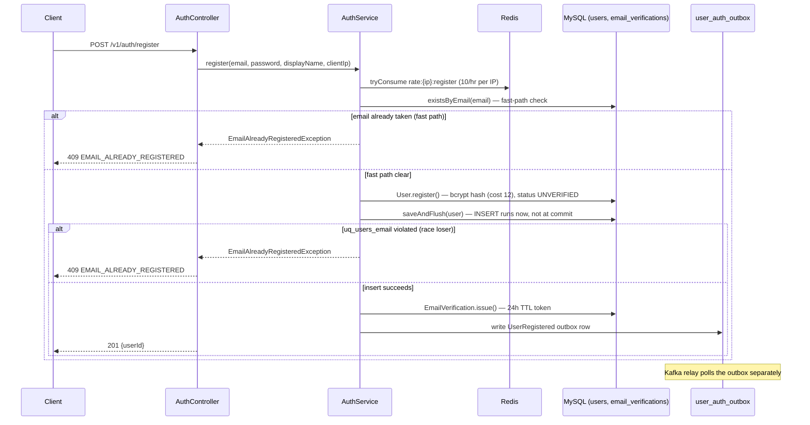
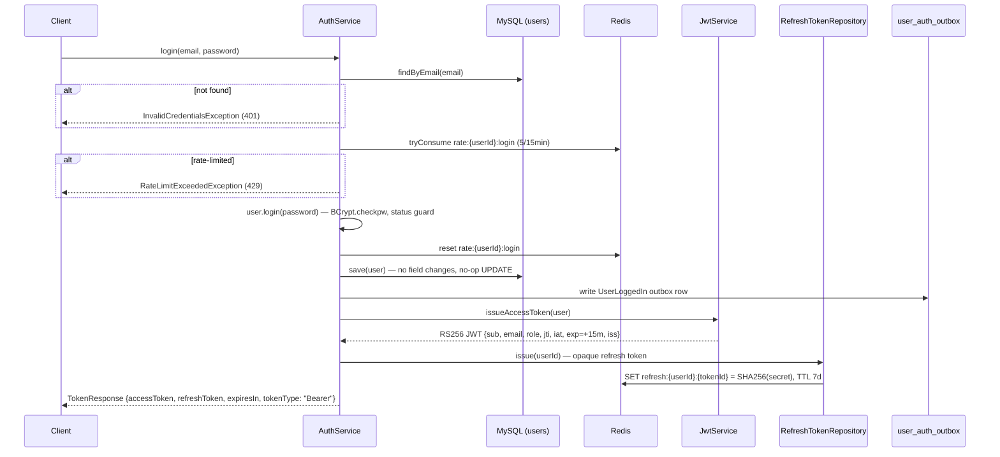
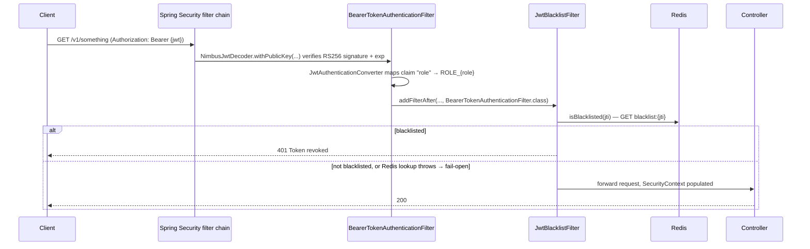
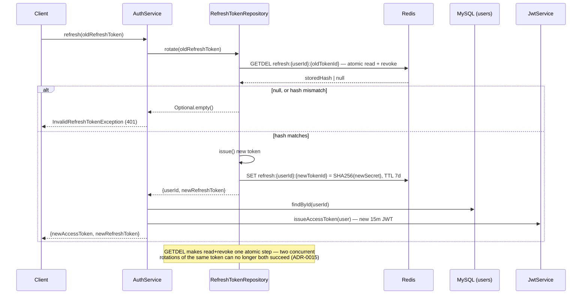
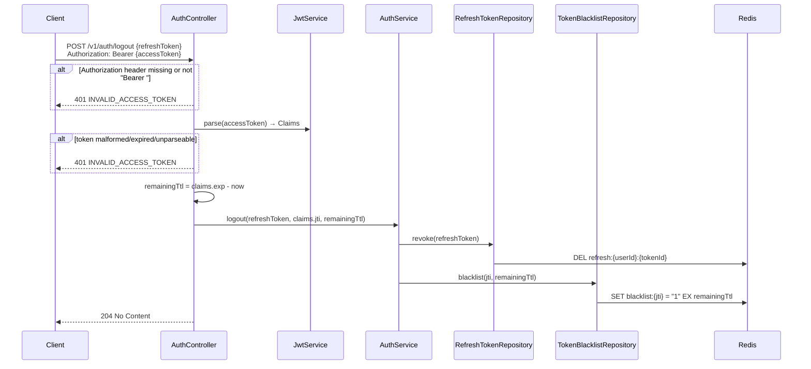

# User/Auth Service — AuthService Sequence Flows

Companion to `user-auth-lld.md` §6 (Authentication & Session Strategy) and §8
(Sequence Diagrams). Walks the five core `AuthService` flows — register, login,
request authentication, refresh, logout — as implemented today, each verified
line-by-line against the current code. Corrections from the original hand-drawn
drafts are called out explicitly so the gap between intended and actual behaviour
is visible, rather than silently fixed.

---

## 1. Register

**Verified against:** `AuthController.java:44-50` (`POST /v1/auth/register`, `201` +
`RegisterResponse{userId}`), `AuthService.java:77-101` (`register`),
`PasswordHash.java:19` (`BCrypt.hashpw(..., gensalt(12))`), `V1__init.sql:14`
(`uq_users_email`).

**Corrections from the original draft:** the draft showed a single
`User.register()` step straight to `201`. Two things were missing:

1. The `existsByEmail` fast-path check (gives the common duplicate-email case an
   immediate, cheap `409` without paying for a bcrypt hash + DB round trip).
2. The **race-safety net** — `save` → `saveAndFlush` plus a catch on
   `DataIntegrityViolationException`, added in **ADR-0015**. Two concurrent
   registrations for the same email can both pass the fast-path check (it's a
   plain read, not a lock); `uq_users_email` is the real guard, and
   `saveAndFlush` forces the INSERT to run synchronously so the constraint
   violation is caught and translated to the same `409` instead of leaking out
   as a raw `500`.

---

## 2. Login

**Verified against:** `AuthService.java:122-140` (`login`), `JwtService.java:41-59`
(claim set + TTL from `application.yml:64`, `900`s), `RefreshTokenRepository.java:38-43`
(`issue`), `TokenResponse.java:6-15`.

**Corrections from the original draft:**

- Missing the `findByEmail` lookup — required *before* the rate-limit check,
  since the limiter key is `rate:{userId}:login`, not `rate:{email}:login`; you
  need the user row to even form the key.
- Missing the `rateLimitRepository.reset()` call on success (otherwise a user's
  failed-attempt counter never clears between lockout windows).
- Missing the `UserLoggedIn` outbox write — `login` is one of the two domain
  events for this context (`UserRegistered`, `UserLoggedIn` per `CLAUDE.md`'s
  bounded-context table); omitting it understates what the flow actually does.
- The `save(user)` call is real but currently a no-op in practice: `User.login()`
  only validates and throws — it mutates no fields — so Hibernate's dirty-check
  skips the UPDATE. Included above for fidelity to the code, not because it has
  an observable effect today.
- JWT claims and `TokenResponse` fields were abbreviated in the draft
  (`exp=15m` only, `{accessToken, refreshToken}` only) — `iat`/`iss` and
  `expiresIn`/`tokenType` are also present.

---

## 3. Request Authentication (filter chain)

**Verified against:** `SecurityConfig.java:48-50` (`NimbusJwtDecoder`),
`SecurityConfig.java:54-66` (`JwtAuthenticationConverter` / role mapping),
`SecurityConfig.java:43` (`addFilterAfter`), `JwtBlacklistFilter.java:47-49`
(catch-and-allow on Redis failure), `TokenBlacklistRepository.java:30-36`
(`blacklist:{jti}`).

**Corrections from the original draft:** none — this one matched the
implementation as drawn. Only change above: made `Redis` an explicit
participant for consistency with the other diagrams, instead of folding the
lookup into a `BL->>BL` self-call.

---

## 4. Refresh

**Verified against:** `AuthService.java:146-154` (`refresh`),
`RefreshTokenRepository.java:61-71` (`rotate`, post-ADR-0015).

**Corrections from the original draft:** this is the flow that just changed.
The draft described the *pre-fix* behaviour — separate "validate hash, DELETE
old key" then "issue new token, SET new key" steps. That's a real
check-then-act race: two requests presenting the same token could both read the
stored hash before either deleted it, both pass validation, and both issue a
new session for one rotation. The fix (ADR-0015) replaced the GET-then-DELETE
with a single atomic Redis `GETDEL` — whichever request's `GETDEL` runs first
gets the stored hash; the other gets `null` and correctly fails. The diagram
above reflects the current, fixed code.

Also missing from the draft: the `userRepository.findById(rotated.userId())`
lookup between getting the rotated token back and issuing the new access
token — needed because `issueAccessToken` signs claims (`email`, `role`) off
the full `User`, not just the `userId`.

The draft's closing note — *"old token now unusable — reuse = signal of
theft"* — describes the **design intent** from `user-auth-lld.md` §6.2
("...the caller should treat this as a possible token-replay and may choose to
revoke all sessions for the user"), not automated behaviour. `AuthService.refresh`
does not itself detect reuse and revoke all sessions on a failed rotation —
it just throws `InvalidRefreshTokenException`. Reacting to repeated rotation
failures as a compromise signal is a caller-side decision that isn't
implemented today.

---

## 5. Logout

**Verified against:** `AuthController.java:67-84` (`logout`),
`AuthService.java:160-166` (`logout`), `RefreshTokenRepository.java:74-76`
(`revoke`), `TokenBlacklistRepository.java:23-28` (`blacklist`).

**Notes (this flow wasn't in the original four drafts):**

- The access token is mandatory here, not optional: `AuthController.logout`
  throws `InvalidAccessTokenException` (`401`) if the `Authorization` header is
  missing, malformed, or fails to parse — there's no logout path that skips
  blacklisting. `AuthService.logout`'s `accessTokenJti` parameter is nullable
  at the method-signature level, but the controller never actually calls it
  with `null`.
- `revoke()` is a silent no-op if `refreshToken` is malformed or already gone
  (`RefreshTokenRepository.parse` returns empty, `.ifPresent` does nothing) —
  logout never fails because of a bad refresh token, only because of a bad
  access token.
- `blacklist()` itself no-ops if `remainingTtl` is zero/negative (token already
  expired) — nothing to blacklist, it would fail open on its own anyway.
- This is single-device logout. Logout-all-devices and the `deactivate()` path
  use `RefreshTokenRepository.revokeAll` (`SCAN refresh:{userId}:*` + `DEL`)
  instead of a single `revoke` — see `user-auth-lld.md` §8.1 for the
  deactivation flow.
