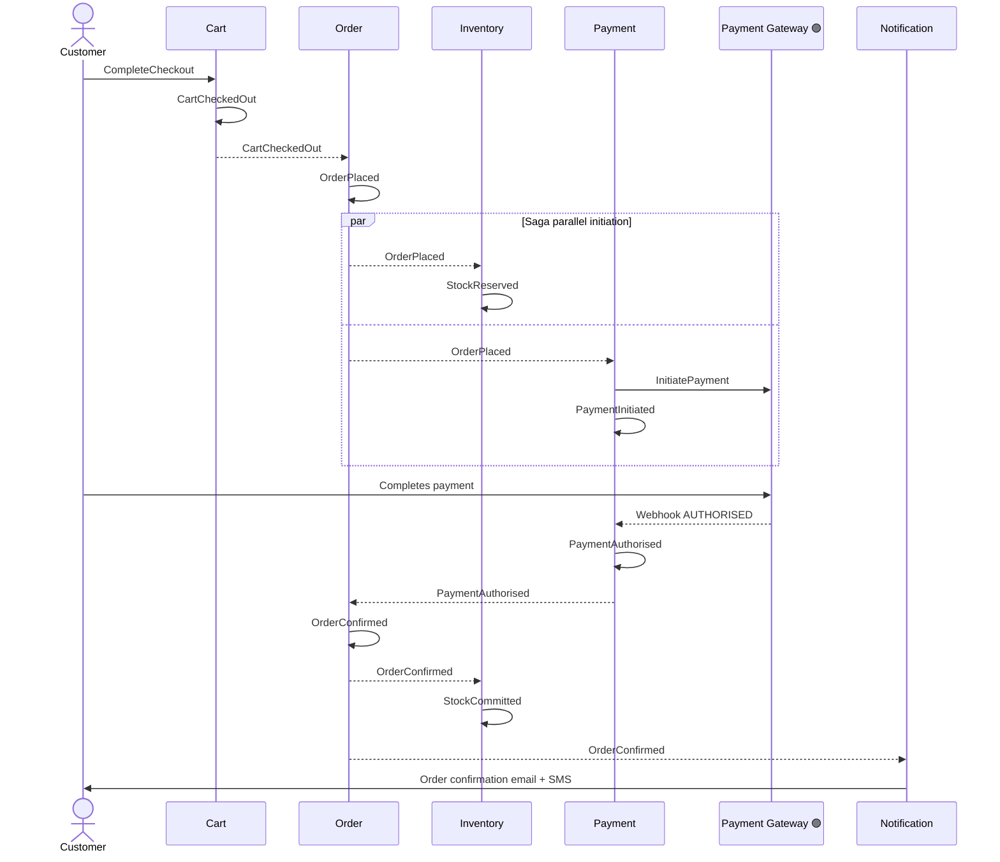
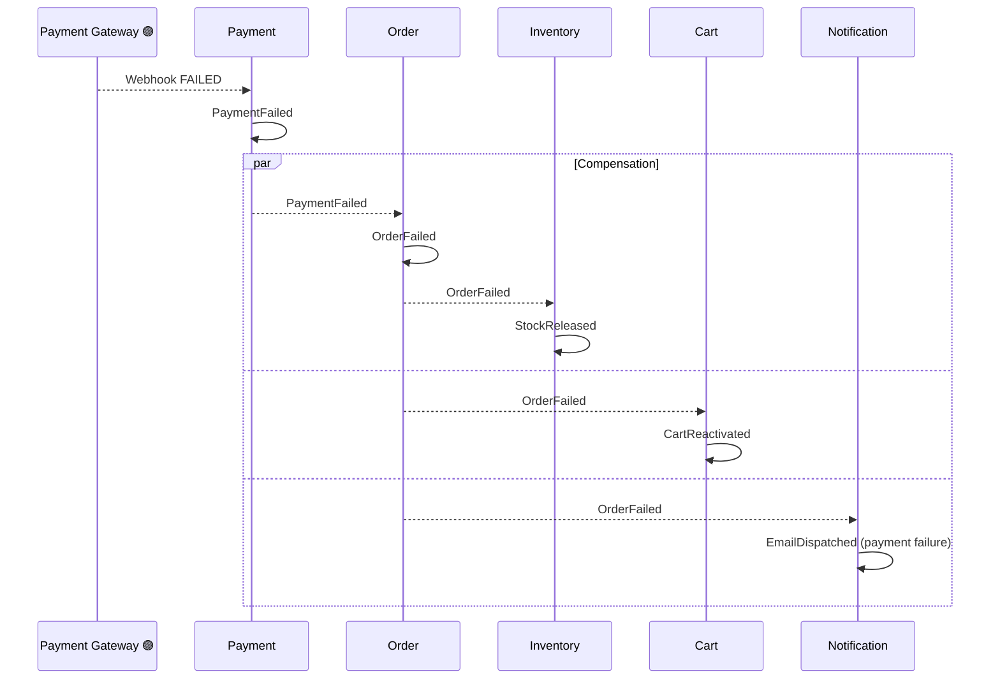
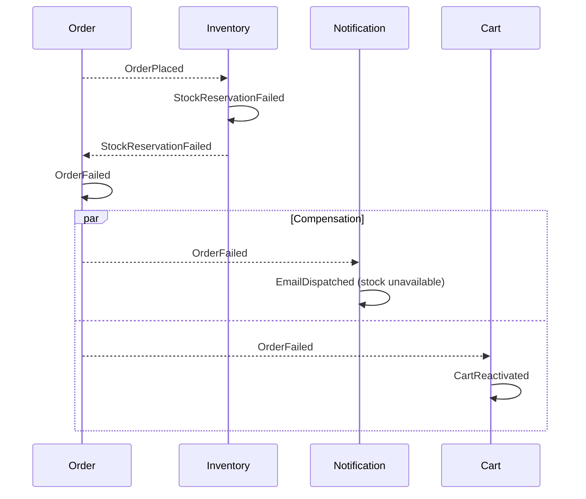
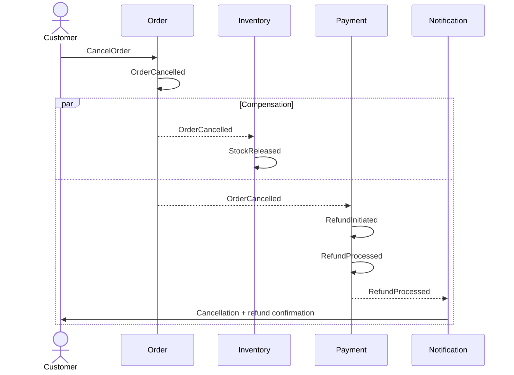
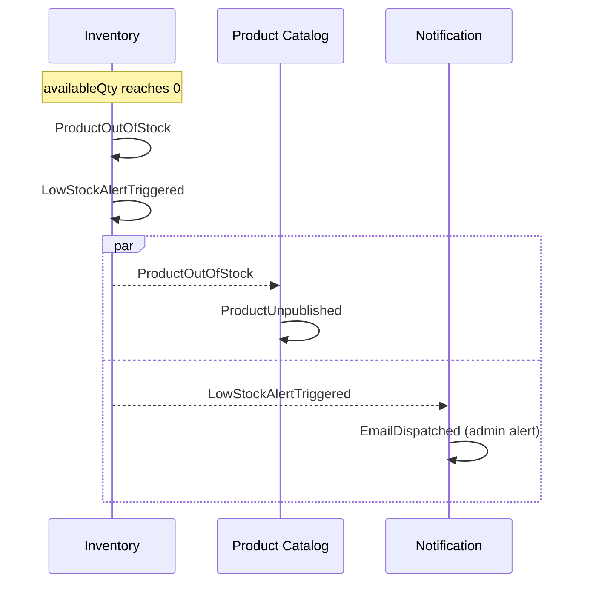

# Event Storming — Domain Model

**Method:** Big Picture + Design-Level Event Storming (Alberto Brandolini)
**Scope:** All 7 bounded contexts — in priority order
**Version:** 0.3
**Status:** Draft — pending architect review

---

## Legend

| Notation | Sticky | Meaning |
|---|---|---|
| 🟠 **Domain Event** | Orange | Something that happened — past tense, immutable business fact |
| 🔵 **Command** | Blue | Intent to change state — imperative, issued by actor or policy |
| 🟡 **Aggregate** | Yellow | Consistency boundary — decides to accept/reject a command, emits events |
| 🩷 **Actor** | Pink | Human role or external system issuing a command |
| 🔴 **Policy** | Lilac | "Whenever X happens, do Y" — automation rule or reaction |
| 🟣 **External System** | Purple | Third-party outside the platform boundary |
| 🟢 **Read Model** | Green | Query projection consumed by UI or downstream service |
| ❗ **Hotspot** | Red | Open question, ambiguity, or design risk |

---

## Bounded Context Map — Event Boundaries

```
┌────────────────────────────────────────────────────────────────────────────────────┐
│                              Ecommerce Platform                                    │
│                                                                                    │
│  ┌─────────────────┐      ┌────────────────────┐      ┌─────────────────────┐     │
│  │   User / Auth   │      │   Product Catalog   │      │        Cart         │     │
│  │                 │      │                     │      │                     │     │
│  │  publishes:     │      │  publishes:         │      │  publishes:         │     │
│  │  UserRegistered │      │  ProductPublished   │      │  CartCheckedOut     │     │
│  │  UserLoggedIn   │      │  ProductPriceUpdated│─────►│  CartAbandoned      │     │
│  │  UserDeactivated│      │  ProductOutOfStock◄─┐      │                     │     │
│  └────────┬────────┘      └─────────────────────┘      └──────────┬──────────┘     │
│           │ JWT Claims                                             │ CartCheckedOut  │
│           │ (sync, in-request)                                     │                │
│  ┌─────────▼────────────────────────────────────────────────────────▼─────────┐    │
│  │                              Order                                          │    │
│  │  publishes: OrderPlaced · OrderConfirmed · OrderCancelled · OrderShipped   │    │
│  │             OrderDelivered · OrderFailed · ReturnApproved                  │    │
│  └──────┬────────────────────┬─────────────────────────────────┬──────────────┘    │
│         │ OrderPlaced         │ OrderCancelled                   │ ReturnApproved    │
│         │ OrderConfirmed      │ OrderFailed                      │                  │
│  ┌──────▼──────────┐  ┌──────▼──────────┐  ┌───────────────────▼────────────┐     │
│  │    Payment      │  │   Inventory     │  │         Notification            │     │
│  │                 │  │                 │  │      (consumer-only)            │     │
│  │  publishes:     │  │  publishes:     │  │                                 │     │
│  │  PaymentAuth'd  │  │  StockReserved  │  │  consumes events from all       │     │
│  │  PaymentFailed  │  │  StockReleased  │  │  other 6 contexts               │     │
│  │  RefundProcessed│  │  ProductOutOf   │  │                                 │     │
│  └─────────────────┘  │  Stock ─────────┼─►│  Product Catalog (above)       │     │
│                        └─────────────────┘  └─────────────────────────────────┘    │
└────────────────────────────────────────────────────────────────────────────────────┘
```

---

## Priority 1 — User / Auth

> **Owns:** Identity, authentication, session management, role assignment, address book.
> **Does NOT own:** Cart state, order history, product preferences — those belong to their respective contexts.

### Actors

| Actor | Type | Description |
|---|---|---|
| Guest | Human | Unauthenticated visitor |
| Customer | Human | Registered, email-verified user |
| Admin | Human | Platform administrator with elevated role |
| 🟣 Email Provider | External | SES / SendGrid — delivers verification and reset emails |

### Aggregates

| Aggregate | Invariants |
|---|---|
| `User` | Email is unique platform-wide. Password stored as bcrypt (cost ≥ 12). Account cannot authenticate until `EmailVerified`. Deactivated users have no valid sessions. |
| `AuthSession` | One refresh token per device session. Access token TTL = 15 min. Refresh token TTL = 7 days. Refresh token is single-use (rotate on each refresh). |

### Commands → Events → Policies

| # | 🩷 Actor | 🔵 Command | 🟡 Aggregate | 🟠 Domain Event | 🔴 Policy / Reaction |
|---|---|---|---|---|---|
| UA-01 | Guest | `RegisterUser` | User | `UserRegistered` | → Dispatch `SendVerificationEmail`; rate-limit: max 3 registration attempts/hr per IP |
| UA-02 | Guest | `VerifyEmail` | User | `EmailVerified` | → Activate account to ACTIVE state |
| UA-03 | Guest | `ResendVerificationEmail` | User | `VerificationEmailResent` | → Rate-limit: max 3 resends/hr per user |
| UA-04 | Customer | `LoginUser` | AuthSession | `UserLoggedIn` | → Issue JWT (RS256) + refresh token |
| UA-05 | Customer | `RefreshAccessToken` | AuthSession | `AccessTokenRefreshed` | → Rotate refresh token (invalidate old on issue of new) |
| UA-06 | Customer | `LogoutUser` | AuthSession | `UserLoggedOut` | → Invalidate this device's refresh token |
| UA-07 | Customer | `LogoutAllDevices` | AuthSession | `AllSessionsRevoked` | → Invalidate all refresh tokens for this userId |
| UA-08 | Guest | `RequestPasswordReset` | User | `PasswordResetRequested` | → Send reset link (1h TTL); return HTTP 200 regardless of email existence |
| UA-09 | Guest | `ResetPassword` | User | `PasswordResetCompleted` | → Publish `AllSessionsRevoked` |
| UA-10 | Customer | `ChangePassword` | User | `PasswordChanged` | → Publish `AllSessionsRevoked` |
| UA-11 | Customer | `UpdateProfile` | User | `UserProfileUpdated` | |
| UA-12 | Customer | `AddDeliveryAddress` | User | `DeliveryAddressAdded` | |
| UA-13 | Customer | `UpdateDeliveryAddress` | User | `DeliveryAddressUpdated` | |
| UA-14 | Customer | `RemoveDeliveryAddress` | User | `DeliveryAddressRemoved` | → Validate: address not referenced by any active order |
| UA-15 | Customer | `SetDefaultAddress` | User | `DefaultAddressSet` | |
| UA-16 | Admin | `DeactivateUser` | User | `UserDeactivated` | → Publish `AllSessionsRevoked` |
| UA-17 | Admin | `ReactivateUser` | User | `UserReactivated` | |
| UA-18 | Admin | `ChangeUserRole` | User | `UserRoleChanged` | → Publish `AllSessionsRevoked` (stale role claim in JWT) |
| UA-19 | Admin | `AdminCreateUser` | User | `AdminUserCreated` | → Send welcome + set-password email |

### External System Dependencies

| 🟣 System | Interaction | Failure Mode |
|---|---|---|
| Email Provider | Sends verification, reset, welcome emails | Retry 3× with back-off; log `NotificationFailed` to DLQ |

### Cross-Context Events Published by This Context

| 🟠 Event | Consumed By | Trigger |
|---|---|---|
| `UserRegistered` | Notification | Send verification email |
| `UserLoggedIn` | Cart | Merge guest cart on login |
| `UserDeactivated` | — | Internal only (session revocation) |
| `AdminUserCreated` | Notification | Send welcome email |
| `PasswordResetRequested` | Notification | Send reset email |

### Read Models

| 🟢 Read Model | Consumer |
|---|---|
| User profile | Profile page, checkout |
| Address book | Checkout address selection |
| Active session list | "Manage devices" security page |

### Hotspots

| ❗ | Description | Severity |
|---|---|---|
| H-UA-1 | Email enumeration via password reset — always return HTTP 200 | Medium |
| H-UA-2 | Stale role claim: user role changes but JWT still carries old claim until 15-min expiry. Force `AllSessionsRevoked` on role change | Medium |
| H-UA-3 | Address removal with active order reference — soft-delete and preserve for order history | Low |

---

## Priority 2 — Product Catalog

> **Owns:** Product lifecycle, variants, pricing, categories, images, search indexing.
> **Does NOT own:** Stock levels (Inventory), cart line items (Cart), order line items (Order).

### Actors

| Actor | Type | Description |
|---|---|---|
| Admin | Human | Creates and manages product content |
| Customer | Human | Browses and searches (read-only) |
| 🟣 Search Index | External | Elasticsearch / OpenSearch — full-text product search |
| 🟣 CDN / Storage | External | S3 + CloudFront — product image hosting |

### Aggregates

| Aggregate | Invariants |
|---|---|
| `Product` | SKU unique platform-wide. Must have ≥ 1 image before `PublishProduct`. Price > 0. Deletion is soft-only — product retained for order history referential integrity. State machine: `DRAFT → PUBLISHED ↔ UNPUBLISHED → ARCHIVED`. |
| `Category` | Category name unique within its parent node. Cannot delete a category with active products assigned. Supports multi-level hierarchy. |

### Commands → Events → Policies

| # | 🩷 Actor | 🔵 Command | 🟡 Aggregate | 🟠 Domain Event | 🔴 Policy / Reaction |
|---|---|---|---|---|---|
| PC-01 | Admin | `CreateProduct` | Product | `ProductCreated` | → Publish `InventoryItemCreateRequested` to Inventory BC |
| PC-02 | Admin | `UpdateProductDetails` | Product | `ProductDetailsUpdated` | → Re-index in search |
| PC-03 | Admin | `PublishProduct` | Product | `ProductPublished` | → Index in search; mark visible to customers |
| PC-04 | Admin | `UnpublishProduct` | Product | `ProductUnpublished` | → Remove from search index |
| PC-05 | Admin | `ArchiveProduct` | Product | `ProductArchived` | → Remove from search; soft-delete flag set |
| PC-06 | Admin | `UpdateProductPrice` | Product | `ProductPriceUpdated` | → Notify Cart BC to flag affected line items |
| PC-07 | Admin | `AddProductVariant` | Product | `ProductVariantAdded` | → Publish `InventoryItemCreateRequested` for new SKU |
| PC-08 | Admin | `UpdateProductVariant` | Product | `ProductVariantUpdated` | → Re-index |
| PC-09 | Admin | `RemoveProductVariant` | Product | `ProductVariantRemoved` | → Publish `InventoryItemDeactivateRequested` for SKU; reject if SKU has active cart items |
| PC-10 | Admin | `UploadProductImage` | Product | `ProductImageUploaded` | → CDN cache invalidation |
| PC-11 | Admin | `RemoveProductImage` | Product | `ProductImageRemoved` | → Reject if it is the only image on a published product |
| PC-12 | Admin | `SetPrimaryImage` | Product | `PrimaryImageSet` | → Re-index thumbnail URL |
| PC-13 | Admin | `CreateCategory` | Category | `CategoryCreated` | |
| PC-14 | Admin | `UpdateCategory` | Category | `CategoryUpdated` | |
| PC-15 | Admin | `DeleteCategory` | Category | `CategoryDeleted` | → Reject if any active product assigned |
| PC-16 | Admin | `MoveProductToCategory` | Product | `ProductCategoryChanged` | → Re-index |
| PC-17 | System | `UnpublishOutOfStockProduct` | Product | `ProductUnpublished` | → Triggered by `ProductOutOfStock` consumed from Inventory BC |

### External System Dependencies

| 🟣 System | Interaction | Failure Mode |
|---|---|---|
| Search Index | Index/de-index on publish, update, archive | Async — eventual consistency acceptable (< 5s lag SLA) |
| CDN / Storage | Store images on upload; invalidate cache on primary image change | S3 upload fails → return 503 to admin |

### Cross-Context Events Published by This Context

| 🟠 Event | Consumed By | Trigger |
|---|---|---|
| `ProductPriceUpdated` | Cart | Flag cart line items whose snapshot price is now stale |
| `ProductPublished` | — | Search index update (internal) |
| `ProductVariantAdded` | Inventory | Create inventory record for new SKU |
| `ProductVariantRemoved` | Inventory | Deactivate inventory record for SKU |

### Cross-Context Events Consumed by This Context

| 🟠 Event | Published By | Reaction |
|---|---|---|
| `ProductOutOfStock` | Inventory | `UnpublishOutOfStockProduct` → `ProductUnpublished` |

### Read Models

| 🟢 Read Model | Consumer |
|---|---|
| Product listing page (paginated, filtered) | Customer browse |
| Product detail page | Customer PDP, Cart add-to-cart |
| Category tree | Navigation, admin management |
| Admin product list | Admin content management |
| Search index document | Search engine |

### Hotspots

| ❗ | Description | Severity |
|---|---|---|
| H-PC-1 | `ProductPriceUpdated` triggers cart refresh — push immediately or lazy-load on next cart view? | Medium |
| H-PC-2 | Variant removal while items exist in active carts — block or mark unavailable? | Medium |
| H-PC-3 | Search index eventual consistency — up to 5s lag after publish. Must document and accept | Low |

---

## Priority 3 — Cart

> **Owns:** Cart lifecycle, line items, price snapshots, coupon application, checkout gate.
> **Does NOT own:** Order creation (Order BC), stock levels (Inventory BC), coupon definitions (future Promo BC).

### Actors

| Actor | Type | Description |
|---|---|---|
| Guest | Human | Unauthenticated shopper identified by session token |
| Customer | Human | Authenticated shopper |
| 🟣 Coupon / Promo Service | External | Validates codes, calculates discount amounts |
| 🔴 System Timer | Internal | Fires cart abandonment and expiry policies |

### Aggregates

| Aggregate | Invariants |
|---|---|
| `Cart` | One active cart per user at a time. Line item quantity ≤ available stock at time of add. Total = Σ(snapshotPrice × qty) − discount + tax. Cart cannot proceed to checkout if any item is out of stock. Cart is in CHECKED_OUT state after `CartCheckedOut` — cannot be modified. |
| `CartItem` | Snapshot price is immutable after `CartItemAdded`. Quantity ≥ 1. Removed by `CartItemRemoved` — not soft-deleted. |

### Commands → Events → Policies

| # | 🩷 Actor | 🔵 Command | 🟡 Aggregate | 🟠 Domain Event | 🔴 Policy / Reaction |
|---|---|---|---|---|---|
| CT-01 | Guest / Customer | `AddItemToCart` | Cart | `CartItemAdded` | → Snapshot product price at this moment; auto-create Cart if none exists |
| CT-02 | Customer | `UpdateCartItemQuantity` | Cart | `CartItemQuantityUpdated` | → Re-validate against current available stock |
| CT-03 | Customer | `RemoveItemFromCart` | Cart | `CartItemRemoved` | → Recalculate totals |
| CT-04 | Customer | `ApplyCoupon` | Cart | `CouponApplied` | → Call Coupon Service to validate; reject if invalid / expired / usage exhausted |
| CT-05 | Customer | `RemoveCoupon` | Cart | `CouponRemoved` | → Recalculate totals without discount |
| CT-06 | System | `MergeGuestCart` | Cart | `GuestCartMerged` | → Triggered by `UserLoggedIn`; merge guest items into user cart; sum quantities for duplicates |
| CT-07 | System | `RefreshCartPrices` | Cart | `CartPricesRefreshed` | → Triggered by `ProductPriceUpdated` from Catalog BC; flag changed line items |
| CT-08 | System | `AbandonCart` | Cart | `CartAbandoned` | → Triggered after 30-min inactivity; publish for Notification BC |
| CT-09 | System | `ExpireCart` | Cart | `CartExpired` | → Triggered after 30-day TTL |
| CT-10 | Customer | `ClearCart` | Cart | `CartCleared` | |
| CT-11 | Customer | `InitiateCheckout` | Cart | `CheckoutInitiated` | → Validate all items in stock; validate prices unchanged; validate coupon still valid |
| CT-12 | Customer | `CompleteCheckout` | Cart | `CartCheckedOut` | → Publish to Order BC; cart transitions to CHECKED_OUT |
| CT-13 | System | `ReactivateCart` | Cart | `CartReactivated` | → Triggered by `OrderFailed` / `PaymentFailed`; cart returned to ACTIVE so customer can retry |

### External System Dependencies

| 🟣 System | Interaction | Failure Mode |
|---|---|---|
| Coupon / Promo Service | Validate coupon code at `ApplyCoupon`; check usage limit at `InitiateCheckout` | If unreachable, reject coupon with 503 — do not silently accept |

### Cross-Context Events Published by This Context

| 🟠 Event | Consumed By | Trigger |
|---|---|---|
| `CartCheckedOut` | Order | Create order from cart snapshot |
| `CartAbandoned` | Notification | Send recovery email after 30 min delay |

### Cross-Context Events Consumed by This Context

| 🟠 Event | Published By | Reaction |
|---|---|---|
| `UserLoggedIn` | User/Auth | `MergeGuestCart` |
| `ProductPriceUpdated` | Product Catalog | `RefreshCartPrices` — flag stale snapshots |
| `OrderFailed` | Order | `ReactivateCart` — restore cart for retry |
| `PaymentFailed` | Payment | `ReactivateCart` — restore cart for retry |

### Read Models

| 🟢 Read Model | Consumer |
|---|---|
| Cart summary (items, totals, price-change warnings, stock flags) | Cart page, checkout page |
| Cart item count | Navigation badge |
| Checkout validation result | Checkout pre-flight page |

### Hotspots

| ❗ | Description | Severity |
|---|---|---|
| H-CT-1 | Race between checkout validation and `OrderPlaced` stock reservation — validation passes, but stock taken before reservation | High |
| H-CT-2 | Guest cart loss on browser close — irrecoverable without email. Accept for now; email-based recovery is a future feature | Low |
| H-CT-3 | Cart merge conflict — same item in guest + user cart. Decision: sum quantities | Low |
| H-CT-4 | Coupon concurrent use — two carts apply the last available use simultaneously. Requires atomic increment at Coupon Service | High |

---

## Priority 4 — Order

> **Owns:** Order lifecycle state machine, order line items (price-locked), return requests.
> **Does NOT own:** Payment execution (Payment BC), stock numbers (Inventory BC).
> **Saga boundary:** Order is the saga orchestrator for the checkout flow. It publishes `OrderPlaced` and reacts to `PaymentAuthorised`, `PaymentFailed`, and `StockReservationFailed`.

### Actors

| Actor | Type | Description |
|---|---|---|
| Customer | Human | Places orders, tracks status, cancels, requests returns |
| Admin | Human | Manages fulfilment, approves returns, updates status |
| System | Policy | Reacts to Payment and Inventory events to drive state machine |

### Aggregates

| Aggregate | Invariants |
|---|---|
| `Order` | Total is immutable after `OrderPlaced`. State transitions must follow the state machine. One Order per `CartCheckedOut` event. Cancellation allowed in PENDING and CONFIRMED only; admin can cancel PROCESSING. |
| `OrderLineItem` | Unit price snapshotted from cart at order creation — never recalculated. Qty ≥ 1. |
| `Return` | Return window = 30 days from `OrderDelivered`. Return qty ≤ ordered qty per line item. One Return per Order. |

### Order State Machine

```
                         [CartCheckedOut]
                                │
                         ┌──────▼──────┐
                         │   PENDING   │
                         └──────┬──────┘
               ┌────────────────┼────────────────┐
     PaymentFailed /      PaymentAuthorised    StockReservationFailed
     PaymentExpired              │
         │               ┌──────▼──────┐
    ┌────▼─────┐          │  CONFIRMED  │
    │  FAILED  │          └──────┬──────┘
    └──────────┘    Cancel ──────┼────── Admin proceeds
                         ┌──────▼──────┐
                    ┌────│  PROCESSING │────┐ Cancel
                    │    └──────┬──────┘    │
                    │    Admin  │ ships      │
               ┌────▼───┐ ┌────▼──────┐    │
               │CANCELLED│ │  SHIPPED  │    │
               └─────────┘ └─────┬─────┘   │
                           Delivery│         │
                         ┌────────▼──┐      │
                         │ DELIVERED │      │
                         └───────────┘      │
                         ← CANCELLED ───────┘
```

### Commands → Events → Policies

| # | 🩷 Actor | 🔵 Command | 🟡 Aggregate | 🟠 Domain Event | 🔴 Policy / Reaction |
|---|---|---|---|---|---|
| OR-01 | System | `PlaceOrder` | Order | `OrderPlaced` | → Publish to Inventory BC (`ReserveStock`) AND Payment BC (`InitiatePayment`) |
| OR-02 | System | `ConfirmOrder` | Order | `OrderConfirmed` | → Publish to Inventory BC (`CommitStock`) + Notification BC |
| OR-03 | System | `FailOrder` | Order | `OrderFailed` | → Publish to Inventory BC (`ReleaseStock`) + Notification BC + Cart BC (`ReactivateCart`) |
| OR-04 | Admin | `StartProcessing` | Order | `OrderProcessingStarted` | → Notify customer |
| OR-05 | Admin | `ShipOrder` | Order | `OrderShipped` | → Attach tracking number; notify customer |
| OR-06 | Admin | `MarkDelivered` | Order | `OrderDelivered` | → Start 30-day return window; notify customer |
| OR-07 | Customer | `CancelOrder` | Order | `OrderCancelled` | → Publish to Inventory (`ReleaseStock`); publish to Payment (`InitiateRefund`) if payment was captured |
| OR-08 | Admin | `AdminCancelOrder` | Order | `OrderCancelled` | → Same downstream reactions as customer cancel |
| OR-09 | Admin | `UpdateTrackingNumber` | Order | `TrackingNumberUpdated` | → Notify customer with updated link |
| OR-10 | Customer | `RequestReturn` | Return | `ReturnRequested` | → Notify admin; validate within 30-day window |
| OR-11 | Admin | `ApproveReturn` | Return | `ReturnApproved` | → Publish to Payment BC (`InitiateRefund`) |
| OR-12 | Admin | `RejectReturn` | Return | `ReturnRejected` | → Notify customer with reason |
| OR-13 | System | `ExpireReturnWindow` | Return | `ReturnWindowExpired` | → Timer fires 30 days after `OrderDelivered` |
| OR-14 | Admin | `AddOrderNote` | Order | `OrderNoteAdded` | → Internal; not customer-visible |

### External System Dependencies

| 🟣 System | Interaction | Failure Mode |
|---|---|---|
| None — Order BC is event-driven only | All integrations are via Kafka domain events | — |

### Cross-Context Events Published by This Context

| 🟠 Event | Consumed By | Trigger |
|---|---|---|
| `OrderPlaced` | Inventory, Payment, Notification | Cart checkout succeeded |
| `OrderConfirmed` | Inventory, Notification | Payment authorised |
| `OrderFailed` | Inventory, Notification, Cart | Payment failed or stock unavailable |
| `OrderCancelled` | Inventory, Payment, Notification | Customer or admin cancellation |
| `OrderShipped` | Notification | Admin ships order |
| `OrderDelivered` | Notification | Admin marks delivered |
| `ReturnApproved` | Payment, Notification | Admin approves return |
| `ReturnRejected` | Notification | Admin rejects return |

### Cross-Context Events Consumed by This Context

| 🟠 Event | Published By | Reaction |
|---|---|---|
| `CartCheckedOut` | Cart | `PlaceOrder` |
| `PaymentAuthorised` | Payment | `ConfirmOrder` |
| `PaymentFailed` | Payment | `FailOrder` |
| `PaymentExpired` | Payment | `FailOrder` |
| `StockReservationFailed` | Inventory | `FailOrder` |

### Read Models

| 🟢 Read Model | Consumer |
|---|---|
| Order history (customer) | My Orders page |
| Order detail with status timeline | Order detail page |
| Admin order management list (filtered by status, date, customer) | Admin fulfilment dashboard |

### Hotspots

| ❗ | Description | Severity |
|---|---|---|
| H-OR-1 | Partial saga failure: stock reserved but payment service crashes before confirming. `PaymentExpired` event (15-min TTL) is the compensating trigger | High |
| H-OR-2 | Concurrent cancel + ship: admin ships at same moment customer cancels. Requires optimistic locking on Order aggregate version field | High |
| H-OR-3 | Return window enforcement from recorded vs actual delivery date. Use event timestamp on `OrderDelivered` — note in T&Cs | Low |

---

## Priority 5 — Payment

> **Owns:** Payment lifecycle, gateway interaction, refund lifecycle.
> **Does NOT own:** Order state (Order BC), which items were purchased (Order BC).
> **Critical constraint:** Zero duplicate charges. All state changes driven by gateway webhooks, processed idempotently on `transactionId`.

### Actors

| Actor | Type | Description |
|---|---|---|
| Customer | Human | Completes payment on gateway-hosted page |
| 🟣 Payment Gateway | External | Stripe / Razorpay — authorises, captures, refunds |
| System | Policy | Initiates payment on `OrderPlaced`; initiates refund on `OrderCancelled` / `ReturnApproved` |

### Aggregates

| Aggregate | Invariants |
|---|---|
| `Payment` | Exactly one Payment per Order. All monetary values stored as integers in smallest currency unit (paise for INR) — no floating-point. State transitions are append-only (event-sourced). Idempotent on `transactionId`. |
| `Refund` | Refund amount > 0. `sum(all refunds for payment) ≤ capturedAmount`. A Payment may have multiple partial Refunds. |

### Payment State Machine

```
[OrderPlaced] → InitiatePayment
                      │
               ┌──────▼──────┐
               │  INITIATED  │──── 15-min TTL ────► EXPIRED ──► [OrderFailed]
               └──────┬──────┘
                      │  Webhook: AUTHORISED
               ┌──────▼──────┐
               │  AUTHORISED │──────────────────────────────► [OrderConfirmed]
               └──────┬──────┘
                      │  Webhook: CAPTURED
               ┌──────▼──────┐
               │  CAPTURED   │
               └──────┬──────┘
                      │  [OrderCancelled] or [ReturnApproved]
               ┌──────▼──────────┐
               │ REFUND_INITIATED │
               └──────┬──────────┘
                      │  Webhook: REFUNDED
               ┌──────▼──────┐          ┌─────────────┐
               │  REFUNDED   │          │ REFUND_FAILED│ → Admin alert
               └─────────────┘          └─────────────┘

Webhook: FAILED at any stage → FAILED ──► [OrderFailed]
```

### Commands → Events → Policies

| # | 🩷 Actor | 🔵 Command | 🟡 Aggregate | 🟠 Domain Event | 🔴 Policy / Reaction |
|---|---|---|---|---|---|
| PM-01 | System | `InitiatePayment` | Payment | `PaymentInitiated` | → Call gateway API; return redirect URL to customer |
| PM-02 | Gateway | `AuthorisePayment` | Payment | `PaymentAuthorised` | → Publish to Order BC |
| PM-03 | Gateway | `CapturePayment` | Payment | `PaymentCaptured` | → Publish to Order BC (pre-auth flow only) |
| PM-04 | Gateway | `FailPayment` | Payment | `PaymentFailed` | → Publish to Order BC |
| PM-05 | System | `ExpirePayment` | Payment | `PaymentExpired` | → Timer fires at 15-min TTL; publish to Order BC |
| PM-06 | System | `ProcessWebhook` | Payment | `PaymentWebhookProcessed` | → Deduplicate on `transactionId`; drive state machine above |
| PM-07 | System | `InitiateRefund` | Refund | `RefundInitiated` | → Triggered by `OrderCancelled` (post-capture) or `ReturnApproved` |
| PM-08 | Gateway | `ProcessRefund` | Refund | `RefundProcessed` | → Publish to Notification BC |
| PM-09 | Gateway | `FailRefund` | Refund | `RefundFailed` | → Alert admin; manual resolution required |

### External System Dependencies

| 🟣 System | Interaction | Failure Mode |
|---|---|---|
| Payment Gateway | Initiate payment session; receive webhooks; initiate refund | Gateway down → return 503 to Order BC; retry with back-off up to 3× |
| — | HMAC signature verification on every webhook | Invalid signature → reject with 400; log for security audit |

### Cross-Context Events Published by This Context

| 🟠 Event | Consumed By | Trigger |
|---|---|---|
| `PaymentAuthorised` | Order | Confirm order |
| `PaymentFailed` | Order, Cart | Fail order, reactivate cart |
| `PaymentExpired` | Order | Fail order after 15-min TTL |
| `RefundProcessed` | Notification | Notify customer of refund |
| `RefundFailed` | Notification | Alert admin |

### Cross-Context Events Consumed by This Context

| 🟠 Event | Published By | Reaction |
|---|---|---|
| `OrderPlaced` | Order | `InitiatePayment` |
| `OrderCancelled` | Order | `InitiateRefund` (if payment was captured) |
| `ReturnApproved` | Order | `InitiateRefund` |

### Read Models

| 🟢 Read Model | Consumer |
|---|---|
| Payment status per order (masked card, amount, status) | Order detail page |
| Refund status and history | Order detail page, support tooling |

### Hotspots

| ❗ | Description | Severity |
|---|---|---|
| H-PM-1 | Late `PaymentAuthorised` webhook arrives after `PaymentExpired` already fired and order is FAILED. Must check order state before processing late webhooks; if FAILED, immediately initiate refund | High |
| H-PM-2 | Webhook arrives before DB write completes due to network timing. Idempotent retry will self-heal on second delivery | Medium |
| H-PM-3 | Floating-point rounding in monetary amounts. All amounts stored and computed in paise (integers only) | High |
| H-PM-4 | `OrderCancelled` received but payment was never captured (only authorised). `InitiateRefund` must check payment state — only refund CAPTURED payments | Medium |

---

## Priority 6 — Inventory

> **Owns:** Per-SKU stock levels, stock reservations with TTL, reorder alerts.
> **Does NOT own:** Product metadata (Catalog BC), order details (Order BC).
> **Critical constraint:** `availableQty` must never go negative. Enforced with optimistic locking on every mutation.

### Actors

| Actor | Type | Description |
|---|---|---|
| Inventory Manager | Human | Replenishes stock, performs manual adjustments, sets reorder levels |
| Admin | Human | Views stock levels |
| System | Policy | Reacts to Order, Payment, and Catalog events |

### Aggregates

| Aggregate | Invariants |
|---|---|
| `InventoryItem` | `availableQty = onHandQty − reservedQty`. Both quantities ≥ 0. Optimistic locking (version field) on every write. One record per SKU. |
| `StockReservation` | TTL = 15 min. One reservation per `orderId`. Expired reservations auto-released by a scheduled job. |

### Commands → Events → Policies

| # | 🩷 Actor | 🔵 Command | 🟡 Aggregate | 🟠 Domain Event | 🔴 Policy / Reaction |
|---|---|---|---|---|---|
| IN-01 | System | `CreateInventoryItem` | InventoryItem | `InventoryItemCreated` | → Triggered by `ProductCreated` / `ProductVariantAdded` from Catalog BC |
| IN-02 | System | `ReserveStock` | InventoryItem | `StockReserved` | → Triggered by `OrderPlaced`; if insufficient stock, emit `StockReservationFailed` |
| IN-03 | System | `FailStockReservation` | InventoryItem | `StockReservationFailed` | → Publish to Order BC to fail order |
| IN-04 | System | `CommitStock` | InventoryItem | `StockCommitted` | → Triggered by `OrderConfirmed`; reservation → permanent deduction from onHandQty |
| IN-05 | System | `ReleaseReservation` | StockReservation | `StockReleased` | → Triggered by `OrderCancelled`, `OrderFailed`, or `ReservationExpired` |
| IN-06 | System | `ExpireReservation` | StockReservation | `ReservationExpired` | → Scheduled job fires at TTL (15 min); triggers `ReleaseReservation` |
| IN-07 | Inv. Manager | `ReplenishStock` | InventoryItem | `StockReplenished` | → Recalculate status; clear alert if qty now above threshold; re-publish product if was out of stock |
| IN-08 | Inv. Manager | `AdjustInventory` | InventoryItem | `InventoryAdjusted` | → Mandatory `reasonCode` (DAMAGE / THEFT / AUDIT / EXPIRY / OTHER) for audit trail |
| IN-09 | Inv. Manager | `SetReorderLevel` | InventoryItem | `ReorderLevelSet` | |
| IN-10 | System | `TriggerLowStockAlert` | InventoryItem | `LowStockAlertTriggered` | → Fires when `availableQty ≤ reorderLevel`; publish to Notification BC |
| IN-11 | System | `ClearLowStockAlert` | InventoryItem | `LowStockAlertCleared` | → Fires when `StockReplenished` brings qty above threshold |
| IN-12 | System | `MarkOutOfStock` | InventoryItem | `ProductOutOfStock` | → Fires when `availableQty = 0`; publish to Catalog BC to unpublish product |
| IN-13 | System | `DeactivateInventoryItem` | InventoryItem | `InventoryItemDeactivated` | → Triggered by `ProductVariantRemoved` from Catalog BC |

### External System Dependencies

| 🟣 System | Interaction | Failure Mode |
|---|---|---|
| None — Inventory BC is entirely event-driven | — | — |

### Cross-Context Events Published by This Context

| 🟠 Event | Consumed By | Trigger |
|---|---|---|
| `StockReservationFailed` | Order | Fail order — cannot reserve required stock |
| `StockReserved` | — | Internal confirmation (Order BC monitors via saga) |
| `ProductOutOfStock` | Product Catalog | Unpublish affected product / variant |
| `LowStockAlertTriggered` | Notification | Alert inventory manager |

### Cross-Context Events Consumed by This Context

| 🟠 Event | Published By | Reaction |
|---|---|---|
| `ProductCreated` | Product Catalog | `CreateInventoryItem` |
| `ProductVariantAdded` | Product Catalog | `CreateInventoryItem` for new SKU |
| `ProductVariantRemoved` | Product Catalog | `DeactivateInventoryItem` |
| `OrderPlaced` | Order | `ReserveStock` for all line items |
| `OrderConfirmed` | Order | `CommitStock` |
| `OrderCancelled` | Order | `ReleaseReservation` |
| `OrderFailed` | Order | `ReleaseReservation` |

### Read Models

| 🟢 Read Model | Consumer |
|---|---|
| Full stock level detail (onHand, reserved, available) | Inventory Manager dashboard |
| Availability status only (IN_STOCK / LOW_STOCK / OUT_OF_STOCK) — no exact counts | Product detail page |
| Bulk availability for SKU list | Cart checkout validation |
| Low stock alert list | Inventory Manager alert panel |

### Hotspots

| ❗ | Description | Severity |
|---|---|---|
| H-IN-1 | Concurrent `ReserveStock` for same SKU — two orders for last unit. Must use optimistic locking (`version` check) or `SELECT FOR UPDATE` | High |
| H-IN-2 | Reservation TTL expires while customer is on payment page — payment succeeds but stock released. Re-check availability post `PaymentAuthorised` | High |
| H-IN-3 | Manual `AdjustInventory` with negative delta would push `onHandQty` below `reservedQty`. Validate: `onHandQty + delta ≥ reservedQty` before applying | Medium |
| H-IN-4 | Approved return — does stock revert to available? Requires explicit `ReturnReceived` command; stock restored only on physical receipt confirmation | Medium |

---

## Priority 7 — Notification

> **Owns:** Dispatch lifecycle, delivery tracking, retry, dead-letter routing, user preferences.
> **Does NOT own:** Any business domain state — Notification BC is a pure consumer of other contexts' events.
> **Constraint:** Transactional notifications (order, payment) always sent. Marketing notifications (cart recovery, promotions) respect opt-in preferences.

### Actors

| Actor | Type | Description |
|---|---|---|
| Customer | Human | Manages channel preferences; views notification history |
| Admin | Human | Triggers manual notifications; views DLQ |
| System | Policy | Consumes domain events from all 6 other contexts and dispatches notifications |
| 🟣 Email Provider | External | SES / SendGrid |
| 🟣 SMS Provider | External | Twilio |
| 🟣 Push Provider | External | Firebase FCM / Apple APNs |

### Aggregates

| Aggregate | Invariants |
|---|---|
| `Notification` | Max 3 delivery attempts per notification. Idempotent: one Notification per `(userId, sourceEventId, channel)` — prevents duplicates on Kafka replay. Transactional type cannot be suppressed by preferences. |
| `NotificationPreference` | Transactional categories are read-only (always enabled). Marketing categories default to false. One preference record per user. |

### Commands → Events → Policies

| # | 🩷 Actor | 🔵 Command | 🟡 Aggregate | 🟠 Domain Event | 🔴 Policy / Reaction |
|---|---|---|---|---|---|
| NT-01 | System | `DispatchEmail` | Notification | `EmailDispatched` | → Call Email Provider API |
| NT-02 | System | `DispatchSMS` | Notification | `SMSDispatched` | → Call SMS Provider API |
| NT-03 | System | `DispatchPush` | Notification | `PushNotificationDispatched` | → Call Push Provider API |
| NT-04 | System | `DeliverNotification` | Notification | `NotificationDelivered` | → Provider delivery webhook received |
| NT-05 | System | `FailNotification` | Notification | `NotificationFailed` | → Schedule retry: attempt 1 at +1 min, attempt 2 at +5 min, attempt 3 at +15 min |
| NT-06 | System | `RetryNotification` | Notification | `NotificationRetried` | → Re-attempt dispatch |
| NT-07 | System | `AbandonNotification` | Notification | `NotificationAbandoned` | → 3rd retry exhausted; route to DLQ; alert on-call |
| NT-08 | System | `SuppressNotification` | Notification | `NotificationSuppressed` | → User opted out; log suppression with reason |
| NT-09 | Customer | `UpdatePreferences` | NotificationPreference | `NotificationPreferencesUpdated` | |
| NT-10 | Admin | `SendManualNotification` | Notification | `ManualNotificationDispatched` | |

### External System Dependencies

| 🟣 System | Interaction | Failure Mode |
|---|---|---|
| Email Provider | Send transactional and marketing emails | Provider 5xx → retry via policy NT-05/06/07 |
| SMS Provider | Send transactional SMS | Provider failure → retry; fall back to email if SMS fails after 3 attempts |
| Push Provider | Send push notifications | Provider failure → retry; silent failure acceptable for push (non-critical) |

### Event-to-Notification Trigger Map

| 🟠 Trigger Event | Source BC | Notification Type | Channels | Delay | Respects Preferences |
|---|---|---|---|---|---|
| `UserRegistered` | User/Auth | Transactional | Email | Immediate | No |
| `PasswordResetRequested` | User/Auth | Transactional | Email | Immediate | No |
| `AdminUserCreated` | User/Auth | Transactional | Email | Immediate | No |
| `OrderPlaced` | Order | Transactional | Email | Immediate | No |
| `OrderConfirmed` | Order | Transactional | Email + SMS | Immediate | No |
| `OrderShipped` | Order | Transactional | Email + Push | Immediate | No |
| `OrderDelivered` | Order | Transactional | Email + Push | Immediate | No |
| `OrderCancelled` | Order | Transactional | Email | Immediate | No |
| `OrderFailed` | Order | Transactional | Email | Immediate | No |
| `PaymentFailed` | Payment | Transactional | Email | Immediate | No |
| `RefundProcessed` | Payment | Transactional | Email | Immediate | No |
| `RefundFailed` | Payment | Operational | Email (Admin) | Immediate | No |
| `ReturnApproved` | Order | Transactional | Email | Immediate | No |
| `ReturnRejected` | Order | Transactional | Email | Immediate | No |
| `CartAbandoned` | Cart | Marketing | Email | +30 min | **Yes** |
| `LowStockAlertTriggered` | Inventory | Operational | Email (Inv. Mgr) | Immediate | No |

### Cross-Context Events Consumed by This Context

| 🟠 Event | Published By |
|---|---|
| `UserRegistered`, `PasswordResetRequested`, `AdminUserCreated` | User/Auth |
| `ProductPublished` (future: watchlist alerts) | Product Catalog |
| `CartAbandoned` | Cart |
| `OrderPlaced`, `OrderConfirmed`, `OrderShipped`, `OrderDelivered`, `OrderCancelled`, `OrderFailed`, `ReturnApproved`, `ReturnRejected` | Order |
| `PaymentFailed`, `RefundProcessed`, `RefundFailed` | Payment |
| `LowStockAlertTriggered` | Inventory |

### Read Models

| 🟢 Read Model | Consumer |
|---|---|
| Notification history per user | My Account → Notifications |
| Notification preferences form | Account settings |
| DLQ / failed notifications dashboard | Admin / ops |

### Hotspots

| ❗ | Description | Severity |
|---|---|---|
| H-NT-1 | Duplicate notifications if Kafka topic is replayed during incident recovery. Deduplicate on `(userId, sourceEventId, channel)` in Notification aggregate | High |
| H-NT-2 | Cart abandonment email after cart reactivated — cancel queued email on `CartReactivated` event | Medium |
| H-NT-3 | Customer receives "order confirmed" email before status page updates — async lag is cosmetic; acceptable | Low |

---

## Consolidated Domain Event Catalogue

**Total: 91 domain events across 7 bounded contexts**

| Event | BC | Aggregate | Cross-Context Consumers |
|---|---|---|---|
| `UserRegistered` | User/Auth | User | Notification |
| `EmailVerified` | User/Auth | User | — |
| `VerificationEmailResent` | User/Auth | User | — |
| `UserLoggedIn` | User/Auth | AuthSession | Cart |
| `AccessTokenRefreshed` | User/Auth | AuthSession | — |
| `UserLoggedOut` | User/Auth | AuthSession | — |
| `AllSessionsRevoked` | User/Auth | AuthSession | — |
| `PasswordResetRequested` | User/Auth | User | Notification |
| `PasswordResetCompleted` | User/Auth | User | — |
| `PasswordChanged` | User/Auth | User | — |
| `UserProfileUpdated` | User/Auth | User | — |
| `DeliveryAddressAdded` | User/Auth | User | — |
| `DeliveryAddressUpdated` | User/Auth | User | — |
| `DeliveryAddressRemoved` | User/Auth | User | — |
| `DefaultAddressSet` | User/Auth | User | — |
| `UserDeactivated` | User/Auth | User | — |
| `UserReactivated` | User/Auth | User | — |
| `UserRoleChanged` | User/Auth | User | — |
| `AdminUserCreated` | User/Auth | User | Notification |
| `ProductCreated` | Product Catalog | Product | Inventory |
| `ProductDetailsUpdated` | Product Catalog | Product | — |
| `ProductPublished` | Product Catalog | Product | — |
| `ProductUnpublished` | Product Catalog | Product | — |
| `ProductArchived` | Product Catalog | Product | — |
| `ProductPriceUpdated` | Product Catalog | Product | Cart |
| `ProductVariantAdded` | Product Catalog | Product | Inventory |
| `ProductVariantUpdated` | Product Catalog | Product | — |
| `ProductVariantRemoved` | Product Catalog | Product | Inventory |
| `ProductImageUploaded` | Product Catalog | Product | — |
| `ProductImageRemoved` | Product Catalog | Product | — |
| `PrimaryImageSet` | Product Catalog | Product | — |
| `ProductCategoryChanged` | Product Catalog | Product | — |
| `CategoryCreated` | Product Catalog | Category | — |
| `CategoryUpdated` | Product Catalog | Category | — |
| `CategoryDeleted` | Product Catalog | Category | — |
| `CartItemAdded` | Cart | Cart | — |
| `CartItemQuantityUpdated` | Cart | Cart | — |
| `CartItemRemoved` | Cart | Cart | — |
| `CouponApplied` | Cart | Cart | — |
| `CouponRemoved` | Cart | Cart | — |
| `GuestCartMerged` | Cart | Cart | — |
| `CartPricesRefreshed` | Cart | Cart | — |
| `CartAbandoned` | Cart | Cart | Notification |
| `CartExpired` | Cart | Cart | — |
| `CartCleared` | Cart | Cart | — |
| `CheckoutInitiated` | Cart | Cart | — |
| `CartCheckedOut` | Cart | Cart | Order |
| `CartReactivated` | Cart | Cart | — |
| `OrderPlaced` | Order | Order | Inventory, Payment, Notification |
| `OrderConfirmed` | Order | Order | Inventory, Notification |
| `OrderFailed` | Order | Order | Inventory, Notification, Cart |
| `OrderProcessingStarted` | Order | Order | Notification |
| `OrderShipped` | Order | Order | Notification |
| `OrderDelivered` | Order | Order | Notification |
| `OrderCancelled` | Order | Order | Inventory, Payment, Notification |
| `TrackingNumberUpdated` | Order | Order | Notification |
| `ReturnRequested` | Order | Return | Notification |
| `ReturnApproved` | Order | Return | Payment, Notification |
| `ReturnRejected` | Order | Return | Notification |
| `ReturnWindowExpired` | Order | Return | — |
| `OrderNoteAdded` | Order | Order | — |
| `PaymentInitiated` | Payment | Payment | — |
| `PaymentAuthorised` | Payment | Payment | Order |
| `PaymentCaptured` | Payment | Payment | — |
| `PaymentFailed` | Payment | Payment | Order, Cart |
| `PaymentExpired` | Payment | Payment | Order |
| `PaymentWebhookProcessed` | Payment | Payment | — |
| `RefundInitiated` | Payment | Refund | — |
| `RefundProcessed` | Payment | Refund | Notification |
| `RefundFailed` | Payment | Refund | Notification |
| `InventoryItemCreated` | Inventory | InventoryItem | — |
| `StockReserved` | Inventory | InventoryItem | — |
| `StockReservationFailed` | Inventory | InventoryItem | Order |
| `StockCommitted` | Inventory | InventoryItem | — |
| `StockReleased` | Inventory | InventoryItem | — |
| `ReservationExpired` | Inventory | StockReservation | — |
| `StockReplenished` | Inventory | InventoryItem | — |
| `InventoryAdjusted` | Inventory | InventoryItem | — |
| `ReorderLevelSet` | Inventory | InventoryItem | — |
| `LowStockAlertTriggered` | Inventory | InventoryItem | Notification |
| `LowStockAlertCleared` | Inventory | InventoryItem | — |
| `ProductOutOfStock` | Inventory | InventoryItem | Product Catalog |
| `InventoryItemDeactivated` | Inventory | InventoryItem | — |
| `EmailDispatched` | Notification | Notification | — |
| `SMSDispatched` | Notification | Notification | — |
| `PushNotificationDispatched` | Notification | Notification | — |
| `NotificationDelivered` | Notification | Notification | — |
| `NotificationFailed` | Notification | Notification | — |
| `NotificationRetried` | Notification | Notification | — |
| `NotificationAbandoned` | Notification | Notification | — |
| `NotificationSuppressed` | Notification | Notification | — |
| `NotificationPreferencesUpdated` | Notification | NotificationPreference | — |
| `ManualNotificationDispatched` | Notification | Notification | — |

---

## Cross-Context Event Boundary Matrix

Rows = publisher. Columns = consumer. Cell = event name(s).

| Publisher ↓ \ Consumer → | User/Auth | Product Catalog | Cart | Order | Payment | Inventory | Notification |
|---|---|---|---|---|---|---|---|
| **User/Auth** | — | — | `UserLoggedIn` | — | — | — | `UserRegistered` `PasswordResetRequested` `AdminUserCreated` |
| **Product Catalog** | — | — | `ProductPriceUpdated` | — | — | `ProductCreated` `ProductVariantAdded` `ProductVariantRemoved` | — |
| **Cart** | — | — | — | `CartCheckedOut` | — | — | `CartAbandoned` |
| **Order** | — | — | `OrderFailed` `PaymentFailed`(relay) | — | `OrderPlaced` `OrderCancelled` `ReturnApproved` | `OrderPlaced` `OrderConfirmed` `OrderCancelled` `OrderFailed` | `OrderPlaced` `OrderConfirmed` `OrderShipped` `OrderDelivered` `OrderCancelled` `OrderFailed` `ReturnApproved` `ReturnRejected` |
| **Payment** | — | — | `PaymentFailed` | `PaymentAuthorised` `PaymentFailed` `PaymentExpired` | — | — | `RefundProcessed` `RefundFailed` `PaymentFailed` |
| **Inventory** | — | `ProductOutOfStock` | — | `StockReservationFailed` | — | — | `LowStockAlertTriggered` |
| **Notification** | — | — | — | — | — | — | — |

---

## Saga Flows

### Saga A — Successful Order Placement



### Saga B — Payment Failure (Compensation)



### Saga C — Stock Unavailable (Compensation)



### Saga D — Order Cancellation with Refund



### Saga E — Stockout → Catalog Unpublish



---

## Consolidated Hotspot Register

| ID | Bounded Context | Description | Severity | Mitigation / ADR Candidate |
|---|---|---|---|---|
| H-UA-1 | User/Auth | Email enumeration via password reset response | Medium | Always return HTTP 200 regardless |
| H-UA-2 | User/Auth | Stale role claim in JWT after role change | Medium | Force `AllSessionsRevoked` on `UserRoleChanged` |
| H-UA-3 | User/Auth | Address removal while referenced by active order | Low | Soft-delete; retain for order history |
| H-PC-1 | Product Catalog | `ProductPriceUpdated` propagation to in-flight carts | Medium | Lazy refresh on cart load; flag changed items |
| H-PC-2 | Product Catalog | Variant removal while in active carts | Medium | Block removal if SKU exists in any ACTIVE cart |
| H-PC-3 | Product Catalog | Search index eventual consistency lag | Low | Accept; document 5-second SLA |
| H-CT-1 | Cart | Race condition between checkout validation and reservation | **High** | **ADR candidate** — short TTL reservation immediately on `CheckoutInitiated` |
| H-CT-2 | Cart | Guest cart irrecoverable on session loss | Low | Accept; email recovery is future scope |
| H-CT-3 | Cart | Cart merge quantity strategy | Low | Decision: sum quantities for duplicates |
| H-CT-4 | Cart | Coupon concurrent usage exceeding limit | **High** | **ADR candidate** — atomic increment with DB constraint |
| H-OR-1 | Order | Partial saga: stock reserved, payment service crashes | **High** | **ADR candidate** — `PaymentExpired` TTL (15 min) as compensating trigger |
| H-OR-2 | Order | Concurrent cancel + ship race condition | **High** | **ADR candidate** — optimistic locking on Order version field |
| H-OR-3 | Order | Return window based on recorded vs actual delivery | Low | Use event timestamp; document in T&Cs |
| H-PM-1 | Payment | Late `PaymentAuthorised` after order already FAILED | **High** | **ADR candidate** — check order state before processing; auto-refund if FAILED |
| H-PM-2 | Payment | Webhook arrives before DB write completes | Medium | Idempotent retry self-heals |
| H-PM-3 | Payment | Floating-point rounding in monetary amounts | **High** | **ADR candidate** — all amounts in paise (integers); never floating-point |
| H-PM-4 | Payment | Refund attempted on AUTHORISED (not CAPTURED) payment | Medium | Payment aggregate validates state before refund |
| H-IN-1 | Inventory | Concurrent reservation race — last unit overselling | **High** | **ADR candidate** — optimistic locking with version field |
| H-IN-2 | Inventory | Reservation TTL expires during active payment session | **High** | **ADR candidate** — re-check availability post `PaymentAuthorised` |
| H-IN-3 | Inventory | Manual adjustment making `onHandQty < reservedQty` | Medium | Validate delta before applying |
| H-IN-4 | Inventory | Stock return on refund — when does stock revert? | Medium | Explicit `ReturnReceived` command required |
| H-NT-1 | Notification | Duplicate dispatch on Kafka topic replay | **High** | **ADR candidate** — deduplicate on `(userId, sourceEventId, channel)` |
| H-NT-2 | Notification | Abandonment email queued after cart reactivated | Medium | Cancel queued email on `CartReactivated` event |
| H-NT-3 | Notification | Email delivery async lag vs status page | Low | Cosmetic; acceptable |

**ADR candidates identified: 8** (marked High severity above)

---

## Output Checklist

- [x] All 7 bounded contexts covered in priority order
- [x] All actors identified per context
- [x] All domain events named in past tense
- [x] Commands that trigger each event documented
- [x] Aggregates and invariants defined per context
- [x] Policies documented per context
- [x] External system dependencies identified per context
- [x] Cross-context events at every boundary documented
- [x] Cross-context boundary matrix produced
- [x] 5 saga flows with sequence diagrams
- [x] 91 events in consolidated catalogue
- [x] 24 hotspots logged with severity
- [x] 8 ADR candidates flagged

---

## Open Questions

| # | Question | Owner | Impact |
|---|---|---|---|
| OQ-1 | Should `CartReactivated` cancel a queued cart abandonment notification? | Product Owner | Notification BC design |
| OQ-2 | On `PaymentAuthorised` late webhook (post order FAILED) — auto-refund or manual review? | Architect | Payment + Order saga |
| OQ-3 | Cart merge strategy for duplicate items — sum or take max quantity? | Product Owner | Cart BC |
| OQ-4 | Does a return approval restore inventory (indicating physical return confirmed)? If yes, `ReturnReceived` command needed | Architect | Inventory BC |
| OQ-5 | What is the exact TTL for cart abandonment notification — 30 min or configurable per business rule? | Product Owner | Notification BC |

## Next Recommended Step

Produce `docs/requirements/functional-requirements.md` using this event catalogue as input — one functional requirement per command/event pair, grouped by bounded context, in the same priority order.

Alternatively, the 8 high-severity hotspots above should be resolved as ADRs in `docs/adr/` before LLD begins. Recommended first ADR: **H-IN-1 + H-CT-1 — Stock Reservation Strategy** (concurrent overselling prevention).
