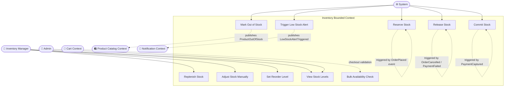

# Use Case Diagram — Inventory



## Use Case Descriptions

| ID | Use Case | Primary Actor | Precondition | Postcondition |
|---|---|---|---|---|
| UC-IN-01 | Reserve Stock | System | `OrderPlaced` event received | StockReserved; availableQty decremented |
| UC-IN-02 | Release Stock | System | `OrderCancelled` or `PaymentFailed` | StockReleased; availableQty restored |
| UC-IN-03 | Commit Stock | System | `PaymentCaptured` event received | Reservation → actual deduction from onHand |
| UC-IN-04 | Replenish Stock | Inventory Manager | SKU exists | onHandQty increased; alert cleared if above threshold |
| UC-IN-05 | Adjust Stock Manually | Inventory Manager | SKU exists; reason provided | Stock delta applied; InventoryAdjusted event logged |
| UC-IN-06 | Set Reorder Level | Inventory Manager | SKU exists | Reorder threshold updated |
| UC-IN-07 | View Stock Levels | Inv. Manager / Admin | Authenticated | Full stock detail including reserved quantities |
| UC-IN-08 | Trigger Low Stock Alert | System | availableQty ≤ reorderLevel | LowStockAlertTriggered event; admin notified |
| UC-IN-09 | Mark Out of Stock | System | availableQty = 0 | ProductOutOfStock event; Catalog unpublishes variant |
| UC-IN-10 | Bulk Availability Check | Cart Context | SKU list provided | Per-SKU availability status returned |

## Inventory Invariants

```
availableQuantity = onHandQuantity - reservedQuantity
availableQuantity ≥ 0  (enforced with optimistic locking)
reservedQuantity ≥ 0
Reservation TTL = 15 minutes (auto-release on expiry)
```
