# Use Case Diagram — Notification

```mermaid
graph TD
    Customer(["👤 Customer"])
    Admin(["👤 Admin"])
    System(["⚙️ System (Event Consumer)"])

    subgraph UC_Notification ["Notification Bounded Context"]
        UC1["Send Order Confirmation"]
        UC2["Send Shipping Notification"]
        UC3["Send Payment Failure Alert"]
        UC4["Send Refund Confirmation"]
        UC5["Send Cart Abandonment Reminder"]
        UC6["Send Low Stock Alert (Admin)"]
        UC7["Send Welcome / Verification Email"]
        UC8["Retry Failed Notification"]
        UC9["Update Notification Preferences"]
        UC10["View Notification History"]
        UC11["Admin: Manual Send"]
    end

    EmailProvider(["📧 Email Provider (SES/SendGrid)"])
    SMSProvider(["📱 SMS Provider (Twilio)"])
    PushProvider(["🔔 Push (FCM/APNs)"])
    DLQ(["☠️ Dead Letter Queue"])

    Customer --> UC9
    Customer --> UC10

    Admin --> UC11
    Admin --> UC10

    System --> UC1
    System --> UC2
    System --> UC3
    System --> UC4
    System --> UC5
    System --> UC6
    System --> UC7
    System --> UC8

    UC1 & UC2 & UC3 & UC4 & UC5 & UC7 -.->|dispatches via| EmailProvider
    UC3 & UC4 -.->|may dispatch via| SMSProvider
    UC2 -.->|may dispatch via| PushProvider

    UC8 -.->|max 3 retries; then routes to| DLQ
```



## Use Case Descriptions

| ID | Use Case | Trigger Event | Channel(s) | Respects Preferences? |
|---|---|---|---|---|
| UC-NT-01 | Order Confirmation | `OrderConfirmed` | Email, SMS | No — transactional |
| UC-NT-02 | Shipping Notification | `OrderShipped` | Email, Push | No — transactional |
| UC-NT-03 | Payment Failure Alert | `PaymentFailed` | Email | No — transactional |
| UC-NT-04 | Refund Confirmation | `RefundIssued` | Email | No — transactional |
| UC-NT-05 | Cart Abandonment Reminder | `CartAbandoned` (+30 min) | Email | Yes — marketing |
| UC-NT-06 | Low Stock Alert | `LowStockAlertTriggered` | Email (admin) | No — operational |
| UC-NT-07 | Welcome / Verification | `UserRegistered` | Email | No — transactional |
| UC-NT-08 | Retry Failed Notification | Internal retry | Same as original | — |
| UC-NT-09 | Update Preferences | Customer action | — | — |
| UC-NT-10 | View History | Customer / Admin | — | — |
| UC-NT-11 | Admin Manual Send | Admin action | Email / SMS / Push | No |

## Notification Decision Rules

```
IF notification type = TRANSACTIONAL → always send (ignore preferences)
IF notification type = MARKETING     → check opt-in; suppress if opted out
IF delivery fails                    → retry up to 3 times (exponential back-off: 1m, 5m, 15m)
IF 3rd retry fails                   → route to DLQ; record NotificationFailed
ALL dispatches                       → log with correlationId, templateId, status, timestamp
```
