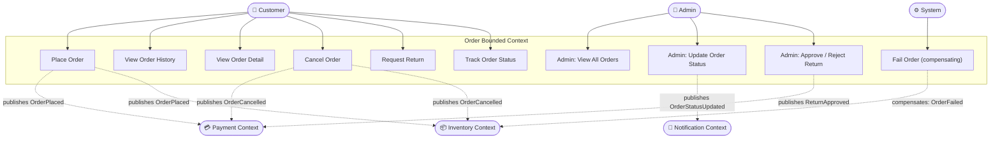
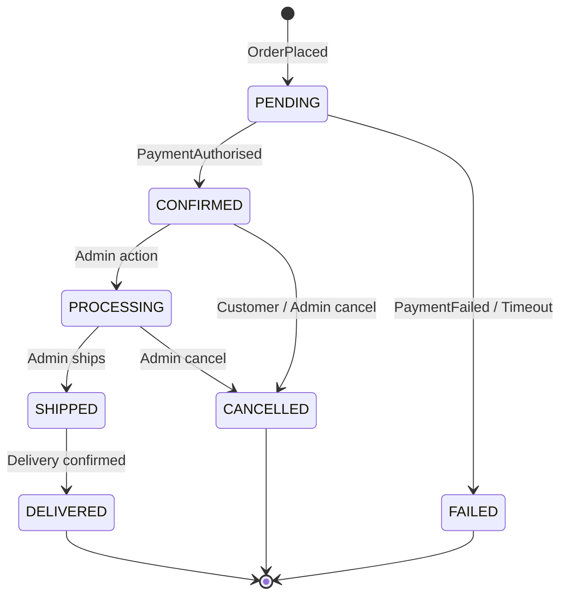

# Use Case Diagram — Order

## Use Case Descriptions

| ID | Use Case | Primary Actor | Precondition | Postcondition |
|---|---|---|---|---|
| UC-OR-01 | Place Order | Customer | Cart checked out; items in stock | Order PENDING; payment initiated; stock reserved |
| UC-OR-02 | View Order History | Customer | Authenticated | Paginated list of own orders |
| UC-OR-03 | View Order Detail | Customer | Order belongs to customer | Full order with items, address, payment, timeline |
| UC-OR-04 | Cancel Order | Customer | Order in PENDING or CONFIRMED | Order CANCELLED; stock released; refund if paid |
| UC-OR-05 | Request Return | Customer | Order DELIVERED within 30 days | Return request submitted |
| UC-OR-06 | Track Order Status | Customer | Order exists | Current status and timeline shown |
| UC-OR-07 | Admin: View All Orders | Admin | Authenticated as ADMIN | Filtered, paginated order list |
| UC-OR-08 | Admin: Update Order Status | Admin | Valid state transition | Order status updated; customer notified |
| UC-OR-09 | Admin: Approve Return | Admin | Return request exists | ReturnApproved event; refund initiated |
| UC-OR-10 | Fail Order (system) | System | Payment failed or timeout | Order FAILED; stock released; customer notified |

## Order State Machine

