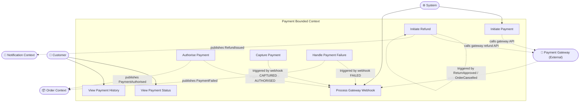
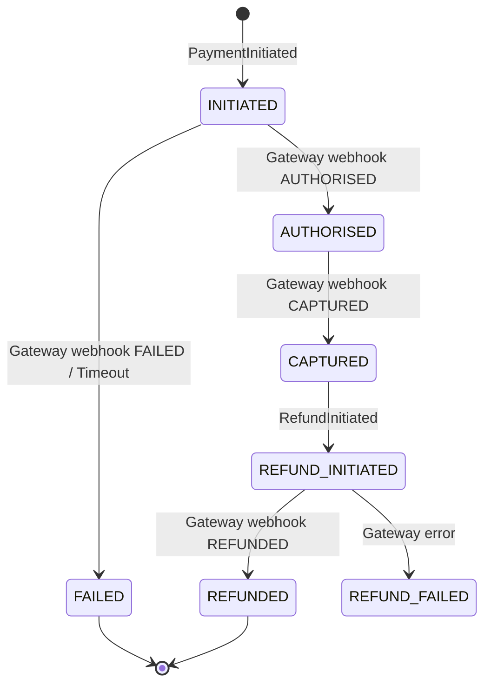

# Use Case Diagram — Payment

## Use Case Descriptions

| ID | Use Case | Primary Actor | Precondition | Postcondition |
|---|---|---|---|---|
| UC-PM-01 | Initiate Payment | System | Order PENDING | Payment INITIATED; redirect URL returned to customer |
| UC-PM-02 | Authorise Payment | Gateway (webhook) | Payment INITIATED | Payment AUTHORISED; PaymentAuthorised event published |
| UC-PM-03 | Capture Payment | Gateway (webhook) | Payment AUTHORISED | Payment CAPTURED; fulfilment triggered |
| UC-PM-04 | Handle Payment Failure | Gateway (webhook) | Payment INITIATED | Payment FAILED; PaymentFailed event published |
| UC-PM-05 | Process Gateway Webhook | System | Valid HMAC signature | Idempotent state transition; duplicate webhooks ignored |
| UC-PM-06 | Initiate Refund | System | Payment CAPTURED | Refund INITIATED; gateway refund API called |
| UC-PM-07 | View Payment Status | Customer | Order exists | Current payment status (masked card, amount) |
| UC-PM-08 | View Payment History | Customer | Authenticated | List of payments and refunds per order |

## Payment State Machine

