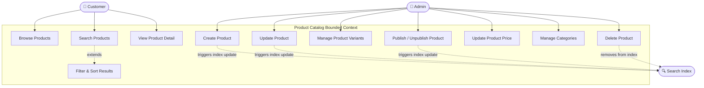

# Use Case Diagram — Product Catalog

## Use Case Descriptions

| ID | Use Case | Primary Actor | Precondition | Postcondition |
|---|---|---|---|---|
| UC-PC-01 | Browse Products | Customer | — | Paginated list of PUBLISHED products |
| UC-PC-02 | Search Products | Customer | — | Relevant PUBLISHED products returned |
| UC-PC-03 | Filter & Sort Results | Customer | Search or browse active | Filtered/sorted result set |
| UC-PC-04 | View Product Detail | Customer | Product PUBLISHED | Full product info with variants and stock status |
| UC-PC-05 | Create Product | Admin | Authenticated as ADMIN | Product created in DRAFT state |
| UC-PC-06 | Update Product | Admin | Product exists | Product fields updated; search index refreshed |
| UC-PC-07 | Manage Product Variants | Admin | Product exists | Variants with SKU, price, attributes saved |
| UC-PC-08 | Publish / Unpublish | Admin | Product in DRAFT or PUBLISHED | Product visibility toggled |
| UC-PC-09 | Update Price | Admin | Product exists | New price active; previous price retained |
| UC-PC-10 | Manage Categories | Admin | Authenticated as ADMIN | Category tree updated |
| UC-PC-11 | Delete Product | Admin | Product exists | Product soft-deleted; hidden from customers |
