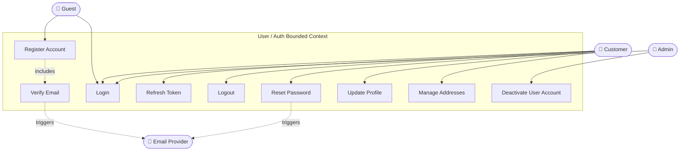

# Use Case Diagram — User / Auth

## Use Case Descriptions

| ID | Use Case | Primary Actor | Precondition | Postcondition |
|---|---|---|---|---|
| UC-UA-01 | Register Account | Guest | Email not already registered | Account in UNVERIFIED state; verification email sent |
| UC-UA-02 | Verify Email | Guest | Registration complete; token valid | Account ACTIVE; user logged in |
| UC-UA-03 | Login | Guest / Customer | Account ACTIVE | JWT + refresh token issued |
| UC-UA-04 | Refresh Token | Customer | Valid refresh token | New access token issued |
| UC-UA-05 | Logout | Customer | Authenticated | Refresh token invalidated |
| UC-UA-06 | Reset Password | Guest / Customer | Account exists | Password updated; all sessions invalidated |
| UC-UA-07 | Update Profile | Customer | Authenticated | Profile updated |
| UC-UA-08 | Manage Addresses | Customer | Authenticated | Delivery addresses saved |
| UC-UA-09 | Deactivate User | Admin | Target account exists | Account DEACTIVATED; all tokens revoked |
