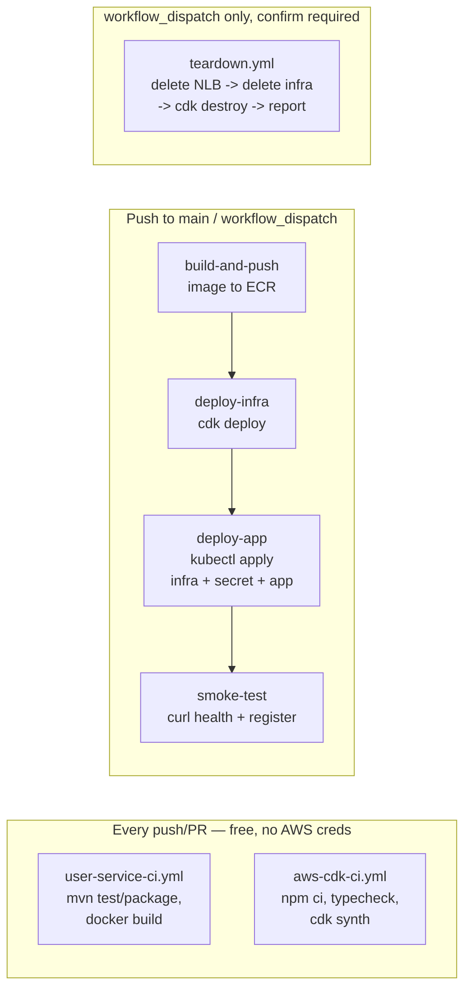

# Phase 1 CI/CD — GitHub Actions

Four workflows under `.github/workflows/` automate what `phase1/DEPLOYING_AWS.md`
otherwise has you run by hand. See
[`ADR-0016`](../docs/adr/ADR-0016-cdk-and-cicd-for-eks-deployment.md) for the reasoning
behind the trigger design (deploy-on-push-to-main, teardown-is-manual-only) and
[`phase1/infra/cdk/README.md`](infra/cdk/README.md) for the CDK app these workflows call.

---

## Pipeline architecture

| Workflow | Trigger | AWS creds? | Can create/destroy billed resources? |
|---|---|---|---|
| `user-service-ci.yml` | push/PR touching `phase1/user-service/**` | No | No |
| `aws-cdk-ci.yml` | push/PR touching `phase1/infra/cdk/**` | Yes (read-only `cdk synth`) | No |
| `deploy.yml` | push to `main`, or manual | Yes | **Creates** (EKS cluster, nodes, NLB) |
| `teardown.yml` | manual only, requires `confirm: destroy` input | Yes | **Destroys** |

`deploy.yml` and `teardown.yml` share a `concurrency: group: aws-deploy` — GitHub Actions
queues them rather than letting a deploy and a teardown race against the same cluster.

---

## One-time repository configuration

Done once, after completing `phase1/infra/cdk/README.md`'s "One-time bootstrap":

1. **Repository variable** `AWS_DEPLOY_ROLE_ARN` — the `DeployRoleArn` output from
   `cdk deploy EcommerceGithubOidcStack`. Settings → Secrets and variables → Actions →
   Variables → New repository variable.
2. **Repository variable** `AWS_REGION` (optional) — defaults to `ap-south-1` (matching
   `phase1/k8s/eks-cluster.yaml`) if unset.

No AWS access keys are stored anywhere in GitHub — every workflow authenticates via
OIDC (`aws-actions/configure-aws-credentials` + `role-to-assume`), per ADR-0016 §3.

---

## Running a deploy

**Automatic:** merge a PR into `main` (per this repo's GitFlow — `main` only moves via
release PRs, so this is not "every commit").

**Manual (re-run without a new commit):** Actions tab → "Deploy to AWS (EKS)" → Run
workflow → branch `main` (or any branch you want to test from, via `workflow_dispatch`).

A run takes roughly the same 15-25 minutes `phase1/DEPLOYING_AWS.md` quotes for
`eksctl` — EKS control plane provisioning is still the slow part, CDK doesn't change
that. Watch progress under the Actions tab; `smoke-test`'s final step curls
`/actuator/health` and `POST /v1/auth/register` against the new NLB hostname and fails
the run if either doesn't respond correctly.

**Cost reminder:** a green run leaves a real EKS cluster billing at
~$0.20–0.25/hr (`phase1/DEPLOYING_AWS.md`'s cost table). Nothing in this pipeline tears
it down automatically.

---

## Running a teardown

Actions tab → "Teardown AWS (EKS)" → Run workflow → type `destroy` in the confirmation
field exactly (case-sensitive) → Run workflow. Anything else in that field fails the
job before touching AWS.

The job releases the NLB, deletes the in-cluster infra, runs `cdk destroy` on the
network/ECR/EKS stacks (not the GitHub OIDC bootstrap stack — that stays), and writes a
post-teardown checklist (orphaned EBS volumes / load balancers / Elastic IPs) to the
job summary. A `::warning::` there means check the AWS console — the job doesn't fail
outright on leftovers, since some of them (e.g. an EIP from something unrelated) may
not be this pipeline's to delete.

---

## Troubleshooting

| Symptom | Likely cause |
|---|---|
| `deploy.yml` fails at `deploy-infra` with an assume-role error | `AWS_DEPLOY_ROLE_ARN` unset/wrong, or the bootstrap stack (`phase1/infra/cdk/README.md`) was never deployed |
| `deploy-app` job's `rollout status` step times out | Same causes as `phase1/DEPLOYING_AWS.md`'s troubleshooting table (PVC/EBS CSI driver not ready, image pull failure) — inspect via `kubectl -n ecommerce-infra describe pod` using credentials from the failed run's `aws eks update-kubeconfig` command, run locally |
| `smoke-test` times out waiting for the NLB hostname | NLB provisioning can occasionally take longer than the 5-minute poll window — re-run just this job (Actions UI → "Re-run failed jobs"), or check `kubectl -n ecommerce get svc user-service-external` directly |
| Two `deploy.yml` runs queued back to back | Expected — `concurrency: group: aws-deploy` serialises them so a deploy and a teardown (or two deploys) can't race |
| `teardown.yml` job fails the confirmation check | The `confirm` input must be exactly `destroy`, not `Destroy`/`DESTROY`/anything else — intentional, not a bug |
| Pipeline user-service image doesn't reflect a just-merged code change | Check `build-and-push` actually ran and pushed a new tag (`${GITHUB_SHA::12}`) — `deploy-app` substitutes that exact tag into the overlay, not `:latest` |
