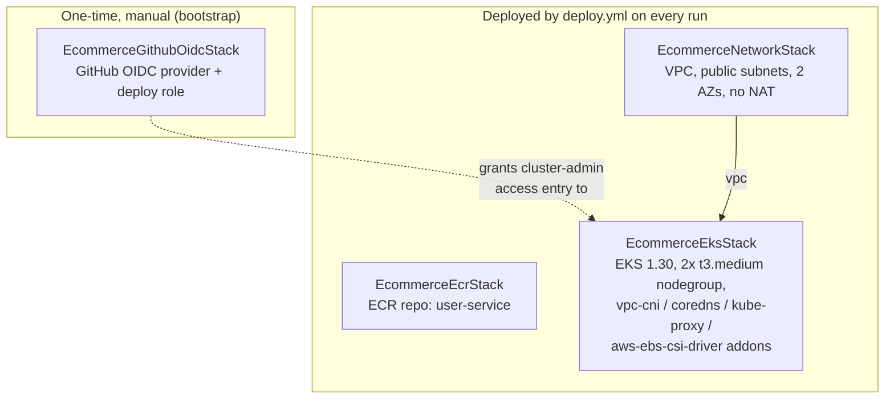

# Phase 1 AWS Infrastructure — CDK (TypeScript)

Replaces `eksctl create cluster -f phase1/k8s/eks-cluster.yaml` with a CDK app. See
[`ADR-0016`](../../../docs/adr/ADR-0016-cdk-and-cicd-for-eks-deployment.md) for why, and
[`phase1/CICD.md`](../../CICD.md) for how this fits into the automated GitHub Actions
pipeline. This README covers running the CDK app directly (manual use, or the one-time
bootstrap step the pipeline can't do for itself).

**Scope reminder (ADR-0016 §2):** this app provisions AWS cloud resources only — VPC,
EKS cluster, node group, IRSA addons, ECR. It does not deploy anything *inside* the
cluster. `phase1/k8s/` and `phase1/user-service/k8s/` (Kustomize) still own that, exactly
as in `phase1/DEPLOYING_AWS.md`.

---

## Stack architecture



| Stack | File | Depends on |
|---|---|---|
| `EcommerceGithubOidcStack` | `lib/github-oidc-stack.ts` | — |
| `EcommerceNetworkStack` | `lib/network-stack.ts` | — |
| `EcommerceEcrStack` | `lib/ecr-stack.ts` | — |
| `EcommerceEksStack` | `lib/eks-stack.ts` | `EcommerceNetworkStack` (VPC), `EcommerceGithubOidcStack` (grants the deploy role an EKS Access Entry) |

Cost trade-offs (public-only VPC, no NAT, 2x `t3.medium`) mirror
`phase1/DEPLOYING_AWS.md`'s existing cost table exactly — this doesn't change the bill,
just how the same resources get created.

---

## Prerequisites

| Tool | Check |
|---|---|
| Node.js 20+ | `node --version` |
| AWS CLI v2, configured | `aws sts get-caller-identity` |
| AWS CDK CLI (installed via `npm ci` below, no global install needed) | — |

```bash
cd phase1/infra/cdk
npm ci
```

---

## One-time bootstrap

Two things need to exist before `deploy.yml` can run for the first time — both done
**manually, once**, from a developer machine with broad AWS credentials (not by CI,
which is the chicken-and-egg this section resolves):

```bash
# 1. CDK's own toolkit stack (S3 staging bucket, ECR asset repo, deploy roles) —
#    standard for any CDK app, one-time per account+region.
npx cdk bootstrap aws://<ACCOUNT_ID>/<REGION>

# 2. The GitHub OIDC trust + deploy role that deploy.yml/teardown.yml assume.
#    Uses this repo's owner/name by default (Minoltan/ecommerce-platform) —
#    override via GITHUB_REPO_OWNER/GITHUB_REPO_NAME env vars if you forked it.
npx cdk deploy EcommerceGithubOidcStack
```

Take the `DeployRoleArn` output from step 2 and set it as the `AWS_DEPLOY_ROLE_ARN`
repository variable in GitHub (Settings → Secrets and variables → Actions → Variables) —
see `phase1/CICD.md` for the full list of repo configuration this pipeline needs.

If your AWS account already has a GitHub OIDC provider registered (from another
project) — an account can only have one per issuer URL — `cdk deploy` will fail with
"provider already exists". Edit `lib/github-oidc-stack.ts` to use
`iam.OpenIdConnectProvider.fromOpenIdConnectProviderArn(...)` against the existing
provider instead of creating a new one.

---

## Manual usage

```bash
cd phase1/infra/cdk

# What would change, without applying it
npx cdk diff EcommerceNetworkStack EcommerceEcrStack EcommerceEksStack

# Same three stacks deploy.yml deploys — deliberately excludes
# EcommerceGithubOidcStack (that one's the bootstrap step above)
npx cdk deploy EcommerceNetworkStack EcommerceEcrStack EcommerceEksStack

# Get kubectl talking to the new cluster
aws eks update-kubeconfig --name ecommerce-platform-test --region <REGION>
# then continue from phase1/DEPLOYING_AWS.md Step 3 onward (kubectl apply -k ...)

# Tear down the same three stacks (does NOT touch EcommerceGithubOidcStack)
# — release the LoadBalancer Service first, same order as
# phase1/DEPLOYING_AWS.md's teardown section, or the NLB is orphaned.
kubectl delete -k phase1/user-service/k8s/overlays/aws
kubectl delete -k phase1/k8s/infra
npx cdk destroy EcommerceNetworkStack EcommerceEcrStack EcommerceEksStack
```

`npx cdk synth --all` requires AWS credentials even though it deploys nothing — the
EKS/VPC L2 constructs perform read-only context lookups (e.g. availability zones).

---

## Troubleshooting

| Symptom | Likely cause |
|---|---|
| `cdk deploy` fails with "this stack uses assets, so the toolkit stack must be deployed" | `cdk bootstrap` (One-time bootstrap, step 1) was skipped for this account/region |
| `AccessDenied` assuming the deploy role from GitHub Actions | `AWS_DEPLOY_ROLE_ARN` repo variable not set, or the OIDC trust policy's `sub` condition doesn't match this repo — check `lib/github-oidc-stack.ts`'s `githubOrg`/`githubRepo` props match your actual repo |
| `kubectl` commands fail with "You must be logged in to the server (Unauthorized)" after a fresh `cdk deploy` | The calling principal has no EKS Access Entry — check it's in `adminPrincipalArns` (`bin/infra.ts`) or was granted via `bootstrapClusterCreatorAdminPermissions` (only applies to whichever principal ran `cdk deploy` for `EcommerceEksStack`) |
| `EcommerceGithubOidcStack` deploy fails with "OpenIDConnect provider already exists" | See "if your AWS account already has a GitHub OIDC provider" above |
| Node group stuck, pods `Pending` | Same as `phase1/DEPLOYING_AWS.md`'s troubleshooting table — check the EBS CSI driver / PVC provisioning, not a CDK-specific issue |
